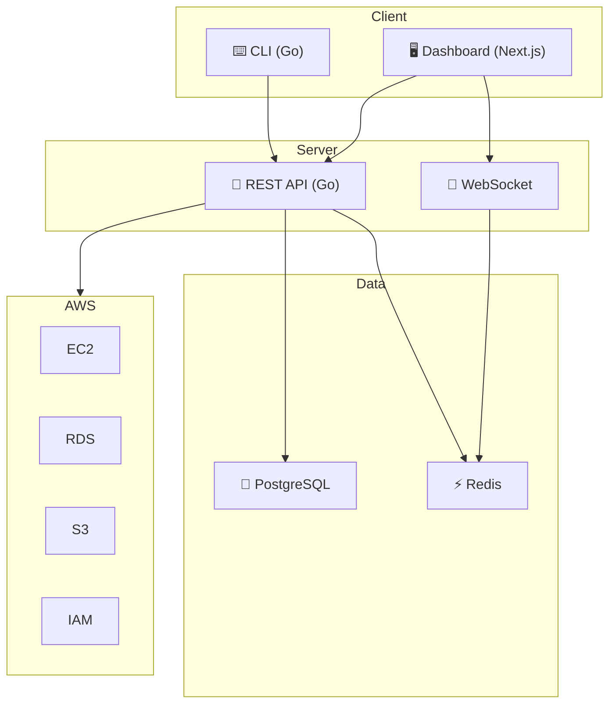

<div align="center">

```
  ██████╗ █████╗ ██████╗ ███████╗██╗   ██╗██╗     ███████╗
 ██╔════╝██╔══██╗██╔══██╗██╔════╝██║   ██║██║     ██╔════╝
 ██║     ███████║██████╔╝███████╗██║   ██║██║     █████╗  
 ██║     ██╔══██║██╔═══╝ ╚════██║██║   ██║██║     ██╔══╝  
 ╚██████╗██║  ██║██║     ███████║╚██████╔╝███████╗███████╗
  ╚═════╝╚═╝  ╚═╝╚═╝     ╚══════╝ ╚═════╝ ╚══════╝╚══════╝
```

**Your infrastructure, encapsulated.**

[](https://github.com/Kynto/capsule/actions/workflows/ci.yml)
[](https://github.com/Kynto/capsule/releases)
[](https://goreportcard.com/report/github.com/Kynto/capsule)
[](LICENSE)

</div>

---

## ✨ Features

- 🚀 **One-Command Deployments** — Deploy your infrastructure with a single `capsule deploy` command
- 📦 **Environment Capsules** — Package your entire environment as a versioned, shareable capsule
- 🖥️ **Web Dashboard** — Beautiful real-time dashboard for monitoring and management
- ⌨️ **Powerful CLI** — Full-featured command-line tool for power users and CI/CD pipelines
- 🔐 **Secure by Default** — JWT auth, encrypted secrets, least-privilege IAM policies
- 📊 **Real-Time Monitoring** — Live logs, metrics, and deployment status via WebSocket
- 🔄 **Rolling Updates** — Zero-downtime deployments with automatic rollback
- 🏗️ **Infrastructure as Code** — Define environments declaratively with version control
- 👥 **Team Collaboration** — Multi-tenant workspaces with role-based access control
- ☁️ **AWS Native** — Deep integration with AWS services (EC2, RDS, S3, and more)

---

## 🚀 Quick Start

### Install the CLI

```bash
# macOS / Linux (Homebrew)
brew install kynto/tap/capsule

# Direct download (Linux amd64)
curl -sSL https://github.com/Kynto/capsule/releases/latest/download/capsule-linux-amd64 -o capsule
chmod +x capsule && sudo mv capsule /usr/local/bin/

# Windows (Scoop)
scoop bucket add kynto https://github.com/Kynto/scoop-bucket
scoop install capsule

# Go install
go install github.com/Kynto/capsule/cli/cmd/capsule@latest
```

### Authenticate

```bash
capsule auth login
# Opens browser → enter the device code displayed in your terminal
```

### Create Your First Environment

```bash
# Create an environment
capsule env create my-app --description "Production environment"

# Check status
capsule env status my-app

# Deploy
capsule deploy --env my-app --config capsule.yaml
```

---

## ⌨️ CLI Usage

```bash
capsule [command] [subcommand] [flags]
```

### Core Commands

```bash
# Authentication
capsule auth login              # Authenticate with your account
capsule auth logout             # Clear stored credentials
capsule auth status             # Check authentication status

# Environments
capsule env list                # List all environments
capsule env create <name>       # Create a new environment
capsule env delete <name>       # Delete an environment
capsule env status <name>       # Get environment status

# Deployments
capsule deploy --env <name>     # Deploy to an environment
capsule deploy status <id>      # Check deployment status
capsule deploy rollback <id>    # Rollback a deployment

# Logs
capsule logs <env> --follow     # Stream live logs
capsule logs <env> --tail 100   # Last 100 log lines

# Configuration
capsule config set key value    # Set a config value
capsule config get key          # Get a config value
capsule config list             # List all config values
```

### Output Formats

```bash
# Table (default)
capsule env list

# JSON (for scripting)
capsule env list -o json

# YAML
capsule env list -o yaml
```

---

## 🏗️ Architecture



### Component Overview

| Component    | Technology         | Purpose                              |
|--------------|--------------------|--------------------------------------|
| **Backend**  | Go 1.22+, Chi      | REST API, WebSocket, business logic  |
| **Frontend** | Next.js 14, TS     | Web dashboard, real-time monitoring  |
| **CLI**      | Go 1.22+, Cobra    | Terminal interface, CI/CD automation |
| **Database** | PostgreSQL 16      | Persistent storage                   |
| **Cache**    | Redis 7            | Caching, pub/sub, sessions           |
| **Proxy**    | Traefik            | Reverse proxy, TLS termination       |

---

## 🛠️ Development Setup

### Prerequisites

- Go 1.22+
- Node.js 20+ & pnpm 9+
- Docker & Docker Compose
- Make

### Get Started

```bash
# Clone the repository
git clone https://github.com/Kynto/capsule.git
cd capsule

# Start infrastructure services
docker compose up -d postgres redis

# Run the backend
cd backend && go run ./cmd/server

# In a new terminal — run the frontend
cd frontend && pnpm install && pnpm dev

# In a new terminal — build the CLI
cd cli && go build -o ../bin/capsule ./cmd/capsule
```

### Useful Make Targets

```bash
make build          # Build all components
make test           # Run all tests
make lint           # Run all linters
make dev            # Start development environment
make docker-build   # Build Docker images
make clean          # Clean build artifacts
make help           # Show all available targets
```

---

## 🤝 Contributing

We welcome contributions! Please see our [Contributing Guide](CONTRIBUTING.md) for details.

1. Fork the repository
2. Create a feature branch (`git checkout -b feat/amazing-feature`)
3. Commit your changes (`git commit -m 'feat: add amazing feature'`)
4. Push to the branch (`git push origin feat/amazing-feature`)
5. Open a Pull Request

Please read our [Code of Conduct](CODE_OF_CONDUCT.md) before contributing.

---

## 🔐 Security

Found a vulnerability? Please see our [Security Policy](SECURITY.md) for responsible disclosure guidelines.

---

## 📄 License

This project is licensed under the MIT License — see the [LICENSE](LICENSE) file for details.

---

<div align="center">

Built with ❤️ by [Kynto](https://github.com/Kynto)

</div>
