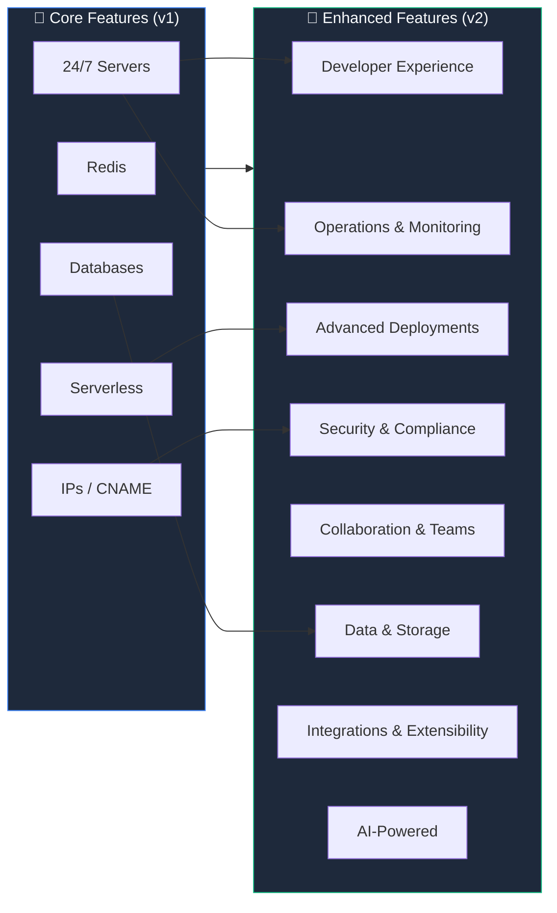
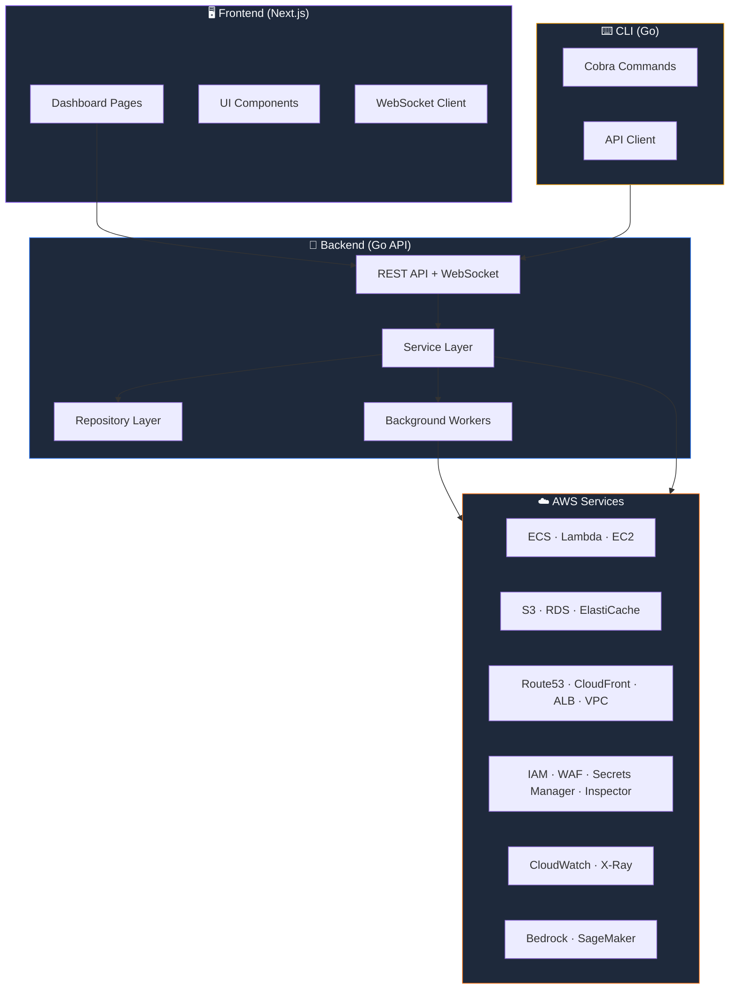
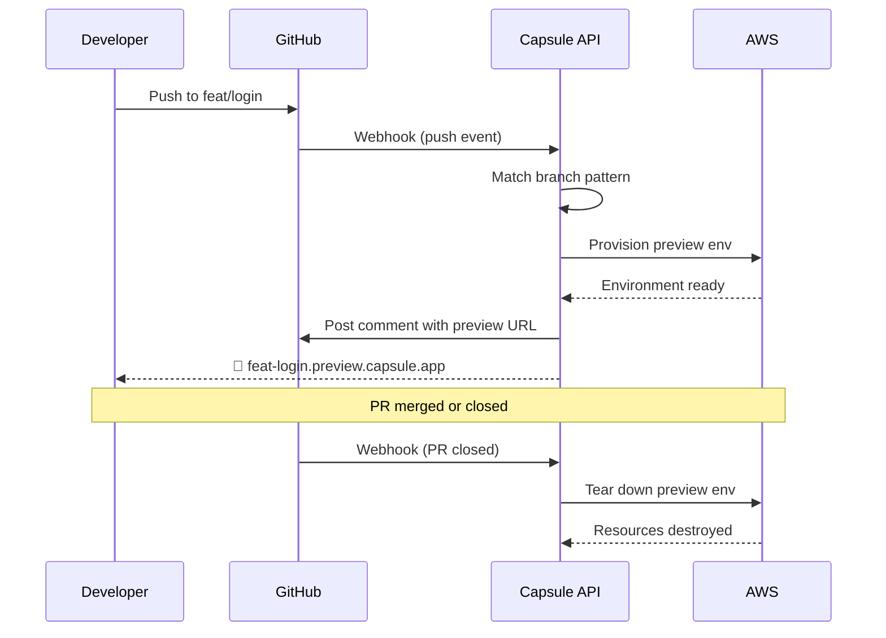
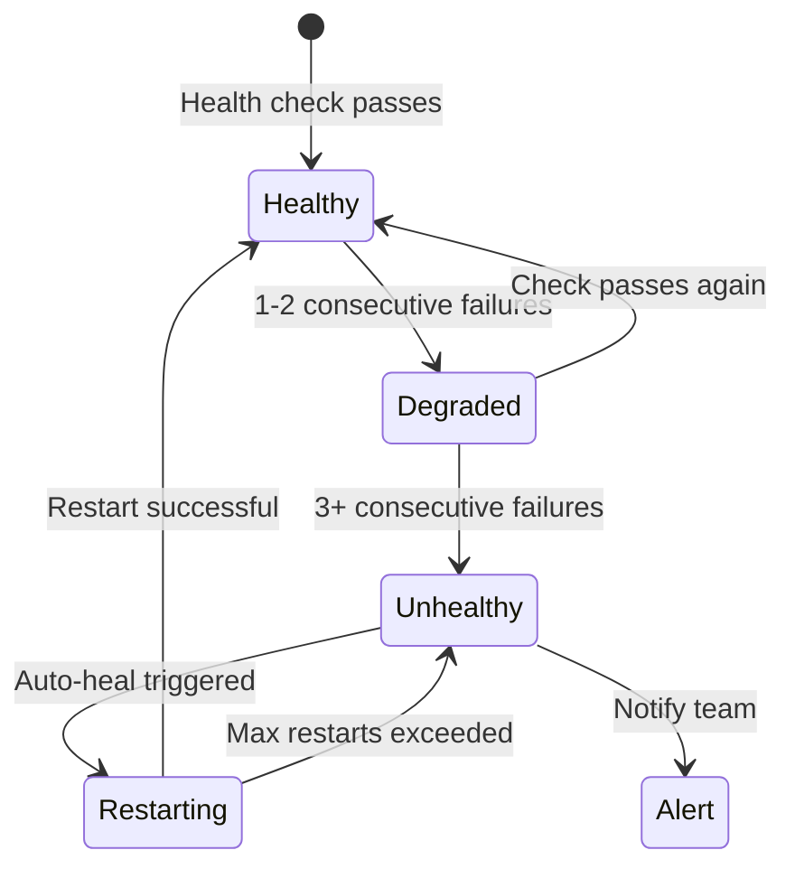
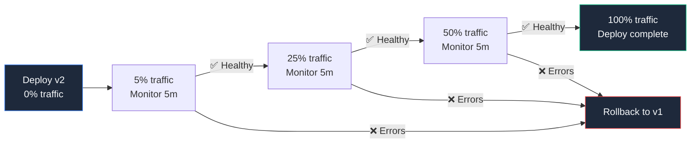
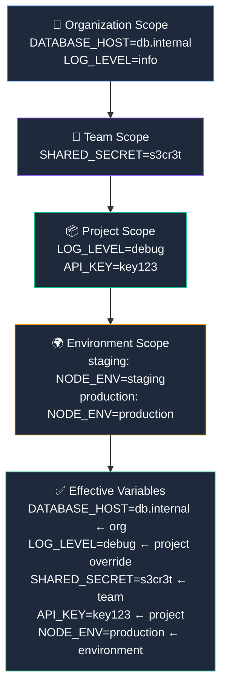
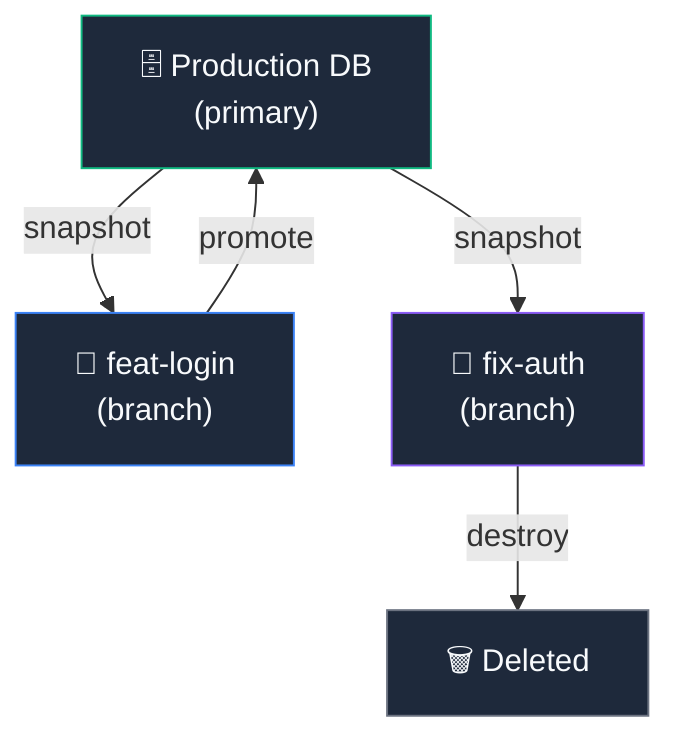
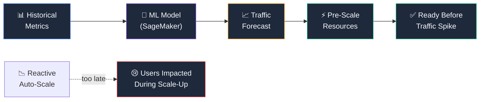
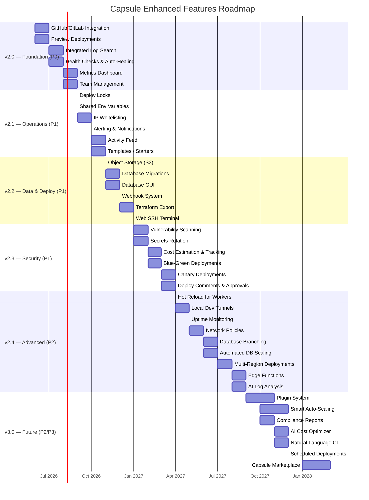

# 🚀 Capsule — Enhanced Features Roadmap

> **Version:** 2.0 · **Last Updated:** 2026-05-26 · **Status:** Planning  
> *Your infrastructure, encapsulated — and supercharged.*

---

## Table of Contents

- [Overview](#overview)
- [Feature Matrix](#feature-matrix)
- [Architecture Impact Map](#architecture-impact-map)
- [Category 1 — Developer Experience (DX)](#category-1--developer-experience-dx)
- [Category 2 — Operations & Monitoring](#category-2--operations--monitoring)
- [Category 3 — Advanced Deployments](#category-3--advanced-deployments)
- [Category 4 — Security & Compliance](#category-4--security--compliance)
- [Category 5 — Collaboration & Teams](#category-5--collaboration--teams)
- [Category 6 — Data & Storage](#category-6--data--storage)
- [Category 7 — Integrations & Extensibility](#category-7--integrations--extensibility)
- [Category 8 — AI-Powered Features](#category-8--ai-powered-features)
- [Implementation Roadmap](#implementation-roadmap)
- [Appendix: Priority & Effort Definitions](#appendix-priority--effort-definitions)

---

## Overview

Capsule's **5 core features** — Databases, Redis, IPs/CNAME, Serverless Deployments, and 24/7 Servers — form the foundation of a self-hosted PaaS on AWS. This document defines **40 enhanced features** across 8 categories that elevate Capsule from a provisioning tool into a **complete cloud platform** rivaling Vercel, Railway, Render, and Coolify — while remaining fully self-hosted.

### Core vs. Enhanced



---

## Feature Matrix

> **Priority:** P0 = Critical · P1 = High · P2 = Medium · P3 = Nice-to-have  
> **Effort:** S = Small (< 1 wk) · M = Medium (1–2 wk) · L = Large (3–4 wk) · XL = Extra Large (> 1 mo)

| # | Feature | Category | Priority | Effort | CLI | Dashboard | AWS Services |
|---|---------|----------|----------|--------|-----|-----------|-------------|
| 1 | Preview Deployments | DX | **P0** | L | ✅ | ✅ | Lambda, CloudFront, Route53 |
| 2 | Templates / Starters | DX | **P1** | M | ✅ | ✅ | — |
| 3 | Database GUI | DX | **P1** | L | ❌ | ✅ | — |
| 4 | Web SSH Terminal | DX | **P1** | M | ✅ | ✅ | EC2, SSM |
| 5 | Integrated Log Search | DX | **P0** | L | ✅ | ✅ | CloudWatch Logs |
| 6 | Hot Reload for Workers | DX | **P2** | S | ✅ | ❌ | — |
| 7 | Local Dev Tunnels | DX | **P2** | M | ✅ | ❌ | API Gateway, WebSocket |
| 8 | Health Checks & Auto-Healing | Ops | **P0** | M | ✅ | ✅ | ECS, ALB, CloudWatch |
| 9 | Metrics Dashboard | Ops | **P0** | L | ❌ | ✅ | CloudWatch, Prometheus |
| 10 | Alerting & Notifications | Ops | **P1** | M | ✅ | ✅ | SNS, CloudWatch Alarms |
| 11 | Cost Estimation & Tracking | Ops | **P1** | L | ✅ | ✅ | Cost Explorer, Budgets |
| 12 | Uptime Monitoring | Ops | **P2** | M | ✅ | ✅ | Route53 Health Checks |
| 13 | Canary Deployments | Deploys | **P1** | XL | ✅ | ✅ | CodeDeploy, ALB |
| 14 | Blue-Green Deployments | Deploys | **P1** | L | ✅ | ✅ | ECS, ALB |
| 15 | Multi-Region Deploys | Deploys | **P2** | XL | ✅ | ✅ | Multi-region, Route53 |
| 16 | Edge Functions | Deploys | **P2** | XL | ✅ | ✅ | Lambda@Edge, CloudFront |
| 17 | Scheduled Deployments | Deploys | **P3** | S | ✅ | ✅ | EventBridge |
| 18 | Deploy Locks | Deploys | **P1** | S | ✅ | ✅ | DynamoDB |
| 19 | Secrets Rotation | Security | **P1** | L | ✅ | ✅ | Secrets Manager |
| 20 | Vulnerability Scanning | Security | **P1** | M | ❌ | ✅ | ECR, Inspector |
| 21 | Network Policies | Security | **P2** | L | ✅ | ✅ | VPC, Security Groups |
| 22 | Compliance Reports | Security | **P3** | L | ✅ | ✅ | Config, CloudTrail |
| 23 | IP Whitelisting | Security | **P1** | S | ✅ | ✅ | WAF, Security Groups |
| 24 | Team Management | Teams | **P0** | L | ✅ | ✅ | Cognito, IAM |
| 25 | Deploy Comments & Approvals | Teams | **P2** | M | ❌ | ✅ | — |
| 26 | Activity Feed | Teams | **P1** | M | ❌ | ✅ | DynamoDB Streams |
| 27 | Shared Env Variables | Teams | **P1** | S | ✅ | ✅ | Secrets Manager |
| 28 | Object Storage (S3) | Data | **P1** | M | ✅ | ✅ | S3 |
| 29 | Database Migrations | Data | **P1** | M | ✅ | ✅ | — |
| 30 | Database Branching | Data | **P2** | XL | ✅ | ✅ | RDS, Aurora |
| 31 | Auto DB Scaling | Data | **P2** | L | ❌ | ✅ | Aurora Serverless |
| 32 | Plugin System | Integrations | **P2** | XL | ✅ | ✅ | — |
| 33 | Terraform Export | Integrations | **P1** | M | ✅ | ❌ | — |
| 34 | Webhook System | Integrations | **P1** | M | ✅ | ✅ | SNS, EventBridge |
| 35 | GitHub/GitLab Integration | Integrations | **P0** | L | ❌ | ✅ | — |
| 36 | Capsule Marketplace | Integrations | **P3** | XL | ❌ | ✅ | S3, DynamoDB |
| 37 | AI Log Analysis | AI | **P2** | L | ✅ | ✅ | Bedrock |
| 38 | AI Cost Optimizer | AI | **P3** | L | ✅ | ✅ | Bedrock, Cost Explorer |
| 39 | Natural Language CLI | AI | **P3** | M | ✅ | ❌ | Bedrock |
| 40 | Smart Auto-Scaling | AI | **P3** | XL | ❌ | ✅ | SageMaker, Auto Scaling |

### Summary by Priority

| Priority | Count | Description |
|----------|-------|-------------|
| **P0** | 6 | Ship in v2.0 — required for launch |
| **P1** | 16 | Ship in v2.x — high-value additions |
| **P2** | 11 | Planned — strong competitive differentiators |
| **P3** | 7 | Future — nice-to-have / experimental |

---

## Architecture Impact Map



---

## Category 1 — Developer Experience (DX)

> *Make developers fall in love with deploying.*

### Feature 1 · Preview Deployments

| | |
|---|---|
| **Priority** | P0 |
| **Effort** | L (3–4 weeks) |
| **AWS** | Lambda, CloudFront, Route53, S3 |

#### Description

Every Git branch or pull request automatically receives a unique, isolated deployment with its own URL. When a developer pushes to `feat/login`, Capsule provisions a complete environment at `feat-login.preview.capsule.app` — including serverless functions, a branched database snapshot (if enabled), and isolated environment variables.

Preview deployments auto-destroy when the PR is merged or closed, ensuring zero resource waste.

#### User Stories

- *As a frontend developer, I want to share a preview URL with my designer so they can review my UI changes without setting up a local environment.*
- *As a team lead, I want to click a link in the PR to see the live preview before approving the merge.*
- *As a QA engineer, I want each PR to have its own isolated environment so I can test multiple features simultaneously.*

#### CLI

```bash
# Manual preview deploy from current branch
capsule deploy --preview

# Preview deploy with a custom label
capsule deploy --preview --label "feat-login"

# List active previews
capsule previews list

# Destroy a specific preview
capsule previews destroy feat-login

# View preview logs
capsule logs --preview feat-login
```

#### Dashboard UI

- **Previews tab** on the project page showing all active preview environments
- Each preview card displays: branch name, commit SHA, deploy status, preview URL, age, resource cost
- Click-to-open preview URL button
- Direct link to the associated GitHub/GitLab PR
- "Destroy" button with confirmation dialog
- Auto-cleanup settings: TTL (e.g., destroy after 7 days of inactivity)

#### Configuration (`.capsule/config.json`)

```json
{
  "preview": {
    "enabled": true,
    "autoDeploy": true,
    "branchPattern": "feat/*|fix/*|hotfix/*",
    "ttl": "7d",
    "database": {
      "branch": true,
      "snapshotFrom": "staging"
    },
    "envOverrides": {
      "NODE_ENV": "preview",
      "API_URL": "https://{{branch}}.preview.capsule.app/api"
    },
    "notifications": {
      "github": true,
      "slack": "#deploys"
    }
  }
}
```

#### Flow



---

### Feature 2 · Capsule Templates / Starters

| | |
|---|---|
| **Priority** | P1 |
| **Effort** | M (1–2 weeks) |
| **AWS** | — (local scaffolding) |

#### Description

Pre-built, opinionated project templates that scaffold a complete Capsule project in one command. Each template includes application code, a `.capsule/config.json` with databases, Redis, environment variables, and deployment targets pre-configured. Templates are versioned and community-extensible.

#### Built-in Templates

| Template | Stack | Includes |
|----------|-------|----------|
| `nextjs-prisma` | Next.js 14 + Prisma + PostgreSQL | DB, migrations, auth scaffold |
| `mern` | MongoDB + Express + React + Node | DB, Redis, API scaffold |
| `go-api` | Go + Chi + PostgreSQL | DB, health checks, Dockerfile |
| `fastapi` | Python FastAPI + SQLAlchemy + PostgreSQL | DB, migrations, OpenAPI |
| `laravel` | Laravel 11 + MySQL + Redis | DB, Redis, queue workers |
| `remix-sqlite` | Remix + SQLite (Litestream) | S3 for replication |
| `static-site` | HTML/CSS/JS or Astro | CloudFront distribution |
| `workers-only` | Node.js/Python background workers | Redis queues, cron |

#### User Stories

- *As a new user, I want to go from zero to deployed in under 5 minutes with a single command.*
- *As a full-stack developer, I want a template that sets up my database, Redis, and API routes so I can focus on business logic.*

#### CLI

```bash
# List available templates
capsule templates list

# Scaffold a new project from a template
capsule init --template nextjs-prisma --name my-saas

# Scaffold and immediately deploy
capsule init --template go-api --name my-api --deploy

# Use a community template from the marketplace
capsule init --template @community/django-celery

# Create a template from an existing project
capsule templates create --from . --name my-custom-stack
```

#### Dashboard UI

- **"New Project" wizard** with a visual template gallery
- Template cards with stack icons, description, and "Use Template" button
- Configuration step: project name, region, database size
- Live progress bar during scaffolding and deployment
- "Customize Template" modal to override default settings before init

---

### Feature 3 · Built-in Database GUI

| | |
|---|---|
| **Priority** | P1 |
| **Effort** | L (3–4 weeks) |
| **AWS** | — (proxied through backend) |

#### Description

A web-based database client embedded directly in the Capsule dashboard. Provides a visual interface for PostgreSQL and MySQL with a query browser, table viewer, data editor, schema inspector, and export tools. Also includes a Redis browser with key explorer, TTL viewer, and pub/sub monitor.

No need for external tools like pgAdmin, Adminer, or RedisInsight — everything is in one place.

#### User Stories

- *As a developer, I want to quickly inspect my database tables without installing pgAdmin or connecting via CLI.*
- *As a debugging developer, I want to run ad-hoc SQL queries against my staging database from the browser.*
- *As a data engineer, I want to browse Redis keys, check TTLs, and monitor pub/sub channels in real time.*

#### Dashboard UI — SQL Client

- **Schema browser** (left sidebar): databases → schemas → tables → columns
- **Query editor** (center): syntax-highlighted SQL editor with autocomplete, history, and saved queries
- **Results panel** (bottom): paginated table, export to CSV/JSON, execution time
- **Table viewer**: click a table to browse rows, edit inline, filter/sort columns
- **Schema inspector**: view columns, types, indexes, foreign keys, constraints
- **Visual query builder**: drag-and-drop for users who prefer no-SQL interface

#### Dashboard UI — Redis Browser

- **Key explorer**: filterable tree of all keys with type icons (string, hash, list, set, zset, stream)
- **Value viewer**: formatted display for each key type with edit capability
- **TTL manager**: view and modify TTL for any key, bulk TTL operations
- **Pub/Sub monitor**: real-time stream of messages on subscribed channels
- **Memory analysis**: key size distribution chart, big key detection
- **CLI console**: embedded Redis CLI for raw commands

#### Security

- All database connections are proxied through the Capsule backend — no direct browser-to-DB connections
- Query execution respects RBAC roles (Viewer = read-only, Developer = read/write, Admin = DDL)
- Audit log for all queries executed through the GUI

---

### Feature 4 · Web SSH Terminal

| | |
|---|---|
| **Priority** | P1 |
| **Effort** | M (1–2 weeks) |
| **AWS** | EC2, SSM Session Manager |

#### Description

An xterm.js-based SSH terminal embedded in the dashboard, allowing direct access to any 24/7 server without an external SSH client. Supports multiple tabs, session persistence, and file transfer. Uses AWS Systems Manager Session Manager under the hood for secure, keyless access.

#### User Stories

- *As a developer, I want to SSH into my server from the browser during an incident without searching for SSH keys.*
- *As a DevOps engineer, I want to have multiple terminal tabs open to different servers simultaneously.*
- *As a junior developer, I want a safe way to access servers without managing SSH keys on my machine.*

#### CLI

```bash
# SSH into a specific 24/7 server
capsule ssh --server my-api

# SSH with a specific user
capsule ssh --server my-api --user deploy

# List available servers for SSH
capsule ssh list

# Upload a file to a server
capsule ssh --server my-api --upload ./config.yml:/etc/app/config.yml

# Execute a one-off command
capsule ssh --server my-api --exec "tail -100 /var/log/app.log"
```

#### Dashboard UI

- **Terminal panel** at the bottom of the server detail page (collapsible/expandable)
- Tabbed interface for multiple sessions — each tab shows the server name and connection status
- Toolbar: font size, theme (dark/light/solarized), copy/paste toggle, full-screen mode
- File transfer drag-and-drop zone for quick uploads/downloads
- Session recording for audit (optional)
- Connection indicator: green (connected), yellow (reconnecting), red (disconnected)

---

### Feature 5 · Integrated Log Search

| | |
|---|---|
| **Priority** | P0 |
| **Effort** | L (3–4 weeks) |
| **AWS** | CloudWatch Logs Insights, S3 (archive) |

#### Description

Full-text search across all application, build, and infrastructure logs with a Datadog-like experience built right into Capsule. Supports filtering by time range, severity level, service name, deployment ID, and keywords. Logs are ingested from CloudWatch and indexed for fast search.

#### User Stories

- *As a developer debugging a production issue, I want to search across all services for a specific error message in the last hour.*
- *As an SRE, I want to correlate logs from the API server, worker, and database to trace a failed request.*
- *As a team lead, I want to see all logs related to a specific deployment to verify a release went smoothly.*

#### CLI

```bash
# Search logs for a keyword
capsule logs search "error" --since 1h --app my-api

# Filter by severity
capsule logs search "timeout" --level error --since 24h

# Follow logs in real time (like tail -f)
capsule logs follow --app my-api

# Search across all services
capsule logs search "user_id=12345" --all-services --since 1d

# Export logs to file
capsule logs search "payment" --since 7d --output logs.json

# View build logs for a specific deployment
capsule logs --deploy-id dep_abc123
```

#### Dashboard UI

- **Log explorer page** with three panels:
  - **Filter sidebar**: time picker, severity checkboxes, service dropdown, deployment selector
  - **Search bar**: full-text search with autocomplete for common fields (`level:`, `service:`, `deploy:`)
  - **Log stream**: infinite scroll of log entries, color-coded by severity
- Each log entry is expandable to show full context (JSON payload, stack trace)
- **Live tail mode**: auto-scrolling real-time log stream with pause button
- **Saved searches**: save frequently used queries for quick access
- **Log volume chart**: histogram at the top showing log volume over time, click to zoom into a time range
- **Share link**: generate a permalink to a specific log view (time range + filters)

---

### Feature 6 · Hot Reload for Workers

| | |
|---|---|
| **Priority** | P2 |
| **Effort** | S (< 1 week) |
| **AWS** | — (local development only) |

#### Description

A file-watching development mode that automatically redeploys workers and serverless functions when code changes are detected. Eliminates the manual deploy-test cycle during development, providing a local experience similar to Next.js's hot reload but for backend workers.

#### User Stories

- *As a developer iterating on a worker function, I want my changes to auto-deploy so I can test immediately without running deploy commands.*
- *As a full-stack developer, I want one command that watches both my frontend and backend workers for changes.*

#### CLI

```bash
# Start dev mode with file watching
capsule dev --watch

# Watch a specific service only
capsule dev --watch --service my-worker

# Watch with verbose logging
capsule dev --watch --verbose

# Watch with custom file extensions
capsule dev --watch --ext ".ts,.js,.go"

# Watch with a custom debounce interval (ms)
capsule dev --watch --debounce 500
```

#### Configuration (`.capsule/config.json`)

```json
{
  "dev": {
    "watch": {
      "enabled": true,
      "include": ["src/**", "lib/**"],
      "exclude": ["node_modules", ".git", "*.test.*"],
      "debounceMs": 300
    }
  }
}
```

---

### Feature 7 · Local Development Tunnels

| | |
|---|---|
| **Priority** | P2 |
| **Effort** | M (1–2 weeks) |
| **AWS** | API Gateway (WebSocket), Lambda |

#### Description

Expose a local development server to the internet through Capsule's infrastructure — like ngrok, but deeply integrated with the platform. A unique, HTTPS-enabled URL routes traffic to the developer's local machine, enabling webhook testing, mobile device testing, and collaborative debugging.

#### User Stories

- *As a developer integrating Stripe webhooks, I want a public URL that forwards webhook events to my local server.*
- *As a mobile developer, I want to test my API from a physical device without deploying to staging.*
- *As a developer pair-programming remotely, I want to share my local environment with a colleague.*

#### CLI

```bash
# Start a tunnel to local port 3000
capsule tunnel --port 3000
# → 🔗 https://tunnel-abc123.capsule.app

# Custom subdomain (if available)
capsule tunnel --port 3000 --subdomain my-dev
# → 🔗 https://my-dev.tunnel.capsule.app

# Tunnel with request inspection enabled
capsule tunnel --port 3000 --inspect

# Tunnel with basic auth
capsule tunnel --port 3000 --auth user:password

# Multiple tunnels
capsule tunnel --port 3000 --name frontend &
capsule tunnel --port 8080 --name api &
```

#### Request Inspector Dashboard

When `--inspect` is enabled, a local web UI at `http://localhost:4040` shows:
- All incoming requests with method, path, headers, and body
- Response status, time, and body
- Replay button to re-send any request
- WebSocket frame inspector for WS connections

---

## Category 2 — Operations & Monitoring

> *Know everything. Fix anything. Before users notice.*

### Feature 8 · Health Checks & Auto-Healing

| | |
|---|---|
| **Priority** | P0 |
| **Effort** | M (1–2 weeks) |
| **AWS** | ECS, ALB Target Groups, CloudWatch |

#### Description

Define HTTP, TCP, or command-based health check endpoints for every service. Capsule continuously monitors each service and displays green/yellow/red status indicators in the dashboard. Unhealthy containers are automatically restarted (auto-healing) with configurable retry policies and cool-down periods.

#### User Stories

- *As an SRE, I want my services to automatically restart if they become unhealthy so I don't get paged for transient failures.*
- *As a developer, I want to see at a glance which services are healthy and which need attention.*
- *As a team lead, I want to configure custom health check endpoints per service so that health reflects real application readiness.*

#### CLI

```bash
# Check health status for a specific app
capsule health --app my-api

# Check health across all services
capsule health --all

# View health check history
capsule health history --app my-api --since 24h

# Manually trigger a health check
capsule health check --app my-api

# Configure health check via CLI
capsule health configure --app my-api \
  --endpoint /healthz \
  --interval 30s \
  --timeout 5s \
  --retries 3
```

#### Configuration (`.capsule/config.json`)

```json
{
  "healthCheck": {
    "http": {
      "path": "/healthz",
      "port": 8080,
      "expectedStatus": 200
    },
    "interval": "30s",
    "timeout": "5s",
    "retries": 3,
    "startPeriod": "60s",
    "autoHeal": {
      "enabled": true,
      "maxRestarts": 5,
      "cooldown": "120s",
      "notifyOnRestart": true
    }
  }
}
```

#### Dashboard UI

- **Service health grid**: each service shows a colored status badge (🟢 Healthy / 🟡 Degraded / 🔴 Unhealthy)
- **Health timeline**: sparkline showing uptime percentage over the last 24h/7d/30d
- **Auto-heal log**: table of recent restarts with reason, timestamp, and duration
- **Health check configuration panel**: edit interval, timeout, endpoint from the UI
- **Dependency map**: visual graph of inter-service health dependencies

#### Health Status Flow



---

### Feature 9 · Metrics Dashboard

| | |
|---|---|
| **Priority** | P0 |
| **Effort** | L (3–4 weeks) |
| **AWS** | CloudWatch Metrics, Prometheus (self-hosted) |

#### Description

Real-time, interactive charts for infrastructure and application metrics. Visualizes CPU utilization, memory usage, disk I/O, network throughput, request count, response time percentiles (p50/p95/p99), and error rates. Powered by CloudWatch metrics for AWS resources and Prometheus for custom application metrics.

#### User Stories

- *As a developer, I want to see how my latest deployment affected response times and error rates.*
- *As an SRE, I want to correlate CPU spikes with traffic patterns to right-size my servers.*
- *As a product manager, I want a high-level overview of system health without understanding infrastructure.*

#### Dashboard UI

- **Overview page**: grid of summary cards (uptime %, avg response time, error rate, active connections)
- **Service detail page**: dedicated metrics panels per service
- **Chart types**: line charts (time series), area charts (stacked usage), bar charts (request distribution)
- **Time range selector**: 15m, 1h, 6h, 24h, 7d, 30d, custom range
- **Comparison mode**: overlay current period with previous period (dotted line)
- **Metric explorer**: search and graph any CloudWatch or Prometheus metric

#### Metrics Available

| Category | Metrics |
|----------|---------|
| **Compute** | CPU %, memory %, disk utilization, container count |
| **Network** | Bytes in/out, packets in/out, active connections |
| **Application** | Request count, response time (p50/p95/p99), error rate (4xx/5xx) |
| **Database** | Query count, query latency, connection pool usage, replication lag |
| **Redis** | Commands/sec, hit rate, memory usage, connected clients |
| **Serverless** | Invocations, duration, throttles, cold starts |

---

### Feature 10 · Alerting & Notifications

| | |
|---|---|
| **Priority** | P1 |
| **Effort** | M (1–2 weeks) |
| **AWS** | SNS, CloudWatch Alarms, EventBridge |

#### Description

Configurable alerting system that monitors key metrics and events and delivers notifications through multiple channels. Supports metric-based alerts (CPU threshold), event-based alerts (deploy failed), and composite alerts (high error rate AND high latency).

#### Supported Channels

| Channel | Setup |
|---------|-------|
| **Slack** | OAuth integration or incoming webhook |
| **Discord** | Webhook URL |
| **Email** | SMTP or SES |
| **Webhooks** | Custom HTTP endpoint |
| **Telegram** | Bot token + chat ID |
| **PagerDuty** | Integration key |

#### User Stories

- *As an SRE, I want to be alerted on Slack when CPU exceeds 90% for more than 5 minutes.*
- *As a developer, I want email notifications when my deployment fails or succeeds.*
- *As a team lead, I want to configure escalation policies so critical alerts reach the right people.*

#### CLI

```bash
# Create a CPU alert
capsule alerts create \
  --name "High CPU" \
  --type cpu-high \
  --threshold 90 \
  --duration 5m \
  --channel slack

# Create a deploy failure alert
capsule alerts create \
  --name "Deploy Failed" \
  --type deploy-failed \
  --channel email,slack

# List all alerts
capsule alerts list

# Disable an alert
capsule alerts disable --id alert_abc123

# Test a notification channel
capsule alerts test --channel slack

# View alert history
capsule alerts history --since 7d
```

#### Dashboard UI

- **Alerts configuration page**: create/edit/delete alert rules with visual threshold builder
- **Alert history**: timeline of triggered alerts with details (what, when, who acknowledged)
- **Notification channels**: manage connected channels with test button
- **Mute/snooze**: temporarily silence alerts during maintenance
- **Escalation policies**: define escalation chains (alert → Slack, 15 min no ack → PagerDuty)

---

### Feature 11 · Cost Estimation & Tracking

| | |
|---|---|
| **Priority** | P1 |
| **Effort** | L (3–4 weeks) |
| **AWS** | Cost Explorer, AWS Budgets, Pricing API |

#### Description

Real-time cost visibility across all Capsule-managed resources. Before provisioning any resource, Capsule shows an estimated monthly cost. Once running, the cost tracking page breaks down actual spending by project, service, and resource type with trend analysis and budget alerts.

#### User Stories

- *As a startup founder, I want to know how much my infrastructure will cost before I provision it.*
- *As a developer, I want to see which of my services costs the most so I can optimize.*
- *As a finance lead, I want budget alerts when spending approaches our monthly limit.*

#### CLI

```bash
# Estimate cost before provisioning
capsule cost estimate --type db --engine postgres --size small
# → Estimated: $15.33/month (RDS db.t4g.micro, 20GB gp3)

# Estimate serverless function cost
capsule cost estimate --type serverless --memory 256 --requests 1M
# → Estimated: $3.57/month (Lambda 256MB, 1M invocations)

# View current month spending
capsule cost current

# View cost breakdown by project
capsule cost breakdown --by project --period month

# Set a budget
capsule cost budget set --monthly 500 --alert-at 80,90,100

# View cost trend
capsule cost trend --period 6m
```

#### Dashboard UI

- **Cost overview**: current month spend, projected month-end cost, budget utilization gauge
- **Breakdown charts**: doughnut chart by service type, stacked bar chart by project over time
- **Resource-level detail**: table of every resource with its daily/monthly cost
- **Budget alerts page**: configure monthly budgets with email/Slack alerts at % thresholds
- **Savings recommendations**: highlight underutilized resources and suggest downsizing
- **Cost comparison**: compare spending between months or before/after a change

---

### Feature 12 · Uptime Monitoring

| | |
|---|---|
| **Priority** | P2 |
| **Effort** | M (1–2 weeks) |
| **AWS** | Route53 Health Checks, CloudWatch Synthetics |

#### Description

Built-in uptime monitoring for all deployed services, with automatic status page generation. Checks are performed from multiple AWS regions for accuracy. Public status pages can be customized with branding and served on a custom domain.

#### User Stories

- *As a SaaS founder, I want a public status page at `status.myapp.com` that automatically reflects my service health.*
- *As a developer, I want to be notified immediately when my API goes down, not when users report it.*
- *As a customer success manager, I want to point customers to a status page during outages.*

#### CLI

```bash
# Create a status page
capsule status-page create --name "MyApp Status" --domain status.myapp.com

# Add a service to the status page
capsule status-page add-service --name "API" --url https://api.myapp.com/healthz

# View uptime stats
capsule uptime --app my-api --period 30d
# → Uptime: 99.97% (13 min downtime)

# Create an incident
capsule incident create --title "API Degraded" --severity minor --message "Investigating elevated error rates"

# Update incident
capsule incident update --id inc_abc --status resolved --message "Root cause identified and fixed"
```

#### Dashboard UI

- **Uptime overview**: grid of services with uptime percentage bars (30d/90d)
- **Public status page**: branded, embeddable page with service status, uptime history, and incident timeline
- **Incident management**: create, update, and resolve incidents with timeline updates
- **Subscriber management**: allow users to subscribe to status updates via email
- **Maintenance windows**: schedule and announce planned maintenance periods

---

## Category 3 — Advanced Deployments

> *Deploy like Netflix. Rollback before anyone notices.*

### Feature 13 · Canary Deployments

| | |
|---|---|
| **Priority** | P1 |
| **Effort** | XL (> 1 month) |
| **AWS** | CodeDeploy, ALB Weighted Target Groups, CloudWatch |

#### Description

Gradually shift production traffic from the old version to the new version in configurable steps (e.g., 5% → 25% → 50% → 100%). At each step, Capsule monitors error rates, latency, and custom metrics. If any metric exceeds the threshold, the deployment automatically rolls back to the last healthy version.

#### User Stories

- *As a developer shipping a risky change, I want to start by routing only 5% of traffic to the new version and watch for errors before going full.*
- *As an SRE, I want automatic rollback if the canary version's error rate exceeds 1%.*

#### CLI

```bash
# Deploy with canary strategy
capsule deploy --strategy canary --steps 5,25,50,100

# Deploy with canary and custom analysis period
capsule deploy --strategy canary \
  --steps 5,25,50,100 \
  --analysis-period 5m \
  --error-threshold 1

# Check canary status
capsule deploy status
# → Canary: 25% traffic, error rate: 0.02%, advancing in 3m

# Manually promote canary to 100%
capsule deploy promote

# Manually rollback canary
capsule deploy rollback
```

#### Canary Deployment Flow



#### Dashboard UI

- **Canary progress bar**: visual indicator of current traffic split with countdown to next step
- **Live comparison panel**: side-by-side metrics for v1 (baseline) and v2 (canary)
- **Promote / Rollback buttons**: one-click manual override
- **Deployment timeline**: event log of each promotion step with metrics snapshot

---

### Feature 14 · Blue-Green Deployments

| | |
|---|---|
| **Priority** | P1 |
| **Effort** | L (3–4 weeks) |
| **AWS** | ECS (two services), ALB Listener Rules |

#### Description

Maintain two identical production environments ("blue" and "green"). Deploy the new version to the inactive environment, verify it, then instantly switch all traffic. If something goes wrong, switch back in seconds — true zero-downtime deployments.

#### User Stories

- *As a developer deploying a database migration, I want to verify everything works on the green environment before switching traffic.*
- *As an SRE, I want the ability to instantly rollback to the previous environment if the new deploy causes issues.*

#### CLI

```bash
# Deploy with blue-green strategy
capsule deploy --strategy blue-green

# Check which environment is active
capsule deploy status --strategy blue-green
# → Active: blue (v1.4.2)  Standby: green (deploying v1.5.0)

# Switch traffic to the standby environment
capsule deploy switch

# Rollback (switch back)
capsule deploy rollback

# Destroy the standby environment to save costs
capsule deploy cleanup-standby
```

#### Dashboard UI

- **Dual environment panel**: side-by-side cards for blue and green environments
- **Active indicator**: green glow around the active environment
- **Switch button**: prominent "Switch Traffic" button with confirmation dialog and countdown
- **Environment health**: independent health indicators for each environment
- **Quick rollback**: one-click switch-back always available

---

### Feature 15 · Multi-Region Deployments

| | |
|---|---|
| **Priority** | P2 |
| **Effort** | XL (> 1 month) |
| **AWS** | Multi-region ECS/Lambda, Route53, Global Accelerator, Aurora Global |

#### Description

Deploy applications to multiple AWS regions simultaneously for high availability and low latency. Route53 latency-based routing directs users to the nearest region. Automatic failover ensures availability even if an entire region goes down.

#### User Stories

- *As a global SaaS provider, I want my API to respond from the nearest AWS region to minimize latency for users worldwide.*
- *As a CTO concerned about resilience, I want automatic failover to a secondary region if the primary region has an outage.*

#### CLI

```bash
# Deploy to multiple regions
capsule deploy --regions us-east-1,eu-west-1,ap-southeast-1

# Check multi-region status
capsule regions list
# → us-east-1: ✅ primary | eu-west-1: ✅ secondary | ap-southeast-1: ✅ secondary

# Add a new region to an existing deployment
capsule regions add ap-northeast-1

# Remove a region
capsule regions remove ap-southeast-1

# Failover to a specific region
capsule regions failover --to eu-west-1
```

#### Dashboard UI

- **World map visualization**: interactive map showing deployment regions with latency from each region
- **Region health panel**: per-region status, traffic distribution, and response time
- **Failover controls**: manual failover toggle with confirmation
- **Traffic distribution chart**: pie chart of request distribution across regions
- **Region configuration**: manage which services run in which regions

---

### Feature 16 · Edge Functions

| | |
|---|---|
| **Priority** | P2 |
| **Effort** | XL (> 1 month) |
| **AWS** | Lambda@Edge, CloudFront Functions |

#### Description

Deploy lightweight middleware functions that execute at AWS CloudFront edge locations worldwide. Perfect for authentication checks, A/B testing, geo-redirects, header manipulation, and request/response transformations — all with sub-millisecond overhead.

#### User Stories

- *As a developer, I want to run authentication middleware at the edge to reject unauthorized requests before they reach my origin server.*
- *As a growth engineer, I want to implement A/B testing at the edge without adding latency to my API.*

#### CLI

```bash
# Deploy an edge function
capsule deploy --edge --name auth-middleware

# Deploy with a specific trigger
capsule deploy --edge --trigger viewer-request --path "/api/*"

# List edge functions
capsule edge list

# View edge function logs (from nearest region)
capsule logs --edge auth-middleware

# Test edge function locally
capsule edge test --function auth-middleware --event request.json
```

#### Example Edge Function

```typescript
// edge/auth-middleware.ts
export default function handler(event: CapsuleEdgeEvent) {
  const token = event.request.headers['authorization'];

  if (!token || !isValid(token)) {
    return {
      status: 401,
      body: JSON.stringify({ error: 'Unauthorized' }),
    };
  }

  // Continue to origin
  return event.request;
}
```

---

### Feature 17 · Scheduled Deployments

| | |
|---|---|
| **Priority** | P3 |
| **Effort** | S (< 1 week) |
| **AWS** | EventBridge Scheduler |

#### Description

Schedule deployments for specific times — ideal for deploying during low-traffic windows, coordinating releases across time zones, or planning maintenance updates.

#### User Stories

- *As a team lead, I want to schedule our release to deploy at 2 AM when traffic is lowest.*
- *As a remote team, I want to schedule a deploy during our shared working hours so the team is available if issues arise.*

#### CLI

```bash
# Schedule a deployment for a specific time
capsule deploy --schedule "2026-06-01T02:00:00Z"

# Schedule with a specific timezone
capsule deploy --schedule "2026-06-01T02:00:00" --tz "America/Chicago"

# List scheduled deployments
capsule deploy scheduled list

# Cancel a scheduled deployment
capsule deploy scheduled cancel --id sched_abc123
```

#### Dashboard UI

- **Deploy scheduler modal**: date/time picker with timezone selector
- **Scheduled deploys list**: upcoming scheduled deployments with countdown timers
- **Calendar view**: monthly view of all scheduled deployments across projects
- **Notification**: configurable reminder before scheduled deploy (e.g., 30 min before)

---

### Feature 18 · Deploy Locks

| | |
|---|---|
| **Priority** | P1 |
| **Effort** | S (< 1 week) |
| **AWS** | DynamoDB (lock state) |

#### Description

Prevent accidental deployments during incidents, maintenance windows, or critical business periods. When a deploy lock is active, all deployment attempts are blocked with a clear message indicating the reason and who set the lock.

#### User Stories

- *As an SRE handling an incident, I want to lock deploys to prevent anyone from deploying changes that could worsen the situation.*
- *As a team lead during a product launch, I want to lock deploys until the launch event is complete.*

#### CLI

```bash
# Lock deployments
capsule deploy lock --reason "Incident #42 in progress" --app my-api

# Lock all projects
capsule deploy lock --reason "Company-wide maintenance window" --all

# Check lock status
capsule deploy lock status
# → 🔒 Locked by @john at 2026-05-26 10:00 UTC
# → Reason: "Incident #42 in progress"

# Unlock deployments
capsule deploy unlock --app my-api

# Lock with auto-expiry
capsule deploy lock --reason "maintenance" --expires 2h
```

#### Dashboard UI

- **Lock banner**: red banner at the top of the deploy page when locks are active
- **Lock/unlock toggle**: prominent button with reason field and optional expiry
- **Lock history**: table of past locks with who, when, why, and duration
- **Override**: admin-only ability to deploy despite a lock (with audit log entry)

---

## Category 4 — Security & Compliance

> *Secure by default. Compliant by design.*

### Feature 19 · Secrets Rotation

| | |
|---|---|
| **Priority** | P1 |
| **Effort** | L (3–4 weeks) |
| **AWS** | Secrets Manager, Lambda (rotation functions) |

#### Description

Automatically rotate database passwords, API keys, and tokens on a configurable schedule with zero-downtime. Capsule manages the rotation lifecycle: generate new credential → update consumers → verify connectivity → retire old credential. Supports custom rotation logic for third-party API keys.

#### User Stories

- *As a security engineer, I want database passwords to rotate every 30 days automatically without any application downtime.*
- *As a developer, I want my application to always use the latest credentials without redeploying.*

#### CLI

```bash
# Rotate all secrets for an app
capsule secrets rotate --all --app my-api

# Rotate a specific secret
capsule secrets rotate --name DATABASE_PASSWORD --app my-api

# Configure rotation schedule
capsule secrets rotation-schedule set \
  --name DATABASE_PASSWORD \
  --interval 30d \
  --app my-api

# View rotation history
capsule secrets rotation-history --app my-api

# Check rotation status
capsule secrets rotation-status --app my-api
```

#### Dashboard UI

- **Secrets management page**: table of all secrets with last rotation date, next rotation date, and status
- **Rotation configuration**: per-secret rotation interval, custom rotation Lambda
- **Rotation history**: timeline of all rotations with success/failure status
- **Manual rotation button**: one-click rotation with pre-flight verification
- **Alert on failure**: automatic notification if rotation fails

---

### Feature 20 · Vulnerability Scanning

| | |
|---|---|
| **Priority** | P1 |
| **Effort** | M (1–2 weeks) |
| **AWS** | ECR Image Scanning, Inspector |

#### Description

Automatically scan Docker images for known CVEs (Common Vulnerabilities and Exposures) before deployment. Configure severity thresholds to block deployments containing critical or high-severity vulnerabilities. Integrated with the deployment pipeline for shift-left security.

#### User Stories

- *As a security engineer, I want all Docker images to be scanned for vulnerabilities before they reach production.*
- *As a developer, I want clear, actionable feedback when my image contains a vulnerable dependency.*

#### Dashboard UI

- **Security tab** on each project: vulnerability summary with severity breakdown (Critical/High/Medium/Low)
- **Vulnerability table**: CVE ID, package, version, fixed version, severity, description
- **Deployment gate indicator**: green checkmark or red block icon on each deployment
- **Trend chart**: vulnerability count over time (are we getting more secure?)
- **Fix suggestions**: auto-generated Dockerfile patches for fixable vulnerabilities
- **Policy configuration**: set severity thresholds per project (e.g., block on Critical, warn on High)

---

### Feature 21 · Network Policies

| | |
|---|---|
| **Priority** | P2 |
| **Effort** | L (3–4 weeks) |
| **AWS** | VPC Security Groups, NACLs, App Mesh (optional) |

#### Description

Define and enforce which services can communicate with each other. Create a service mesh with mTLS (mutual TLS) for encrypted service-to-service communication. Visualize the network topology and identify unauthorized communication paths.

#### User Stories

- *As a security engineer, I want to ensure that only the API service can communicate with the database — no other service should have access.*
- *As a DevOps engineer, I want to visualize all service-to-service communication paths to identify potential security risks.*

#### CLI

```bash
# Allow communication between services
capsule network allow --from api --to db --port 5432

# Deny communication
capsule network deny --from worker --to db

# List all network policies
capsule network policies list

# Visualize network topology (outputs mermaid diagram)
capsule network topology

# Enable mTLS for all internal communication
capsule network mtls enable
```

#### Dashboard UI

- **Network topology map**: interactive graph showing services as nodes and allowed connections as edges
- **Policy editor**: visual rule builder for allow/deny rules
- **Traffic monitor**: real-time visualization of actual traffic between services
- **Unauthorized access alerts**: highlight attempted connections that were blocked by policy

---

### Feature 22 · Compliance Reports

| | |
|---|---|
| **Priority** | P3 |
| **Effort** | L (3–4 weeks) |
| **AWS** | AWS Config, CloudTrail, Audit Manager |

#### Description

Generate compliance evidence reports for SOC 2, HIPAA, GDPR, and other frameworks. Capsule collects audit trails, access logs, encryption status, and configuration snapshots to auto-generate compliance artifacts that auditors can review.

#### User Stories

- *As a compliance officer, I want to generate a SOC 2 evidence report with one command instead of manually collecting screenshots.*
- *As a CTO preparing for audit, I want to know which compliance controls are met and which have gaps.*

#### CLI

```bash
# Generate a SOC 2 compliance report
capsule compliance report --standard soc2 --output ./reports/

# Check compliance status
capsule compliance check --standard hipaa
# → ✅ 42/48 controls met
# → ⚠️  6 controls need attention (see report)

# List supported standards
capsule compliance standards list

# Export audit logs
capsule compliance audit-log --since 90d --output audit.json
```

#### Dashboard UI

- **Compliance dashboard**: per-standard compliance score with progress ring
- **Control matrix**: table of all controls with met/unmet/partial status
- **Evidence viewer**: linked evidence artifacts for each control
- **Gap analysis**: actionable recommendations for unmet controls
- **Report generator**: PDF/HTML export of full compliance report

---

### Feature 23 · IP Whitelisting

| | |
|---|---|
| **Priority** | P1 |
| **Effort** | S (< 1 week) |
| **AWS** | WAF, Security Groups, ALB |

#### Description

Restrict access to services by IP address or CIDR range. Apply rules at the application level (WAF) or infrastructure level (Security Groups). Supports allowlists, denylists, and geo-blocking.

#### User Stories

- *As a security engineer, I want to restrict our admin API to only our office IP addresses.*
- *As a developer, I want to allow only my VPN IP to access the staging environment.*

#### CLI

```bash
# Add an IP to the allowlist
capsule firewall add --ip 1.2.3.4/32 --app my-api

# Add a CIDR range
capsule firewall add --ip 10.0.0.0/16 --app my-api --label "Office VPN"

# Remove an IP
capsule firewall remove --ip 1.2.3.4/32 --app my-api

# List all firewall rules
capsule firewall list --app my-api

# Block a country (geo-blocking)
capsule firewall block-country --country CN --app my-api

# Enable deny-by-default mode (only allowlisted IPs can access)
capsule firewall mode --deny-by-default --app my-api
```

#### Dashboard UI

- **Firewall rules page**: table of all rules with IP/CIDR, label, app, action (allow/deny), created date
- **Quick-add modal**: paste IPs, add label, select scope
- **Geo-blocking map**: interactive world map to enable/disable access by country
- **Access logs**: recent blocked requests with IP, path, and timestamp

---

## Category 5 — Collaboration & Teams

> *Build together. Ship together.*

### Feature 24 · Team Management

| | |
|---|---|
| **Priority** | P0 |
| **Effort** | L (3–4 weeks) |
| **AWS** | Cognito (or self-hosted auth), IAM, DynamoDB |

#### Description

Full-featured organization and team management. Create organizations, invite members by email, assign roles with granular permissions. Support for multiple teams within an organization, each with their own projects and access controls.

#### Roles & Permissions

| Permission | Viewer | Developer | Admin | Owner |
|-----------|--------|-----------|-------|-------|
| View projects & resources | ✅ | ✅ | ✅ | ✅ |
| View logs & metrics | ✅ | ✅ | ✅ | ✅ |
| Deploy to staging | ❌ | ✅ | ✅ | ✅ |
| Deploy to production | ❌ | ❌ | ✅ | ✅ |
| Manage environment vars | ❌ | ✅ | ✅ | ✅ |
| Create/delete resources | ❌ | ❌ | ✅ | ✅ |
| Manage team members | ❌ | ❌ | ✅ | ✅ |
| Billing & org settings | ❌ | ❌ | ❌ | ✅ |
| Delete organization | ❌ | ❌ | ❌ | ✅ |

#### User Stories

- *As an org owner, I want to invite my team and assign roles so that developers can deploy but only admins can manage infrastructure.*
- *As a team lead, I want to create a separate team for the mobile squad with access only to mobile-related projects.*

#### CLI

```bash
# Invite a team member
capsule team invite user@email.com --role developer

# List team members
capsule team list

# Change a member's role
capsule team set-role user@email.com --role admin

# Remove a member
capsule team remove user@email.com

# Create a team
capsule team create --name "Backend Squad"

# Assign projects to a team
capsule team assign-project --team "Backend Squad" --project my-api
```

#### Dashboard UI

- **Organization settings page**: org name, logo, billing info
- **Members page**: table of all members with role, last active, and actions (edit/remove)
- **Invite modal**: email input with role selector and optional welcome message
- **Teams page**: team cards with member count and project count
- **Pending invitations**: list of sent invitations with resend/revoke options
- **Activity per member**: contribution summary (deploys, commits, changes)

---

### Feature 25 · Deploy Comments & Approvals

| | |
|---|---|
| **Priority** | P2 |
| **Effort** | M (1–2 weeks) |
| **AWS** | — |

#### Description

Add comments and discussion threads to any deployment. Configure approval gates that require one or more team members to approve before a production deployment proceeds. Creates an audit trail of deployment decisions.

#### User Stories

- *As a team lead, I want to require at least one approval before any production deployment proceeds.*
- *As a developer, I want to leave a note on my deployment explaining what changed and why.*
- *As an auditor, I want to see who approved each production deployment and when.*

#### Dashboard UI

- **Deployment detail page**: comment thread below the deployment summary
- **Comment box**: markdown-enabled text area with @mentions, attach screenshots
- **Approval gate banner**: "Waiting for approval" status with approve/reject buttons
- **Approval history**: list of approvals and rejections with timestamps and comments
- **Configuration**: per-project approval rules (required approvers count, auto-approve for staging)

---

### Feature 26 · Activity Feed

| | |
|---|---|
| **Priority** | P1 |
| **Effort** | M (1–2 weeks) |
| **AWS** | DynamoDB Streams, EventBridge |

#### Description

Real-time feed of all actions across the organization. Every meaningful event — deployments, resource changes, team changes, incidents — is logged and displayed in a chronological feed with filters and search.

#### User Stories

- *As a team lead, I want to see who deployed what and when without digging through individual project pages.*
- *As an SRE during an incident, I want to see all recent changes across the org to identify what may have caused the issue.*

#### Dashboard UI

- **Activity page**: infinite-scroll feed of events with avatar, action, resource, and timestamp
- **Filter bar**: filter by user, project, event type (deploy, config change, member added), time range
- **Event types**: deploy started/completed/failed, resource created/deleted, env var changed, member invited/removed, incident created/resolved
- **Real-time updates**: new events appear at the top with a subtle animation (WebSocket powered)
- **Export**: download activity feed as CSV for compliance audits

---

### Feature 27 · Shared Environment Variables

| | |
|---|---|
| **Priority** | P1 |
| **Effort** | S (< 1 week) |
| **AWS** | Secrets Manager, SSM Parameter Store |

#### Description

Define environment variables at the organization level that are automatically inherited by all projects. Projects can override org-level values with their own. Supports hierarchical scoping: org → team → project → environment (staging/production).

#### User Stories

- *As an org admin, I want to set the shared database host once at the org level instead of configuring it in every project.*
- *As a developer, I want to override the org-level `LOG_LEVEL` in my project without affecting other projects.*

#### CLI

```bash
# Set an org-level env var
capsule env set --scope org DATABASE_HOST "db.internal"

# Set a team-level env var
capsule env set --scope team --team backend SHARED_SECRET "s3cr3t"

# Set a project-level env var (existing behavior)
capsule env set API_KEY "key123"

# View the effective env vars for a project (merged from all scopes)
capsule env list --effective --app my-api

# View inheritance chain for a specific var
capsule env inspect DATABASE_HOST --app my-api
# → org: db.internal (inherited)
# → project: (not overridden)
# → effective: db.internal
```

#### Environment Variable Resolution Order



#### Dashboard UI

- **Environment variables page** with scope tabs: Organization | Team | Project | Environment
- **Inheritance indicator**: icon showing where each variable originates
- **Override badge**: visual indicator when a project overrides an inherited variable
- **Merge preview**: "effective" tab showing the final merged variables for any project/environment combination

---

## Category 6 — Data & Storage

> *Your data, your way. Branched, scaled, and migrated.*

### Feature 28 · Object Storage (S3 Buckets)

| | |
|---|---|
| **Priority** | P1 |
| **Effort** | M (1–2 weeks) |
| **AWS** | S3, CloudFront (optional CDN) |

#### Description

Create and manage S3 buckets directly from Capsule. Provides a file browser in the dashboard for uploading, downloading, and managing objects. Configure access policies, CORS rules, and lifecycle rules. Optionally attach a CloudFront CDN distribution for public assets.

#### User Stories

- *As a developer, I want to create an S3 bucket for my app's media uploads with a single command.*
- *As a content manager, I want to upload and browse files through the dashboard without using the AWS Console.*

#### CLI

```bash
# Create a new bucket
capsule storage create --name media-bucket --region us-east-1

# Upload a file
capsule storage upload ./photo.jpg --bucket media-bucket --path uploads/

# List objects in a bucket
capsule storage ls --bucket media-bucket --path uploads/

# Download a file
capsule storage download --bucket media-bucket --path uploads/photo.jpg --output ./

# Set bucket to public-read with CDN
capsule storage configure --bucket media-bucket --public --cdn

# Get a presigned URL
capsule storage presign --bucket media-bucket --path uploads/photo.jpg --expires 1h

# Delete a bucket
capsule storage delete --bucket media-bucket --force
```

#### Dashboard UI

- **Storage page**: list of all buckets with size, object count, and region
- **File browser**: navigable folder tree, click to preview images/PDFs, download button
- **Drag-and-drop upload zone**: upload files directly in the browser
- **Bucket settings**: access control, CORS, lifecycle rules, versioning toggle
- **CDN configuration**: enable CloudFront with one click, view cache hit rate
- **Usage chart**: storage size and request count over time

---

### Feature 29 · Database Migrations Runner

| | |
|---|---|
| **Priority** | P1 |
| **Effort** | M (1–2 weeks) |
| **AWS** | — (runs via backend or ECS task) |

#### Description

Built-in database migration management that integrates with popular migration tools (Prisma, Knex, golang-migrate, Flyway, Alembic). Run migrations, rollback changes, and view migration history from the CLI or dashboard. Migrations can be tied to deployments for automated pre-deploy/post-deploy execution.

#### User Stories

- *As a developer, I want to run database migrations from the dashboard without SSH-ing into a server.*
- *As a team lead, I want to see the full migration history and know which version the database is at.*
- *As a developer deploying, I want my migrations to run automatically before the new code starts serving traffic.*

#### CLI

```bash
# Run pending migrations
capsule db migrate --up

# Rollback the last migration
capsule db migrate --rollback

# Rollback to a specific version
capsule db migrate --rollback --to 20260501120000

# View migration status
capsule db migrate status
# → Applied: 42 migrations
# → Pending: 2 migrations
# → Latest: 20260525_add_user_preferences.sql

# Run migrations before deployment (in deploy config)
capsule deploy --run-migrations

# Generate a new migration file
capsule db migrate create "add_user_preferences"
```

#### Dashboard UI

- **Migrations tab** on the database page
- **Migration history table**: version, name, applied date, duration, status (applied/pending/failed)
- **Run migrations button**: execute pending migrations with live output log
- **Rollback button**: rollback with confirmation and target version selector
- **Auto-run toggle**: automatically run migrations on every deployment
- **Migration diff viewer**: view the SQL of each migration file

---

### Feature 30 · Database Branching

| | |
|---|---|
| **Priority** | P2 |
| **Effort** | XL (> 1 month) |
| **AWS** | RDS Snapshots, Aurora Cloning |

#### Description

Create isolated database copies (branches) for development, testing, or preview deployments — inspired by PlanetScale's branching model. Each branch is a full copy-on-write clone of the parent database, sharing storage until writes diverge. Branches can be promoted to production or destroyed after use.

#### User Stories

- *As a developer working on a schema change, I want an isolated database branch to test my migrations without affecting staging.*
- *As a team using preview deployments, I want each preview to have its own database branch with realistic data.*

#### CLI

```bash
# Create a database branch from production
capsule db branch --name feat-login --from production

# List all branches
capsule db branch list
# → production (primary) · feat-login (branch, 2h old) · fix-auth (branch, 1d old)

# Connect to a branch
capsule db branch connect --name feat-login
# → Connection string: postgres://...

# Delete a branch
capsule db branch delete --name feat-login

# Promote a branch to production (with caution)
capsule db branch promote --name feat-login

# Diff schema between branches
capsule db branch diff --from production --to feat-login
```

#### Database Branching Flow



#### Dashboard UI

- **Branches tab** on the database page: visual tree of branches with parent relationship
- **Create branch modal**: select parent, name, optional data filter
- **Branch card**: connection string (click to copy), size, age, "Delete" and "Promote" buttons
- **Schema diff viewer**: side-by-side comparison of schema between two branches

---

### Feature 31 · Automated Database Scaling

| | |
|---|---|
| **Priority** | P2 |
| **Effort** | L (3–4 weeks) |
| **AWS** | Aurora Serverless v2, RDS Auto Scaling |

#### Description

Automatically scale database compute and storage resources based on real-time query load, connection count, and storage utilization. Leverages Aurora Serverless v2 for seamless CPU/memory scaling and RDS storage auto-scaling for disk growth.

#### User Stories

- *As an SRE, I want my database to automatically handle traffic spikes without manual intervention.*
- *As a startup founder, I want my database to scale down during quiet hours to save money.*

#### Dashboard UI

- **Scaling configuration panel**: min/max ACU (Aurora Capacity Units), scaling sensitivity
- **Real-time scaling chart**: current ACU vs. configured range with scaling events annotated
- **Connection pool dashboard**: active connections, idle connections, queue depth
- **Scaling history**: log of all scale-up/down events with trigger reason and duration
- **Cost impact indicator**: estimated cost at current scale vs. fixed-size equivalent

---

## Category 7 — Integrations & Extensibility

> *Capsule plays nice with everything you already use.*

### Feature 32 · Plugin System

| | |
|---|---|
| **Priority** | P2 |
| **Effort** | XL (> 1 month) |
| **AWS** | — (extensibility architecture) |

#### Description

A community-driven plugin system that extends Capsule with custom resources, dashboard UI panels, CLI commands, and integrations. Plugins are distributed via the Capsule Marketplace or installed from Git repositories. A well-defined Plugin API ensures stability across Capsule versions.

#### User Stories

- *As a DevOps engineer, I want to install a monitoring plugin that adds Grafana integration to my dashboard.*
- *As a developer, I want to create a custom plugin that provisions my company's standard infrastructure stack.*

#### CLI

```bash
# Search for plugins
capsule plugin search "monitoring"

# Install a plugin
capsule plugin install capsule-plugin-monitoring

# Install from a Git repo
capsule plugin install https://github.com/user/capsule-plugin-custom

# List installed plugins
capsule plugin list

# Update a plugin
capsule plugin update capsule-plugin-monitoring

# Remove a plugin
capsule plugin remove capsule-plugin-monitoring

# Create a new plugin scaffold
capsule plugin create --name my-plugin
```

#### Plugin API Surface

| Extension Point | Description |
|----------------|-------------|
| **Resources** | Define custom resource types (e.g., Kafka cluster, MongoDB) |
| **CLI Commands** | Add new subcommands to the `capsule` CLI |
| **Dashboard Panels** | Inject custom React components into the dashboard |
| **Webhooks** | Subscribe to Capsule lifecycle events |
| **Config Schema** | Extend `.capsule/config.json` with custom fields |
| **Health Checks** | Define custom health check types |

---

### Feature 33 · Terraform Export

| | |
|---|---|
| **Priority** | P1 |
| **Effort** | M (1–2 weeks) |
| **AWS** | — (code generation) |

#### Description

Export your entire Capsule-managed infrastructure as Terraform HCL files. Useful for compliance audits, migration to another platform, GitOps workflows, or simply having a Terraform backup of your infrastructure state.

#### User Stories

- *As a DevOps engineer, I want to export my Capsule infrastructure as Terraform code so I can version-control it in Git.*
- *As a compliance officer, I want a machine-readable representation of all our infrastructure for audit review.*

#### CLI

```bash
# Export all infrastructure as Terraform
capsule export --format terraform --output ./terraform/

# Export a specific project
capsule export --format terraform --project my-api --output ./terraform/

# Export as CloudFormation
capsule export --format cloudformation --output ./cf/

# Preview what will be exported
capsule export --format terraform --dry-run

# Export with state file import commands
capsule export --format terraform --with-import-commands --output ./terraform/
```

#### Output Structure

```
terraform/
├── main.tf              # Provider and backend config
├── network.tf           # VPC, subnets, security groups
├── compute.tf           # ECS services, Lambda functions
├── database.tf          # RDS instances, ElastiCache clusters
├── storage.tf           # S3 buckets
├── dns.tf               # Route53 records
├── monitoring.tf        # CloudWatch alarms, dashboards
├── variables.tf         # Input variables
├── outputs.tf           # Output values
└── import-commands.sh   # terraform import commands for existing resources
```

---

### Feature 34 · Webhook System

| | |
|---|---|
| **Priority** | P1 |
| **Effort** | M (1–2 weeks) |
| **AWS** | SNS, EventBridge |

#### Description

Create custom webhooks that fire on Capsule events. Useful for integrating with external tools (CI/CD, Slack bots, analytics, audit systems). Each webhook includes a secret for signature verification, retry logic, and delivery history.

#### Supported Events

| Event | Description |
|-------|-------------|
| `deploy.started` | A deployment has been initiated |
| `deploy.success` | A deployment completed successfully |
| `deploy.failed` | A deployment failed |
| `deploy.rollback` | A rollback was triggered |
| `build.started` | A build has started |
| `build.success` | A build completed |
| `build.failed` | A build failed |
| `health.degraded` | A service became degraded |
| `health.unhealthy` | A service became unhealthy |
| `health.recovered` | A service recovered |
| `resource.created` | A new resource was provisioned |
| `resource.deleted` | A resource was destroyed |
| `team.member_added` | A member was added to the team |
| `secret.rotated` | A secret was rotated |
| `alert.triggered` | An alert was triggered |

#### User Stories

- *As a developer, I want to post a message to Slack when a deploy succeeds.*
- *As an SRE, I want to trigger a runbook automation when a health check fails.*

#### CLI

```bash
# Create a webhook
capsule webhook create \
  --event deploy.success \
  --url https://hooks.slack.com/services/xxx \
  --secret my-webhook-secret

# Create a webhook for multiple events
capsule webhook create \
  --event deploy.success,deploy.failed,health.unhealthy \
  --url https://my-system.com/webhooks/capsule

# List webhooks
capsule webhook list

# View delivery history
capsule webhook deliveries --id wh_abc123

# Test a webhook (sends a test payload)
capsule webhook test --id wh_abc123

# Delete a webhook
capsule webhook delete --id wh_abc123
```

#### Webhook Payload Example

```json
{
  "id": "evt_abc123",
  "type": "deploy.success",
  "timestamp": "2026-05-26T10:30:00Z",
  "project": "my-api",
  "data": {
    "deployId": "dep_xyz789",
    "version": "v1.5.0",
    "commit": "a1b2c3d",
    "branch": "main",
    "duration": "45s",
    "triggeredBy": "john@company.com"
  }
}
```

#### Dashboard UI

- **Webhooks page**: list of all webhooks with event type, URL, status, and recent delivery stats
- **Create webhook modal**: event picker, URL input, secret generation, test button
- **Delivery log**: table of recent deliveries with status code, response time, and payload (expandable)
- **Retry button**: manually retry a failed delivery

---

### Feature 35 · GitHub / GitLab Integration

| | |
|---|---|
| **Priority** | P0 |
| **Effort** | L (3–4 weeks) |
| **AWS** | — |

#### Description

Deep integration with GitHub and GitLab that goes beyond simple webhooks. Automatic deployment on push to configured branches, PR comments with preview URLs and deploy status, commit status checks, and deployment environment syncing.

#### User Stories

- *As a developer, I want my project to auto-deploy when I push to `main` without running any commands.*
- *As a reviewer, I want a bot comment on the PR with a preview deployment link and build status.*
- *As a team lead, I want GitHub deployment status checks to pass before a PR can be merged.*

#### Integration Features

| Feature | Description |
|---------|-------------|
| **Auto-deploy on push** | Configure branches that trigger automatic deployment |
| **PR preview comments** | Bot posts a comment with preview URL, build logs link, and deploy status |
| **Commit status checks** | Deploy status appears as a GitHub/GitLab check on the commit |
| **Deployment environments** | Sync Capsule environments with GitHub deployment environments |
| **Branch protection** | Require successful Capsule build before merge |
| **Monorepo support** | Configure path-based triggers for monorepo projects |

#### Dashboard UI

- **Git integration page**: connect GitHub/GitLab account via OAuth
- **Repository selector**: choose which repositories to connect
- **Branch rules**: configure which branches auto-deploy and to which environment
- **PR activity log**: see all PR-triggered deployments and their status
- **Disconnect button**: cleanly remove integration (with confirmation)

---

### Feature 36 · Capsule Marketplace

| | |
|---|---|
| **Priority** | P3 |
| **Effort** | XL (> 1 month) |
| **AWS** | S3, DynamoDB, CloudFront |

#### Description

A community marketplace for sharing and discovering templates, plugins, and pre-built configurations. Developers can publish their creations, and organizations can maintain private marketplace listings for internal tooling.

#### User Stories

- *As a developer, I want to browse community-created templates to find a starting point for my project.*
- *As a plugin creator, I want to publish my Capsule plugin and track its usage.*
- *As an org admin, I want a private marketplace for our internal templates and plugins.*

#### Dashboard UI

- **Marketplace page**: grid of cards with search, category filters, and sort (popular, recent, trending)
- **Listing detail page**: description, screenshots, install instructions, reviews, and version history
- **Publish flow**: submit your template/plugin for review and listing
- **Private marketplace toggle**: org-only visibility for internal listings
- **Usage analytics**: download count, star count, active installs (for creators)

---

## Category 8 — AI-Powered Features

> *Intelligent infrastructure that learns and adapts.*

### Feature 37 · AI Log Analysis

| | |
|---|---|
| **Priority** | P2 |
| **Effort** | L (3–4 weeks) |
| **AWS** | Amazon Bedrock (Claude/Titan) |

#### Description

AI-powered log analysis that goes beyond keyword search. Detects anomalous patterns, clusters related errors, identifies root causes, and suggests fixes. Powered by LLMs with infrastructure context via Amazon Bedrock.

#### User Stories

- *As a developer debugging a production error, I want AI to analyze my logs and suggest the most likely root cause.*
- *As an SRE, I want to be alerted when log patterns deviate from normal, even if no specific error keyword appears.*

#### CLI

```bash
# Analyze recent logs with AI
capsule logs analyze --app my-api
# → 🤖 Analysis:
# → Detected 3 error clusters in the last hour:
# → 1. Database connection timeout (42 occurrences) — likely cause: connection pool exhaustion
# →    Suggestion: Increase pool size from 10 to 25 in config
# → 2. JWT validation errors (15 occurrences) — likely cause: clock skew between services
# →    Suggestion: Add 30s leeway to JWT validation
# → 3. Memory pressure (8 occurrences) — likely cause: memory leak in /api/reports handler
# →    Suggestion: Profile the reports endpoint and check for unclosed connections

# Analyze with a specific time range
capsule logs analyze --app my-api --since 24h

# Ask a question about your logs
capsule logs ask "why is the response time increasing?" --app my-api

# Get anomaly detection summary
capsule logs anomalies --app my-api --since 7d
```

#### Dashboard UI

- **AI Analysis tab** on the logs page: natural language summary of recent log patterns
- **Error clusters**: grouped related errors with count, first/last occurrence, and AI-generated explanation
- **Anomaly timeline**: highlighted sections of the log volume chart where anomalies were detected
- **Suggested fixes**: actionable code or configuration changes with one-click apply (for config changes)
- **"Ask AI" chat panel**: conversational interface to ask questions about logs and infrastructure

---

### Feature 38 · AI Cost Optimizer

| | |
|---|---|
| **Priority** | P3 |
| **Effort** | L (3–4 weeks) |
| **AWS** | Amazon Bedrock, Cost Explorer, Compute Optimizer |

#### Description

AI analyzes usage patterns across all resources and recommends cost-saving changes. Suggestions include right-sizing instances, switching to serverless for low-traffic services, consolidating databases, and identifying idle resources.

#### User Stories

- *As a CTO, I want AI to identify where we're overspending and recommend specific changes with estimated savings.*
- *As a startup on a budget, I want to know if switching to serverless would save me money based on my actual traffic patterns.*

#### CLI

```bash
# Run cost optimization analysis
capsule optimize --analyze
# → 🤖 Cost Optimization Report:
# → Total monthly spend: $847/month
# → Potential savings: $312/month (37%)
# →
# → Recommendations:
# → 1. 💰 Switch 'my-api' from 24/7 server to serverless (-$89/month)
# →    Current: t3.medium ($30/mo) + ALB ($20/mo) + unused 80% of time
# →    Suggested: Lambda + API Gateway ($4/mo based on actual requests)
# →
# → 2. 💰 Right-size 'worker-db' from db.r6g.large to db.t4g.medium (-$156/month)
# →    Current CPU avg: 12%, Memory avg: 28%
# →
# → 3. 💰 Delete unused Redis cluster 'old-cache' (-$67/month)
# →    No connections in the last 30 days

# Apply a specific recommendation
capsule optimize apply --recommendation 1

# Schedule weekly optimization reports
capsule optimize schedule --weekly --channel email
```

#### Dashboard UI

- **Cost optimization page**: total potential savings highlighted at the top
- **Recommendations list**: sortable by savings amount, effort level, and risk level
- **Before/after comparison**: visual comparison of current vs. recommended architecture
- **One-click apply**: for low-risk recommendations (e.g., delete unused resources)
- **Savings tracker**: cumulative savings from applied recommendations over time

---

### Feature 39 · Natural Language CLI

| | |
|---|---|
| **Priority** | P3 |
| **Effort** | M (1–2 weeks) |
| **AWS** | Amazon Bedrock |

#### Description

Ask Capsule questions in natural language and get answers derived from real infrastructure data. The AI translates natural language into API queries, fetches the relevant data, and responds conversationally.

#### User Stories

- *As a new developer, I want to ask "what's using the most memory?" instead of remembering the exact CLI syntax.*
- *As a team lead, I want a quick answer to "how many deploys did we do this week?" without writing queries.*

#### CLI

```bash
# Ask a question
capsule ask "what's using the most memory right now?"
# → 🤖 The service 'worker-reports' is using the most memory at 78% (1.56 GB of 2 GB).
# →    This is 23% higher than its 7-day average. Consider investigating.

capsule ask "show me all failed deploys this week"
# → 🤖 There were 3 failed deployments this week:
# →    1. my-api (Mon, 14:32) — Build failed: TypeScript error in src/routes.ts
# →    2. worker (Wed, 09:15) — Health check timeout after deploy
# →    3. my-api (Thu, 16:45) — Deploy rolled back: error rate exceeded 2%

capsule ask "what changed in the last deploy of my-api?"
# → 🤖 The last deploy of my-api (v1.5.2, 2h ago):
# →    - 4 files changed, 47 additions, 12 deletions
# →    - Key changes: Updated payment handler, added retry logic
# →    - Deployed by: john@company.com
# →    - Status: Healthy, response time: 45ms avg

capsule ask "compare costs this month vs last month"
# → 🤖 This month: $847 (projected $920)
# →    Last month: $812
# →    Increase: $35 (+4.3%), mainly from new Redis cluster ($45/mo) added May 15
```

---

### Feature 40 · Smart Auto-Scaling

| | |
|---|---|
| **Priority** | P3 |
| **Effort** | XL (> 1 month) |
| **AWS** | SageMaker (ML model), Application Auto Scaling, CloudWatch |

#### Description

ML-based predictive auto-scaling that learns traffic patterns and pre-provisions resources *before* traffic spikes hit. Unlike reactive auto-scaling (which responds after the spike), predictive scaling analyzes historical data to forecast demand and scale proactively.

#### User Stories

- *As an e-commerce platform, I want my infrastructure to scale up 30 minutes before our daily traffic peak, not after users start experiencing latency.*
- *As an SRE, I want scaling decisions based on predicted demand, not just current CPU utilization.*

#### Dashboard UI

- **Scaling insights page**: chart showing predicted vs. actual traffic with scaling events overlaid
- **Training data visualization**: historical patterns the ML model has learned (hourly, daily, weekly cycles)
- **Scaling policy configuration**: set minimum/maximum capacity, scaling sensitivity, and prediction horizon
- **Override controls**: manually set capacity for known upcoming events (product launch, marketing campaign)
- **Model performance**: accuracy metrics of predictions vs. actual demand

#### How It Works



---

## Implementation Roadmap



### Phase Summary

| Phase | Release | Features | Theme |
|-------|---------|----------|-------|
| **v2.0** | Q3 2026 | 6 features | Core platform experience: git integration, previews, logs, health, metrics, teams |
| **v2.1** | Q4 2026 | 6 features | Operational maturity: alerts, activity, templates, security basics |
| **v2.2** | Q4 2026–Q1 2027 | 6 features | Data management and extensibility: storage, migrations, DB GUI, webhooks |
| **v2.3** | Q1–Q2 2027 | 6 features | Security and advanced deploys: scanning, secrets, cost, blue-green, canary |
| **v2.4** | Q2–Q3 2027 | 9 features | Advanced DX and operations: tunnels, uptime, network, branching, edge, AI |
| **v3.0** | Q4 2027–Q1 2028 | 7 features | Platform ecosystem: plugins, marketplace, AI intelligence, compliance |

---

## Appendix: Priority & Effort Definitions

### Priority Levels

| Priority | Definition | SLA |
|----------|-----------|-----|
| **P0 — Critical** | Required for v2.0 launch. Without this, the product is incomplete. | Must ship in the first release |
| **P1 — High** | High-value features that significantly improve the platform. Strong user demand. | Ship within 2 releases of v2.0 |
| **P2 — Medium** | Important differentiators and quality-of-life improvements. Competitive parity features. | Ship within 4 releases |
| **P3 — Nice-to-have** | Experimental, future-looking, or niche features. May be cut if resources are constrained. | No committed timeline |

### Effort Estimates

| Effort | Duration | Team Size | Description |
|--------|----------|-----------|-------------|
| **S — Small** | < 1 week | 1 developer | Self-contained, well-understood scope. Minimal backend + frontend work. |
| **M — Medium** | 1–2 weeks | 1–2 developers | Moderate complexity. Involves backend API + CLI or dashboard changes. |
| **L — Large** | 3–4 weeks | 2–3 developers | Significant scope. New domain models, AWS integrations, full UI. |
| **XL — Extra Large** | > 1 month | 3+ developers | Complex, multi-system feature. Requires new infrastructure, extensive testing, and iteration. |

---

> **Next Steps:**
> 1. Review and validate priorities with the team
> 2. Create GitHub issues for P0 features
> 3. Begin v2.0 sprint with GitHub/GitLab Integration and Preview Deployments
> 4. Set up feature flag infrastructure for incremental rollout

---

*This document is a living roadmap. Features, priorities, and timelines will evolve based on user feedback and team capacity.*
