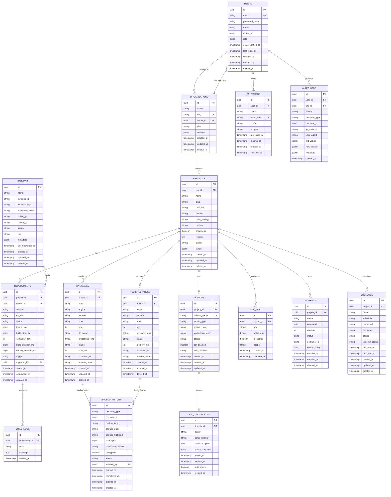

# Capsule — Database Schema

> **Version:** 1.0.0-draft  
> **Last Updated:** 2026-05-26  
> **Engine:** PostgreSQL 15+  
> **Migrations:** golang-migrate (SQL files)

---

## Table of Contents

1. [Overview](#1-overview)
2. [Entity Relationship Diagram](#2-entity-relationship-diagram)
3. [Table Definitions](#3-table-definitions)
4. [Indexes Strategy](#4-indexes-strategy)
5. [Migration Approach](#5-migration-approach)
6. [Data Retention & Archival](#6-data-retention--archival)
7. [Conventions](#7-conventions)

---

## 1. Overview

The Capsule platform database stores all operational state: users, organizations, projects, deployments, managed databases, Redis instances, domains, environment variables, backup history, and audit trails.

### Design Principles

- **UUIDs everywhere:** All primary keys use `uuid` (v4) for portability and security
- **Soft deletes:** Critical records use `deleted_at` timestamps instead of hard deletes
- **Audit trail:** Every mutating operation is logged in `audit_logs`
- **Encrypted at rest:** Sensitive fields (passwords, tokens, connection strings) are AES-256-GCM encrypted before storage
- **Timestamps:** All tables include `created_at` and `updated_at` with timezone

---

## 2. Entity Relationship Diagram



---

## 3. Table Definitions

### 3.1 `users`

Stores user accounts for both CLI and Dashboard access.

| Column | Type | Constraints | Description |
|---|---|---|---|
| `id` | `uuid` | `PK, DEFAULT gen_random_uuid()` | Unique user identifier |
| `email` | `varchar(255)` | `NOT NULL, UNIQUE` | Login email address |
| `password_hash` | `varchar(255)` | `NOT NULL` | bcrypt hash (cost 12) |
| `name` | `varchar(100)` | `NOT NULL` | Display name |
| `avatar_url` | `text` | | Profile image URL |
| `role` | `varchar(20)` | `NOT NULL, DEFAULT 'member'` | `admin`, `member` |
| `email_verified_at` | `timestamptz` | | When email was verified |
| `last_login_at` | `timestamptz` | | Last successful login |
| `created_at` | `timestamptz` | `NOT NULL, DEFAULT now()` | Account creation |
| `updated_at` | `timestamptz` | `NOT NULL, DEFAULT now()` | Last modification |
| `deleted_at` | `timestamptz` | | Soft delete marker |

### 3.2 `organizations`

Multi-tenant organization grouping for projects and users.

| Column | Type | Constraints | Description |
|---|---|---|---|
| `id` | `uuid` | `PK, DEFAULT gen_random_uuid()` | Unique org identifier |
| `name` | `varchar(100)` | `NOT NULL` | Organization display name |
| `slug` | `varchar(100)` | `NOT NULL, UNIQUE` | URL-safe identifier |
| `owner_id` | `uuid` | `NOT NULL, FK → users(id)` | Org creator/owner |
| `plan` | `varchar(30)` | `NOT NULL, DEFAULT 'free'` | `free`, `pro`, `enterprise` |
| `settings` | `jsonb` | `DEFAULT '{}'` | Custom org settings |
| `created_at` | `timestamptz` | `NOT NULL, DEFAULT now()` | Creation timestamp |
| `updated_at` | `timestamptz` | `NOT NULL, DEFAULT now()` | Last update |
| `deleted_at` | `timestamptz` | | Soft delete marker |

### 3.3 `projects`

A deployable application unit owned by an organization.

| Column | Type | Constraints | Description |
|---|---|---|---|
| `id` | `uuid` | `PK, DEFAULT gen_random_uuid()` | Unique project identifier |
| `org_id` | `uuid` | `NOT NULL, FK → organizations(id)` | Owning organization |
| `name` | `varchar(100)` | `NOT NULL` | Project display name |
| `slug` | `varchar(100)` | `NOT NULL` | URL-safe name (unique per org) |
| `repo_url` | `text` | | Git repository URL |
| `branch` | `varchar(100)` | `DEFAULT 'main'` | Default branch to deploy |
| `build_strategy` | `varchar(30)` | `DEFAULT 'auto'` | `auto`, `dockerfile`, `buildpack`, `static` |
| `runtime` | `varchar(30)` | | Detected runtime: `go`, `node`, `python`, etc. |
| `serverless` | `boolean` | `NOT NULL, DEFAULT false` | Deploy as Lambda |
| `replicas` | `int` | `NOT NULL, DEFAULT 1` | Number of container replicas |
| `status` | `varchar(30)` | `NOT NULL, DEFAULT 'created'` | `created`, `active`, `paused`, `archived` |
| `labels` | `jsonb` | `DEFAULT '{}'` | User-defined key-value labels |
| `created_at` | `timestamptz` | `NOT NULL, DEFAULT now()` | |
| `updated_at` | `timestamptz` | `NOT NULL, DEFAULT now()` | |
| `deleted_at` | `timestamptz` | | Soft delete |

**Unique constraint:** `UNIQUE(org_id, slug) WHERE deleted_at IS NULL`

### 3.4 `deployments`

Tracks every deployment attempt and its outcome.

| Column | Type | Constraints | Description |
|---|---|---|---|
| `id` | `uuid` | `PK, DEFAULT gen_random_uuid()` | Deployment identifier |
| `project_id` | `uuid` | `NOT NULL, FK → projects(id)` | Parent project |
| `server_id` | `uuid` | `FK → servers(id)` | Target server (null for serverless) |
| `version` | `varchar(50)` | `NOT NULL` | Semver or sequential version |
| `git_sha` | `varchar(40)` | | Full git commit SHA |
| `status` | `varchar(30)` | `NOT NULL, DEFAULT 'pending'` | `pending`, `building`, `deploying`, `active`, `rolled_back`, `failed` |
| `image_tag` | `varchar(200)` | | Docker image tag |
| `build_strategy` | `varchar(30)` | | Strategy used for this build |
| `container_port` | `int` | | Port the app listens on |
| `build_duration_ms` | `bigint` | | Build time in milliseconds |
| `deploy_duration_ms` | `bigint` | | Deploy time in milliseconds |
| `trigger` | `varchar(30)` | `NOT NULL, DEFAULT 'manual'` | `manual`, `git_push`, `api`, `rollback` |
| `triggered_by` | `uuid` | `FK → users(id)` | Who initiated the deploy |
| `started_at` | `timestamptz` | | Build start time |
| `completed_at` | `timestamptz` | | Deployment completion time |
| `created_at` | `timestamptz` | `NOT NULL, DEFAULT now()` | Record creation |

### 3.5 `build_logs`

Append-only log table for build and deployment output.

| Column | Type | Constraints | Description |
|---|---|---|---|
| `id` | `uuid` | `PK, DEFAULT gen_random_uuid()` | Log entry ID |
| `deployment_id` | `uuid` | `NOT NULL, FK → deployments(id) ON DELETE CASCADE` | Parent deployment |
| `level` | `varchar(10)` | `NOT NULL, DEFAULT 'info'` | `debug`, `info`, `warn`, `error` |
| `message` | `text` | `NOT NULL` | Log message content |
| `created_at` | `timestamptz` | `NOT NULL, DEFAULT now()` | Log timestamp |

### 3.6 `databases`

Managed PostgreSQL instances provisioned per-project.

| Column | Type | Constraints | Description |
|---|---|---|---|
| `id` | `uuid` | `PK, DEFAULT gen_random_uuid()` | Database instance ID |
| `project_id` | `uuid` | `NOT NULL, FK → projects(id)` | Owning project |
| `name` | `varchar(100)` | `NOT NULL` | User-defined name |
| `engine` | `varchar(30)` | `NOT NULL, DEFAULT 'postgres'` | Database engine |
| `version` | `varchar(20)` | `NOT NULL, DEFAULT '15'` | Engine version |
| `host` | `varchar(255)` | `NOT NULL` | Container hostname or IP |
| `port` | `int` | `NOT NULL, DEFAULT 5432` | Port number |
| `db_name` | `varchar(100)` | `NOT NULL` | Database name inside the engine |
| `credentials_enc` | `bytea` | `NOT NULL` | AES-256-GCM encrypted JSON: `{user, password}` |
| `status` | `varchar(30)` | `NOT NULL, DEFAULT 'provisioning'` | `provisioning`, `running`, `stopped`, `error`, `deleted` |
| `size_mb` | `int` | `DEFAULT 0` | Approximate data size |
| `container_id` | `varchar(100)` | | Docker container ID |
| `volume_name` | `varchar(200)` | | Docker volume name for persistence |
| `created_at` | `timestamptz` | `NOT NULL, DEFAULT now()` | |
| `updated_at` | `timestamptz` | `NOT NULL, DEFAULT now()` | |
| `deleted_at` | `timestamptz` | | Soft delete |

### 3.7 `redis_instances`

Managed Redis instances for caching and pub/sub.

| Column | Type | Constraints | Description |
|---|---|---|---|
| `id` | `uuid` | `PK, DEFAULT gen_random_uuid()` | Redis instance ID |
| `project_id` | `uuid` | `NOT NULL, FK → projects(id)` | Owning project |
| `name` | `varchar(100)` | `NOT NULL` | User-defined name |
| `version` | `varchar(20)` | `NOT NULL, DEFAULT '7'` | Redis version |
| `host` | `varchar(255)` | `NOT NULL` | Container hostname |
| `port` | `int` | `NOT NULL, DEFAULT 6379` | Port |
| `password_enc` | `bytea` | `NOT NULL` | AES-256-GCM encrypted password |
| `status` | `varchar(30)` | `NOT NULL, DEFAULT 'provisioning'` | Same as databases |
| `memory_mb` | `int` | `NOT NULL, DEFAULT 256` | Max memory allocation |
| `container_id` | `varchar(100)` | | Docker container ID |
| `volume_name` | `varchar(200)` | | Docker volume for persistence |
| `created_at` | `timestamptz` | `NOT NULL, DEFAULT now()` | |
| `updated_at` | `timestamptz` | `NOT NULL, DEFAULT now()` | |
| `deleted_at` | `timestamptz` | | Soft delete |

### 3.8 `domains`

Custom domains bound to projects.

| Column | Type | Constraints | Description |
|---|---|---|---|
| `id` | `uuid` | `PK, DEFAULT gen_random_uuid()` | Domain record ID |
| `project_id` | `uuid` | `NOT NULL, FK → projects(id)` | Target project |
| `domain_name` | `varchar(255)` | `NOT NULL, UNIQUE` | Fully qualified domain name |
| `record_type` | `varchar(10)` | `NOT NULL, DEFAULT 'CNAME'` | DNS record type |
| `record_value` | `text` | | DNS record value (ALB DNS) |
| `verification_token` | `varchar(100)` | | TXT record token for ownership proof |
| `status` | `varchar(30)` | `NOT NULL, DEFAULT 'pending'` | `pending`, `verifying`, `active`, `error`, `expired` |
| `ssl_enabled` | `boolean` | `NOT NULL, DEFAULT false` | Whether SSL is active |
| `dns_provider` | `varchar(30)` | `DEFAULT 'route53'` | `route53`, `external` |
| `verified_at` | `timestamptz` | | When DNS was verified |
| `created_at` | `timestamptz` | `NOT NULL, DEFAULT now()` | |
| `updated_at` | `timestamptz` | `NOT NULL, DEFAULT now()` | |

### 3.9 `ssl_certificates`

TLS certificates managed by Let's Encrypt or imported.

| Column | Type | Constraints | Description |
|---|---|---|---|
| `id` | `uuid` | `PK, DEFAULT gen_random_uuid()` | Certificate ID |
| `domain_id` | `uuid` | `NOT NULL, FK → domains(id) ON DELETE CASCADE` | Associated domain |
| `issuer` | `varchar(100)` | `NOT NULL` | CA issuer name |
| `serial_number` | `varchar(100)` | | Certificate serial |
| `certificate_pem` | `text` | `NOT NULL` | Full certificate chain PEM |
| `private_key_enc` | `bytea` | `NOT NULL` | AES-256-GCM encrypted private key |
| `issued_at` | `timestamptz` | `NOT NULL` | Certificate issue date |
| `expires_at` | `timestamptz` | `NOT NULL` | Certificate expiry date |
| `auto_renew` | `boolean` | `NOT NULL, DEFAULT true` | Auto-renewal flag |
| `created_at` | `timestamptz` | `NOT NULL, DEFAULT now()` | |

### 3.10 `env_vars`

Encrypted environment variables per project.

| Column | Type | Constraints | Description |
|---|---|---|---|
| `id` | `uuid` | `PK, DEFAULT gen_random_uuid()` | Env var ID |
| `project_id` | `uuid` | `NOT NULL, FK → projects(id)` | Parent project |
| `key` | `varchar(255)` | `NOT NULL` | Variable name |
| `value_enc` | `bytea` | `NOT NULL` | AES-256-GCM encrypted value |
| `is_secret` | `boolean` | `NOT NULL, DEFAULT true` | Mask in UI/API responses |
| `scope` | `varchar(30)` | `NOT NULL, DEFAULT 'runtime'` | `runtime`, `build`, `both` |
| `created_at` | `timestamptz` | `NOT NULL, DEFAULT now()` | |
| `updated_at` | `timestamptz` | `NOT NULL, DEFAULT now()` | |

**Unique constraint:** `UNIQUE(project_id, key)`

### 3.11 `servers`

Physical or virtual servers in the Capsule cluster.

| Column | Type | Constraints | Description |
|---|---|---|---|
| `id` | `uuid` | `PK, DEFAULT gen_random_uuid()` | Server ID |
| `name` | `varchar(100)` | `NOT NULL` | Human-readable name |
| `instance_id` | `varchar(50)` | `UNIQUE` | AWS instance ID (i-xxx) |
| `instance_type` | `varchar(30)` | | `t3.medium`, `t3.large`, etc. |
| `availability_zone` | `varchar(20)` | | AWS AZ |
| `public_ip` | `inet` | | Public IPv4 |
| `private_ip` | `inet` | | VPC private IPv4 |
| `status` | `varchar(30)` | `NOT NULL, DEFAULT 'provisioning'` | `provisioning`, `running`, `stopped`, `terminated`, `error` |
| `role` | `varchar(30)` | `NOT NULL, DEFAULT 'worker'` | `primary`, `worker` |
| `metadata` | `jsonb` | `DEFAULT '{}'` | CPU, memory, disk info |
| `last_heartbeat_at` | `timestamptz` | | Last health check |
| `created_at` | `timestamptz` | `NOT NULL, DEFAULT now()` | |
| `updated_at` | `timestamptz` | `NOT NULL, DEFAULT now()` | |
| `deleted_at` | `timestamptz` | | Soft delete |

### 3.12 `workers`

Long-running background processes tied to projects.

| Column | Type | Constraints | Description |
|---|---|---|---|
| `id` | `uuid` | `PK, DEFAULT gen_random_uuid()` | Worker ID |
| `project_id` | `uuid` | `NOT NULL, FK → projects(id)` | Parent project |
| `name` | `varchar(100)` | `NOT NULL` | Worker process name |
| `command` | `text` | `NOT NULL` | Command to execute |
| `replicas` | `int` | `NOT NULL, DEFAULT 1` | Number of instances |
| `status` | `varchar(30)` | `NOT NULL, DEFAULT 'stopped'` | `running`, `stopped`, `error`, `restarting` |
| `container_id` | `varchar(100)` | | Docker container ID |
| `restart_policy` | `varchar(30)` | `NOT NULL, DEFAULT 'on-failure'` | `always`, `on-failure`, `never` |
| `created_at` | `timestamptz` | `NOT NULL, DEFAULT now()` | |
| `updated_at` | `timestamptz` | `NOT NULL, DEFAULT now()` | |
| `deleted_at` | `timestamptz` | | Soft delete |

### 3.13 `cronjobs`

Scheduled tasks executed via cron expressions.

| Column | Type | Constraints | Description |
|---|---|---|---|
| `id` | `uuid` | `PK, DEFAULT gen_random_uuid()` | Cron job ID |
| `project_id` | `uuid` | `NOT NULL, FK → projects(id)` | Parent project |
| `name` | `varchar(100)` | `NOT NULL` | Job name |
| `schedule` | `varchar(100)` | `NOT NULL` | Cron expression (`*/5 * * * *`) |
| `command` | `text` | `NOT NULL` | Command to execute |
| `timezone` | `varchar(50)` | `DEFAULT 'UTC'` | IANA timezone |
| `status` | `varchar(30)` | `NOT NULL, DEFAULT 'active'` | `active`, `paused`, `disabled` |
| `last_run_status` | `varchar(30)` | | `success`, `failure` |
| `last_run_at` | `timestamptz` | | Last execution time |
| `next_run_at` | `timestamptz` | | Calculated next run |
| `created_at` | `timestamptz` | `NOT NULL, DEFAULT now()` | |
| `updated_at` | `timestamptz` | `NOT NULL, DEFAULT now()` | |
| `deleted_at` | `timestamptz` | | Soft delete |

### 3.14 `backup_history`

Tracks all backup and restore operations.

| Column | Type | Constraints | Description |
|---|---|---|---|
| `id` | `uuid` | `PK, DEFAULT gen_random_uuid()` | Backup record ID |
| `resource_type` | `varchar(30)` | `NOT NULL` | `database`, `redis`, `platform`, `full` |
| `resource_id` | `uuid` | | FK to specific resource (polymorphic) |
| `backup_type` | `varchar(30)` | `NOT NULL` | `manual`, `scheduled`, `pre-deploy` |
| `storage_path` | `text` | `NOT NULL` | S3 key or local file path |
| `storage_backend` | `varchar(20)` | `NOT NULL, DEFAULT 's3'` | `s3`, `local` |
| `size_bytes` | `bigint` | | Backup file size |
| `checksum_sha256` | `varchar(64)` | | Integrity checksum |
| `encrypted` | `boolean` | `NOT NULL, DEFAULT true` | Whether AES-256 encrypted |
| `status` | `varchar(30)` | `NOT NULL, DEFAULT 'in_progress'` | `in_progress`, `completed`, `failed`, `expired` |
| `initiated_by` | `uuid` | `FK → users(id)` | Who triggered the backup |
| `started_at` | `timestamptz` | | Backup start |
| `completed_at` | `timestamptz` | | Backup finish |
| `expires_at` | `timestamptz` | | Auto-expiry date |
| `created_at` | `timestamptz` | `NOT NULL, DEFAULT now()` | |

### 3.15 `audit_logs`

Immutable audit trail for all operations. **Append-only — no UPDATEs or DELETEs.**

| Column | Type | Constraints | Description |
|---|---|---|---|
| `id` | `uuid` | `PK, DEFAULT gen_random_uuid()` | Log entry ID |
| `user_id` | `uuid` | `FK → users(id)` | Acting user (null for system) |
| `org_id` | `uuid` | `FK → organizations(id)` | Organization context |
| `action` | `varchar(50)` | `NOT NULL` | `create`, `update`, `delete`, `deploy`, `login`, etc. |
| `resource_type` | `varchar(50)` | `NOT NULL` | `project`, `database`, `domain`, `user`, etc. |
| `resource_id` | `uuid` | | Target resource ID |
| `ip_address` | `inet` | | Client IP address |
| `user_agent` | `text` | | Client user-agent string |
| `old_values` | `jsonb` | | Previous state (for updates) |
| `new_values` | `jsonb` | | New state (for creates/updates) |
| `metadata` | `jsonb` | `DEFAULT '{}'` | Extra context |
| `created_at` | `timestamptz` | `NOT NULL, DEFAULT now()` | Event timestamp |

### 3.16 `api_tokens`

Personal access tokens for CLI and API authentication.

| Column | Type | Constraints | Description |
|---|---|---|---|
| `id` | `uuid` | `PK, DEFAULT gen_random_uuid()` | Token record ID |
| `user_id` | `uuid` | `NOT NULL, FK → users(id)` | Token owner |
| `name` | `varchar(100)` | `NOT NULL` | Token label (e.g. "CLI laptop") |
| `token_hash` | `varchar(255)` | `NOT NULL, UNIQUE` | SHA-256 hash of the actual token |
| `prefix` | `varchar(10)` | `NOT NULL` | First 8 chars for identification (e.g. `cap_1a2b`) |
| `scopes` | `text` | `NOT NULL, DEFAULT '*'` | Comma-separated scopes or `*` for full access |
| `last_used_at` | `timestamptz` | | Last time the token was used |
| `expires_at` | `timestamptz` | | Optional expiry (null = never) |
| `created_at` | `timestamptz` | `NOT NULL, DEFAULT now()` | |
| `revoked_at` | `timestamptz` | | When the token was revoked |

---

## 4. Indexes Strategy

### Primary & Unique Indexes (automatic)

All `PK` and `UNIQUE` constraints create indexes automatically.

### Query-Optimized Indexes

```sql
-- Users
CREATE INDEX idx_users_email ON users(email) WHERE deleted_at IS NULL;
CREATE INDEX idx_users_role ON users(role) WHERE deleted_at IS NULL;

-- Organizations
CREATE INDEX idx_orgs_owner ON organizations(owner_id) WHERE deleted_at IS NULL;
CREATE INDEX idx_orgs_slug ON organizations(slug) WHERE deleted_at IS NULL;

-- Projects
CREATE INDEX idx_projects_org ON projects(org_id) WHERE deleted_at IS NULL;
CREATE INDEX idx_projects_org_slug ON projects(org_id, slug) WHERE deleted_at IS NULL;
CREATE INDEX idx_projects_status ON projects(status) WHERE deleted_at IS NULL;

-- Deployments
CREATE INDEX idx_deployments_project ON deployments(project_id);
CREATE INDEX idx_deployments_project_status ON deployments(project_id, status);
CREATE INDEX idx_deployments_created ON deployments(created_at DESC);
CREATE INDEX idx_deployments_server ON deployments(server_id) WHERE server_id IS NOT NULL;

-- Build Logs (high-volume, partitioned by deployment)
CREATE INDEX idx_build_logs_deployment ON build_logs(deployment_id, created_at);

-- Databases & Redis
CREATE INDEX idx_databases_project ON databases(project_id) WHERE deleted_at IS NULL;
CREATE INDEX idx_redis_project ON redis_instances(project_id) WHERE deleted_at IS NULL;

-- Domains
CREATE INDEX idx_domains_project ON domains(project_id);
CREATE INDEX idx_domains_status ON domains(status);

-- Env Vars
CREATE INDEX idx_env_vars_project ON env_vars(project_id);

-- Servers
CREATE INDEX idx_servers_status ON servers(status) WHERE deleted_at IS NULL;
CREATE INDEX idx_servers_role ON servers(role) WHERE deleted_at IS NULL;

-- Workers & Cron Jobs
CREATE INDEX idx_workers_project ON workers(project_id) WHERE deleted_at IS NULL;
CREATE INDEX idx_cronjobs_project ON cronjobs(project_id) WHERE deleted_at IS NULL;
CREATE INDEX idx_cronjobs_next_run ON cronjobs(next_run_at) WHERE status = 'active';

-- Backup History
CREATE INDEX idx_backups_resource ON backup_history(resource_type, resource_id);
CREATE INDEX idx_backups_status ON backup_history(status);
CREATE INDEX idx_backups_created ON backup_history(created_at DESC);

-- Audit Logs (high-volume, time-series)
CREATE INDEX idx_audit_user ON audit_logs(user_id, created_at DESC);
CREATE INDEX idx_audit_org ON audit_logs(org_id, created_at DESC);
CREATE INDEX idx_audit_resource ON audit_logs(resource_type, resource_id);
CREATE INDEX idx_audit_action ON audit_logs(action, created_at DESC);

-- API Tokens
CREATE INDEX idx_tokens_user ON api_tokens(user_id) WHERE revoked_at IS NULL;
CREATE INDEX idx_tokens_prefix ON api_tokens(prefix);
```

### Partial Indexes

Partial indexes (using `WHERE` clauses) are used extensively to:
- Exclude soft-deleted records from common queries
- Filter active-only cron jobs for the scheduler
- Reduce index size and improve write performance

### Future Considerations

- **Partitioning `build_logs`** by month once volume exceeds 10M rows
- **Partitioning `audit_logs`** by month for compliance retention
- **GIN index on `jsonb` columns** (`labels`, `metadata`, `settings`) if filtered frequently

---

## 5. Migration Approach

### Tool: golang-migrate

Migrations are stored as numbered SQL files in `migrations/`:

```
migrations/
  000001_create_users.up.sql
  000001_create_users.down.sql
  000002_create_organizations.up.sql
  000002_create_organizations.down.sql
  000003_create_projects.up.sql
  000003_create_projects.down.sql
  ...
```

### Migration Commands

```bash
# Apply all pending migrations
migrate -path migrations -database "$DATABASE_URL" up

# Rollback the last migration
migrate -path migrations -database "$DATABASE_URL" down 1

# Go to a specific version
migrate -path migrations -database "$DATABASE_URL" goto 5

# Check current version
migrate -path migrations -database "$DATABASE_URL" version

# Force version (fix dirty state)
migrate -path migrations -database "$DATABASE_URL" force 5
```

### Migration Rules

1. **Every migration must be reversible** — always write both `.up.sql` and `.down.sql`
2. **Never modify an existing migration** — create a new one instead
3. **Use transactions** — wrap each migration in `BEGIN; ... COMMIT;`
4. **Test both directions** — run `up` then `down` then `up` to verify idempotency
5. **No data migrations in schema files** — separate data migration scripts
6. **Review in PR** — all migrations require code review

### Example Migration

```sql
-- 000001_create_users.up.sql
BEGIN;

CREATE EXTENSION IF NOT EXISTS "pgcrypto";

CREATE TABLE users (
    id          uuid PRIMARY KEY DEFAULT gen_random_uuid(),
    email       varchar(255) NOT NULL,
    password_hash varchar(255) NOT NULL,
    name        varchar(100) NOT NULL,
    avatar_url  text,
    role        varchar(20) NOT NULL DEFAULT 'member',
    email_verified_at timestamptz,
    last_login_at     timestamptz,
    created_at  timestamptz NOT NULL DEFAULT now(),
    updated_at  timestamptz NOT NULL DEFAULT now(),
    deleted_at  timestamptz,

    CONSTRAINT uq_users_email UNIQUE (email)
);

CREATE INDEX idx_users_email ON users(email) WHERE deleted_at IS NULL;

COMMIT;
```

```sql
-- 000001_create_users.down.sql
BEGIN;
DROP TABLE IF EXISTS users;
COMMIT;
```

---

## 6. Data Retention & Archival

| Table | Retention | Strategy |
|---|---|---|
| `users` | Indefinite | Soft delete, GDPR erasure on request |
| `deployments` | 90 days (inactive) | Archive to S3, keep latest 50 per project |
| `build_logs` | 30 days | Partition by month, drop old partitions |
| `audit_logs` | 1 year | Partition by month, archive to S3 |
| `backup_history` | Per `expires_at` | Background worker cleans expired records |
| `api_tokens` | Until revoked | Periodic cleanup of expired tokens |

---

## 7. Conventions

| Convention | Rule |
|---|---|
| **Primary Keys** | `uuid`, column name `id` |
| **Foreign Keys** | `{table_singular}_id` (e.g. `project_id`) |
| **Timestamps** | `timestamptz`, always UTC |
| **Soft Deletes** | `deleted_at timestamptz` (NULL = active) |
| **Encryption** | Sensitive fields stored as `bytea` with `_enc` suffix |
| **Booleans** | Prefix with `is_` or `has_` (e.g. `is_secret`) |
| **Enums** | Stored as `varchar`, validated in application layer |
| **JSON** | `jsonb` type for flexible/nested data |
| **Naming** | `snake_case` for tables and columns |
| **Table names** | Plural (e.g. `users`, `projects`, `deployments`) |

---

> **Resumen (ES):** Documentación completa del esquema de base de datos de Capsule. Incluye diagrama de entidad-relación (ERD), definiciones detalladas de las 16 tablas (usuarios, organizaciones, proyectos, despliegues, logs de build, bases de datos, instancias Redis, dominios, certificados SSL, variables de entorno, servidores, workers, cron jobs, historial de backups, logs de auditoría, y tokens API), estrategia de índices con índices parciales, y enfoque de migraciones con golang-migrate.
