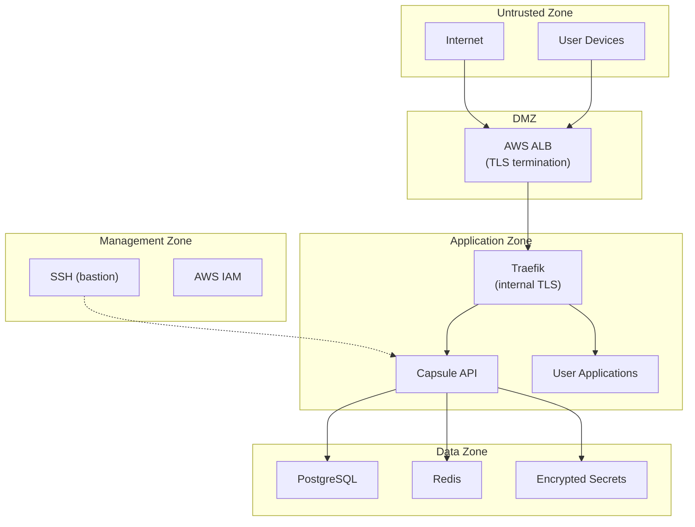
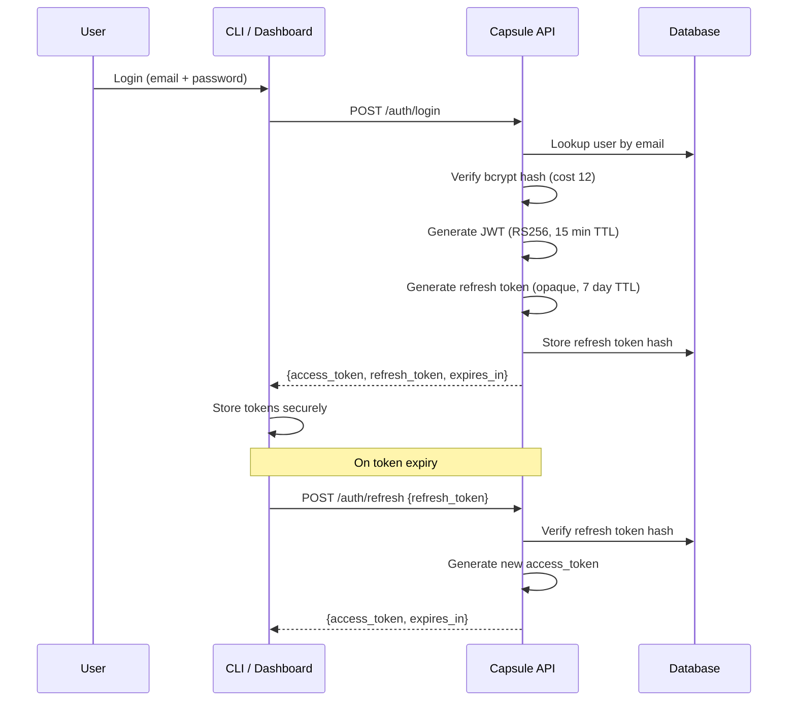
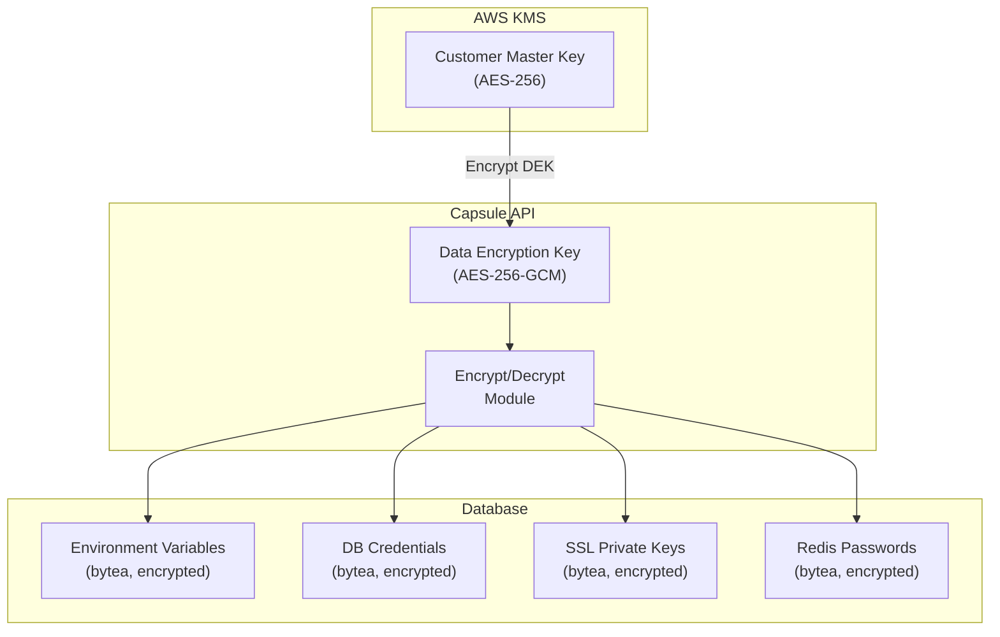
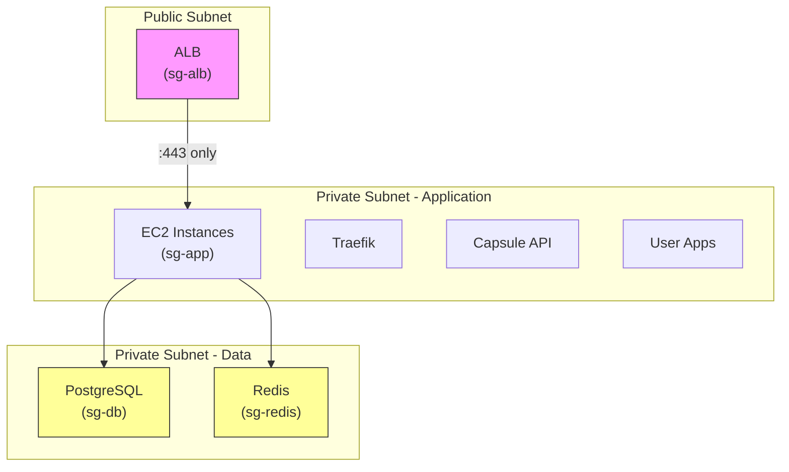
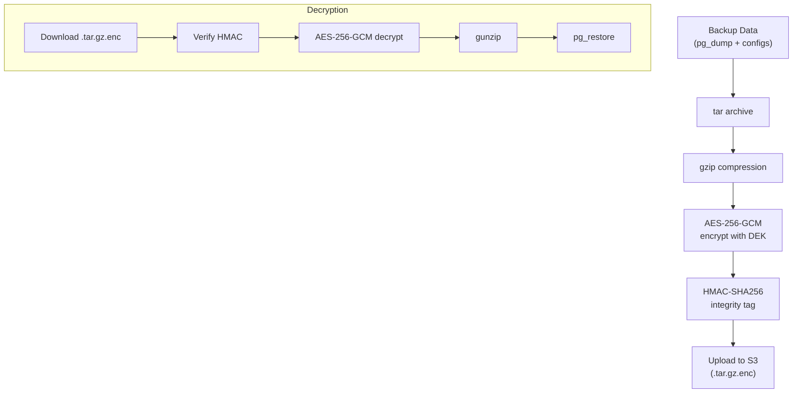
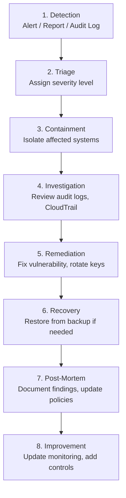

# Capsule — Security Model

> **Version:** 1.0.0-draft  
> **Last Updated:** 2026-05-26  
> **Classification:** Internal — Engineering  
> **Review Cadence:** Quarterly

---

## Table of Contents

1. [Security Overview](#1-security-overview)
2. [Threat Model — STRIDE Analysis](#2-threat-model--stride-analysis)
3. [Authentication Architecture](#3-authentication-architecture)
4. [Authorization Model](#4-authorization-model)
5. [Secret Management](#5-secret-management)
6. [Network Security](#6-network-security)
7. [Encryption](#7-encryption)
8. [Audit Logging](#8-audit-logging)
9. [Supply Chain Security](#9-supply-chain-security)
10. [Compliance Considerations](#10-compliance-considerations)
11. [Incident Response Plan](#11-incident-response-plan)
12. [Security Checklist](#12-security-checklist)

---

## 1. Security Overview

Capsule is a self-hosted PaaS that handles sensitive assets: source code, database credentials, environment secrets, SSL private keys, and production data. This document defines the security model that protects these assets across all layers.

### Security Principles

| Principle | Implementation |
|---|---|
| **Defense in Depth** | Multiple overlapping layers: network, transport, application, data |
| **Least Privilege** | IAM policies scoped by tag; RBAC per user role |
| **Zero Trust Network** | TLS everywhere; all service-to-service calls authenticated |
| **Secrets Never in Plaintext** | AES-256-GCM at rest; TLS 1.3 in transit |
| **Audit Everything** | Immutable audit logs for all mutating operations |
| **Fail Secure** | Errors default to deny; no security fallbacks |

### Trust Boundaries



---

## 2. Threat Model — STRIDE Analysis

### 2.1 Spoofing

| Threat | Attack Vector | Mitigation |
|---|---|---|
| Impersonation of a user | Stolen JWT or API token | Short-lived JWTs (15 min); token revocation; rate-limited login |
| Impersonation of API server | DNS hijacking, MITM | TLS 1.3 on all endpoints; HSTS headers; certificate pinning in CLI |
| Forged deployment | Unauthorized deploy trigger | Auth required on all deploy endpoints; audit logging |

### 2.2 Tampering

| Threat | Attack Vector | Mitigation |
|---|---|---|
| Modified source code in transit | MITM during upload | TLS-encrypted upload; SHA-256 checksums |
| Modified backup files | S3 object tampering | Backup checksums (SHA-256); S3 versioning; AES-256-GCM |
| Modified environment variables | Database compromise | Values encrypted with AES-256-GCM; master key in AWS KMS |
| Container image tampering | Registry access | Local registry; image signing; content trust |

### 2.3 Repudiation

| Threat | Attack Vector | Mitigation |
|---|---|---|
| Denied deployment action | User claims they didn't deploy | Immutable audit logs with user ID, IP, timestamp, user-agent |
| Denied credential access | User accessed secrets | `GET /connection-string` logged in audit trail |
| Deleted evidence | Admin clears logs | Audit log table is append-only (no UPDATE/DELETE in app layer); CloudTrail backup |

### 2.4 Information Disclosure

| Threat | Attack Vector | Mitigation |
|---|---|---|
| Database credentials leaked | API response exposes secrets | Secrets redacted by default; explicit auth for reveal endpoints |
| Source code accessed | Unauthorized container access | Docker network isolation; no SSH to app containers |
| Log data exposure | Sensitive data in logs | Structured logging; secret scrubbing middleware |
| Backup decryption | Key compromise | AES-256-GCM; keys in KMS; key rotation |

### 2.5 Denial of Service

| Threat | Attack Vector | Mitigation |
|---|---|---|
| API flooding | High request volume | Rate limiting per endpoint; WAF rules on ALB |
| Resource exhaustion | Many concurrent deploys | Concurrent deploy queue (max 3); resource quotas per org |
| Database overload | Excessive queries | Connection pooling; query timeouts; pg_stat monitoring |
| Disk exhaustion | Large log/build volume | Log rotation; build artifact cleanup; disk usage alerts |

### 2.6 Elevation of Privilege

| Threat | Attack Vector | Mitigation |
|---|---|---|
| Member → Admin escalation | API bypass | Server-side role checks on every request; no client trust |
| Container escape | Kernel exploit | Unprivileged containers; no `--privileged`; seccomp profiles |
| SQL injection | Malicious input | Parameterized queries (sqlc); input validation |
| SSRF via user apps | App targets internal services | Network segmentation; internal services on separate Docker network |

---

## 3. Authentication Architecture

### 3.1 JWT Token Flow



### 3.2 JWT Claims

```json
{
  "sub": "550e8400-e29b-41d4-a716-446655440000",
  "email": "dev@example.com",
  "role": "admin",
  "org_id": "880e8400-e29b-41d4-a716-446655440003",
  "iat": 1716710800,
  "exp": 1716711700,
  "iss": "capsule",
  "aud": "capsule-api"
}
```

### 3.3 Token Security

| Property | Value | Rationale |
|---|---|---|
| Algorithm | RS256 (RSA + SHA-256) | Asymmetric; verify without signing key |
| Access token TTL | 15 minutes | Short window for stolen tokens |
| Refresh token TTL | 7 days | Balance between security and UX |
| Refresh token storage | SHA-256 hash in DB | Prevents use if DB is compromised |
| Refresh token rotation | Yes | Old token invalidated on each refresh |
| Token revocation | Immediate via DB | Logout invalidates all sessions |

### 3.4 API Key Authentication

```
Format:  cap_{8_char_prefix}_{32_char_random}
Example: cap_1a2b3c4d_e5f6g7h8i9j0k1l2m3n4o5p6q7r8s9t0
```

| Property | Value |
|---|---|
| Hash algorithm | SHA-256 |
| Stored in DB | Hash only (original never stored) |
| Prefix exposed | First 8 chars for identification |
| Scopes | Comma-separated permissions or `*` |
| Rate limit | Same as JWT-authenticated requests |

### 3.5 Password Policy

| Requirement | Value |
|---|---|
| Minimum length | 12 characters |
| Complexity | At least 1 uppercase, 1 lowercase, 1 digit, 1 special |
| Hash algorithm | bcrypt (cost 12) |
| Breach check | Cross-reference with HaveIBeenPwned API (k-anonymity) |
| Max login attempts | 5 per minute per email |
| Lockout duration | 15 minutes after 10 failed attempts |

---

## 4. Authorization Model

### 4.1 Role-Based Access Control (RBAC)

| Role | Permissions |
|---|---|
| **Admin** | Full access to all resources; user management; org settings |
| **Member** | CRUD on projects, databases, Redis, domains, env vars, deployments |
| **Viewer** (future) | Read-only access to projects, deployments, logs |
| **Deploy** (future) | Deploy-only access; cannot modify settings or secrets |

### 4.2 Permission Checks

Every API request passes through the authorization middleware:

```
Request → Auth Middleware → Role Check → Resource Ownership Check → Handler
```

1. **Auth Middleware:** Validates JWT or API key
2. **Role Check:** Verifies user role has permission for the action
3. **Resource Ownership:** Ensures the resource belongs to the user's organization
4. **Handler:** Executes the business logic

### 4.3 API Scopes (for API Keys)

| Scope | Description |
|---|---|
| `*` | Full access |
| `projects:read` | List and view projects |
| `projects:write` | Create, update, delete projects |
| `deployments:read` | View deployments and logs |
| `deployments:write` | Trigger and rollback deployments |
| `databases:*` | Full database management |
| `redis:*` | Full Redis management |
| `domains:*` | Domain binding and SSL |
| `env:read` | View env var keys (not values) |
| `env:write` | Set and delete env vars |
| `backups:*` | Create and restore backups |
| `servers:*` | Server management |
| `admin:*` | Admin-only operations |

---

## 5. Secret Management

### 5.1 Encryption Architecture



### 5.2 Envelope Encryption

1. **AWS KMS** generates and stores the Customer Master Key (CMK)
2. On startup, Capsule API requests a **Data Encryption Key (DEK)** from KMS
3. KMS returns a plaintext DEK + encrypted DEK
4. Capsule uses the plaintext DEK for all encrypt/decrypt operations
5. The encrypted DEK is stored alongside the Capsule config
6. On restart, Capsule sends the encrypted DEK to KMS for decryption

**Key rotation:** KMS automatic rotation (annually) or manual trigger

### 5.3 What Gets Encrypted

| Data | Encryption | Storage |
|---|---|---|
| Environment variable values | AES-256-GCM | `env_vars.value_enc` (bytea) |
| Database credentials | AES-256-GCM | `databases.credentials_enc` (bytea) |
| Redis passwords | AES-256-GCM | `redis_instances.password_enc` (bytea) |
| SSL private keys | AES-256-GCM | `ssl_certificates.private_key_enc` (bytea) |
| Backup files | AES-256-GCM | `.tar.enc` files on S3 |
| API token hashes | SHA-256 (one-way) | `api_tokens.token_hash` |
| User passwords | bcrypt (one-way) | `users.password_hash` |

### 5.4 Fallback Encryption (No KMS)

For single-server setups without AWS KMS:

1. A 256-bit master key is derived from a passphrase via **Argon2id**
2. The passphrase is provided via `CAPSULE_ENCRYPTION_KEY` environment variable
3. The derived key is used for AES-256-GCM operations

> **⚠️ Warning:** This mode has no automatic key rotation. The operator is responsible for key management.

---

## 6. Network Security

### 6.1 TLS Configuration

| Component | TLS Version | Cipher Suites |
|---|---|---|
| ALB → Client | TLS 1.2+ | AWS ELBSecurityPolicy-TLS13-1-2-2021-06 |
| Traefik → ALB | TLS 1.2+ | Modern cipher suites |
| API ↔ Database | TLS 1.2+ | `sslmode=require` |
| CLI → API | TLS 1.2+ | System CA bundle |

### 6.2 Security Headers

All HTTP responses include:

```
Strict-Transport-Security: max-age=31536000; includeSubDomains; preload
X-Content-Type-Options: nosniff
X-Frame-Options: DENY
X-XSS-Protection: 0
Referrer-Policy: strict-origin-when-cross-origin
Content-Security-Policy: default-src 'self'; script-src 'self'; style-src 'self' 'unsafe-inline'
Permissions-Policy: camera=(), microphone=(), geolocation=()
```

### 6.3 Network Segmentation



### 6.4 Docker Network Isolation

```yaml
networks:
  capsule-internal:        # API, DB, Redis, Traefik
    internal: true
    driver: bridge
  capsule-proxy:           # Traefik ↔ App containers
    driver: bridge
  app-{project}-network:   # Per-project isolation
    internal: true
    driver: bridge
```

- Application containers **cannot** communicate with each other
- Application containers **cannot** access the platform database
- Application containers **can** access their own provisioned databases/Redis

### 6.5 Firewall Rules

| Rule | Source | Destination | Port | Protocol |
|---|---|---|---|---|
| Internet → ALB | 0.0.0.0/0 | ALB | 443 | HTTPS |
| Internet → ALB | 0.0.0.0/0 | ALB | 80 | HTTP (redirect) |
| ALB → App | sg-alb | sg-app | 80 | HTTP |
| App → DB | sg-app | sg-db | 5432 | PostgreSQL |
| App → Redis | sg-app | sg-redis | 6379 | Redis |
| Bastion → App | sg-bastion | sg-app | 22 | SSH |
| All other | * | * | * | **DENY** |

---

## 7. Encryption

### 7.1 Encryption at Rest

| Data Store | Encryption | Key Management |
|---|---|---|
| Platform PostgreSQL | AES-256 (volume) | LUKS or EBS encryption |
| User databases | AES-256 (volume) | LUKS or EBS encryption |
| Redis data | AES-256 (volume) | EBS encryption |
| S3 backups | SSE-S3 + AES-256-GCM (file level) | AWS-managed + Capsule DEK |
| Sensitive DB fields | AES-256-GCM (field level) | Capsule DEK via KMS |
| Docker volumes | EBS encryption | AWS KMS |

### 7.2 Encryption in Transit

| Channel | Encryption | Certificate |
|---|---|---|
| User → ALB | TLS 1.3 | ACM or Let's Encrypt |
| ALB → Traefik | TLS 1.2 | Self-signed (internal) |
| API → PostgreSQL | TLS 1.2 | PostgreSQL self-signed |
| CLI → API | TLS 1.3 | Let's Encrypt |
| Backup upload → S3 | TLS 1.2 | AWS-managed |

### 7.3 Backup Encryption



---

## 8. Audit Logging

### 8.1 What Gets Logged

Every mutating API call creates an audit log entry:

| Event | Data Captured |
|---|---|
| User login | user_id, IP, user_agent, success/failure |
| User registration | user_id, email |
| Project CRUD | project_id, old/new values |
| Deployment | project_id, version, trigger, git_sha |
| Database create/delete | database_id, engine, version |
| Secret access | env_var key, user_id (value NOT logged) |
| Domain binding | domain_name, project_id |
| Backup/Restore | backup_id, resource_type, size |
| API token creation | token_id, scopes, expiry |

### 8.2 Audit Log Schema

```json
{
  "id": "uuid",
  "user_id": "uuid",
  "org_id": "uuid",
  "action": "deployment.create",
  "resource_type": "deployment",
  "resource_id": "uuid",
  "ip_address": "203.0.113.42",
  "user_agent": "capsule-cli/1.0.0 (darwin/arm64)",
  "old_values": null,
  "new_values": {
    "version": "v4",
    "status": "building"
  },
  "metadata": {
    "git_sha": "abc1234",
    "trigger": "manual"
  },
  "created_at": "2026-05-26T08:46:40Z"
}
```

### 8.3 Log Integrity

- **Append-only:** Application layer enforces no UPDATE or DELETE on `audit_logs`
- **Database-level protection:** `REVOKE UPDATE, DELETE ON audit_logs FROM capsule_app_user`
- **Backup:** Audit logs are included in platform backups and replicated to CloudWatch Logs
- **Retention:** 1 year in database, archived to S3 Glacier after

### 8.4 Monitoring & Alerting

| Alert | Trigger | Notification |
|---|---|---|
| Brute force login | 10+ failed logins in 5 min | SNS → Email/Slack |
| Unusual deploy | Deploy outside business hours | SNS → Slack |
| Secret access | Connection string retrieved | Audit log entry |
| Admin action | Role change, user deletion | SNS → Email |
| Backup failure | Backup status = failed | SNS → Email/PagerDuty |
| SSL expiry | Certificate expires in < 14 days | SNS → Email |

---

## 9. Supply Chain Security

### 9.1 Dependency Management

| Layer | Tool | Verification |
|---|---|---|
| Go modules | `go.sum` | Checksum database (sum.golang.org) |
| Node.js (Dashboard) | `package-lock.json` | npm audit; Snyk |
| Docker base images | Official images | SHA digest pinning |
| GitHub Actions | Tagged releases | SHA pinning for actions |

### 9.2 Container Security

```dockerfile
# Base image: pinned by digest, not tag
FROM golang:1.22-alpine@sha256:abc123... AS builder

# Non-root user
RUN adduser -D -u 1001 capsule
USER capsule

# Read-only filesystem
# (enforced in docker-compose: read_only: true)

# No privileged mode
# No host networking
# Seccomp default profile
```

### 9.3 Build Verification

1. **Reproducible builds:** `go build` with `-trimpath -ldflags '-s -w'`
2. **SBOM generation:** `syft` generates Software Bill of Materials
3. **Vulnerability scanning:** `trivy` scans images before deployment
4. **Binary signing:** cosign for release binaries

---

## 10. Compliance Considerations

### 10.1 SOC 2 Alignment

| Control | Capsule Implementation |
|---|---|
| **Access Control** | RBAC, JWT auth, API key scopes |
| **Audit Logging** | Immutable audit_logs table |
| **Encryption** | AES-256 at rest, TLS 1.3 in transit |
| **Availability** | Auto-scaling, health checks, backup/restore |
| **Incident Response** | Documented IRP (Section 11) |

### 10.2 GDPR Alignment

| Requirement | Capsule Implementation |
|---|---|
| **Data minimization** | Collect only email, name, password hash |
| **Right to erasure** | `DELETE /users/:id` endpoint (admin); data purge script |
| **Data portability** | `capsule package --everything` exports all data |
| **Encryption** | All PII encrypted at rest |
| **Breach notification** | Audit logs enable forensics; SNS alerts |

### 10.3 HIPAA Considerations

> **Note:** Capsule is not HIPAA-certified out of the box. For HIPAA workloads:
> - Enable EBS encryption with customer-managed KMS keys
> - Enable CloudTrail for all API calls
> - Implement BAA (Business Associate Agreement) with AWS
> - Enable VPC Flow Logs
> - Restrict access to PHI-containing databases

---

## 11. Incident Response Plan

### 11.1 Severity Levels

| Level | Description | Response Time | Example |
|---|---|---|---|
| **P1 Critical** | Data breach, service down | 15 min | Credentials leaked, total outage |
| **P2 High** | Security vulnerability, partial outage | 1 hour | SQL injection found, one service down |
| **P3 Medium** | Suspicious activity, performance degradation | 4 hours | Unusual login pattern, slow deploys |
| **P4 Low** | Policy violation, minor issue | 24 hours | Missed key rotation, dependency CVE |

### 11.2 Response Procedure



### 11.3 Containment Actions

| Scenario | Immediate Action |
|---|---|
| **Stolen API token** | Revoke token via `api_tokens.revoked_at`; force re-auth |
| **Compromised database** | Rotate credentials; restore from clean backup |
| **Container escape** | Terminate instance; launch from clean AMI |
| **DNS hijack** | Lock Route 53 records; contact registrar |
| **Credential leak (public)** | Rotate all secrets; notify affected users; audit access logs |
| **DDoS attack** | Enable WAF rules; scale ALB; engage AWS Shield |

### 11.4 Communication Template

```
Subject: [Capsule Security Incident] P{severity} - {brief description}

Summary: {what happened}
Impact: {affected users/services}
Timeline: {when detected, contained, resolved}
Root Cause: {how it happened}
Remediation: {what was done}
Prevention: {what will change}
```

---

## 12. Security Checklist

### Pre-Deployment

- [ ] IAM role uses least-privilege policy
- [ ] Instance profile configured (no static API keys)
- [ ] KMS key created for encryption
- [ ] VPC with private subnets configured
- [ ] Security groups follow deny-all-by-default
- [ ] TLS certificates provisioned
- [ ] Initial admin password meets policy
- [ ] Audit logging enabled
- [ ] Backup encryption enabled
- [ ] CloudTrail enabled for the AWS account

### Ongoing Operations

- [ ] API keys rotated every 90 days
- [ ] SSL certificates auto-renewing
- [ ] Backup integrity verified monthly
- [ ] Dependency vulnerabilities scanned weekly
- [ ] Docker base images updated monthly
- [ ] Audit logs reviewed monthly
- [ ] Failed login attempts monitored
- [ ] Unused API tokens revoked
- [ ] Disk encryption verified
- [ ] Security patches applied within 7 days of release

### Incident Readiness

- [ ] Incident response plan reviewed quarterly
- [ ] Contact list up to date
- [ ] Backup restore tested quarterly
- [ ] Runbooks for common scenarios documented
- [ ] Alert notifications functional (test fire)

---

> **Resumen (ES):** Modelo de seguridad completo de Capsule. Incluye análisis de amenazas STRIDE (spoofing, tampering, repudiation, information disclosure, denial of service, elevation of privilege), arquitectura de autenticación (JWT RS256 + API keys), modelo de autorización RBAC, gestión de secretos con envelope encryption (KMS + AES-256-GCM), seguridad de red (VPC, security groups, TLS, headers HTTP), cifrado en reposo y en tránsito, auditoría inmutable, seguridad de la cadena de suministro, consideraciones de cumplimiento (SOC 2, GDPR, HIPAA), plan de respuesta a incidentes con procedimientos paso a paso, y checklist de seguridad para pre-despliegue y operaciones continuas.
