# Capsule — System Architecture

> **Version:** 1.0.0-draft  
> **Last Updated:** 2026-05-26  
> **Status:** Living Document  
> **Audience:** Core team, contributors, DevOps engineers

---

## Table of Contents

1. [Overview](#1-overview)
2. [Design Principles](#2-design-principles)
3. [High-Level System Overview](#3-high-level-system-overview)
4. [Component Breakdown](#4-component-breakdown)
5. [Network Architecture](#5-network-architecture)
6. [Container Orchestration](#6-container-orchestration)
7. [Data Flow by Operation](#7-data-flow-by-operation)
8. [Auto-Scaling Architecture](#8-auto-scaling-architecture)
9. [Serverless vs Dedicated Mode](#9-serverless-vs-dedicated-mode)
10. [Observability & Monitoring](#10-observability--monitoring)
11. [Failure Modes & Recovery](#11-failure-modes--recovery)
12. [Glossary](#12-glossary)

---

## 1. Overview

**Capsule** is a self-hosted Platform-as-a-Service (PaaS) that transforms a single AWS account into a fully managed deployment platform. It provides:

- **One-command deployments** from Git repositories or local source
- **Managed databases** (PostgreSQL) and caches (Redis)
- **Automatic SSL/TLS** via Let's Encrypt
- **Custom domain management** with Route 53 integration
- **Zero-downtime deploys** with rolling updates
- **Full backup/restore** with AES-256 encryption
- **CLI + Dashboard** dual-interface access

Capsule targets indie developers, small teams, and startups who want Heroku-like simplicity on their own AWS infrastructure.

---

## 2. Design Principles

| Principle | Description |
|---|---|
| **Self-Contained** | A single binary + Docker image runs the entire platform |
| **AWS-Native** | Leverages AWS primitives (EC2, ALB, Route 53, S3, Lambda) directly |
| **Security-First** | TLS everywhere, encrypted secrets, least-privilege IAM |
| **Opinionated Defaults** | Works out of the box; configurability where it matters |
| **Portable State** | `capsule package --everything` creates a complete portable backup |
| **Minimal Overhead** | Runs on a single t3.medium or scales to multi-node ASG |

---

## 3. High-Level System Overview

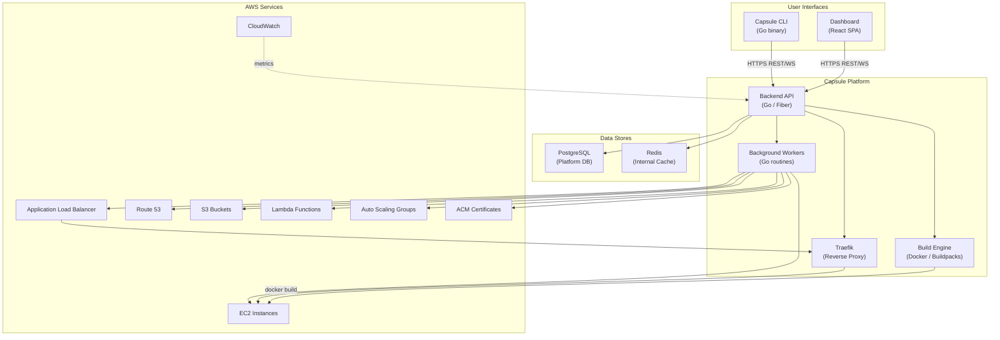

### Interaction Summary

| Interface | Transport | Auth |
|---|---|---|
| CLI → API | HTTPS + WebSocket | Bearer JWT or API Key |
| Dashboard → API | HTTPS + WebSocket | Bearer JWT (HttpOnly cookie) |
| API → AWS | AWS SDK v2 | IAM Role / Instance Profile |
| Traefik → Containers | HTTP (internal) | Docker network isolation |

---

## 4. Component Breakdown

### 4.1 Backend API (Go / Fiber)

The API server is the central control plane. It is built with the [Fiber](https://gofiber.io/) framework (v2) for high-throughput request handling.

```
cmd/
  api/            ← API entrypoint (main.go)
  cli/            ← CLI entrypoint (main.go)
  worker/         ← Background worker entrypoint
internal/
  api/
    handlers/     ← HTTP handlers per resource
    middleware/   ← Auth, rate-limit, CORS, logging
    routes/       ← Route registration
  auth/           ← JWT, API key, session management
  aws/            ← AWS SDK wrappers (EC2, R53, S3, Lambda, ALB, ASG)
  build/          ← Buildpack detection, Dockerfile generation
  config/         ← Configuration loading (env, files)
  db/             ← PostgreSQL repository layer (sqlc)
  deploy/         ← Deployment orchestrator
  domain/         ← Domain binding, DNS verification
  encryption/     ← AES-256 encrypt/decrypt helpers
  models/         ← Domain models and DTOs
  proxy/          ← Traefik dynamic config generation
  redis/          ← Redis management
  backup/         ← Backup/restore engine
  worker/         ← Worker and cron job management
  ws/             ← WebSocket hub for real-time log streaming
```

**Key Design Decisions:**

- **Fiber over net/http**: Raw performance for concurrent deploys; request-level timeouts
- **sqlc over GORM**: Type-safe SQL, no runtime reflection, explicit queries
- **AWS SDK v2**: Context-aware, modular service clients, paginated results
- **golang-migrate**: Version-controlled schema migrations as SQL files

### 4.2 CLI (Go / Cobra)

A single statically-linked binary distributed via `curl | sh`, Homebrew, and GitHub Releases.

```
capsule login           → OAuth / token-based auth
capsule init            → Link local directory to a project
capsule deploy          → Push code, trigger build, deploy
capsule logs            → Stream real-time logs via WebSocket
capsule db create       → Provision a PostgreSQL database
capsule redis create    → Provision a Redis instance
capsule domains add     → Bind custom domain
capsule env set         → Set environment variables
capsule backup create   → Create encrypted backup
capsule package         → Export full platform state
```

### 4.3 Dashboard (React + TypeScript)

A single-page application served by the API server or a CDN.

| Technology | Purpose |
|---|---|
| React 18+ | UI framework |
| TypeScript | Type safety |
| TanStack Query | Server-state management and caching |
| Tailwind CSS | Utility-first styling |
| Recharts | Metrics and usage charts |
| xterm.js | Terminal-in-browser for real-time logs |

### 4.4 Traefik Reverse Proxy

Traefik acts as the edge router for all deployed applications.

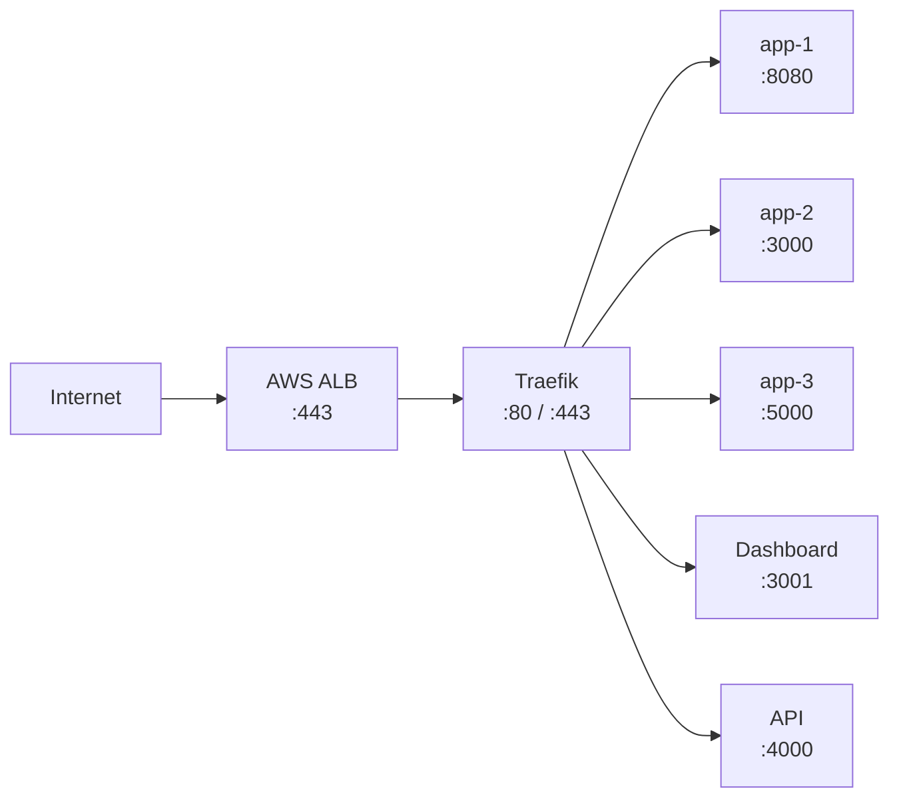

**Traefik Configuration:**

- **Provider:** Docker (label-based routing)
- **Entrypoints:** `web` (:80 → redirect to :443), `websecure` (:443)
- **Certificate Resolvers:** Let's Encrypt (HTTP-01 or DNS-01 challenge via Route 53)
- **Middleware:** Rate limiting, headers, compression, circuit breaker

### 4.5 Build Engine

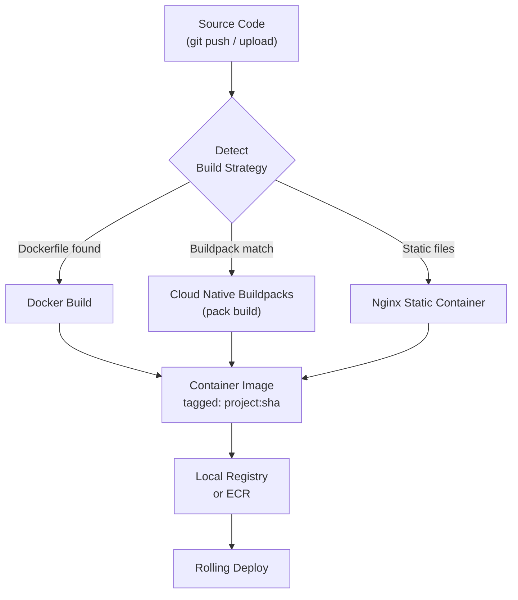

---

## 5. Network Architecture

### 5.1 VPC Layout

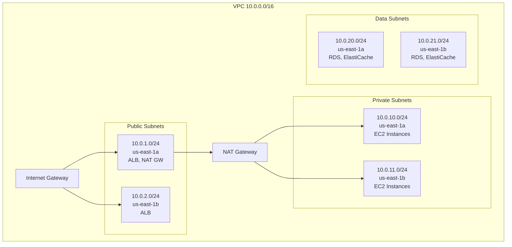

### 5.2 Security Groups

| Security Group | Inbound | Outbound | Attached To |
|---|---|---|---|
| `sg-alb` | 80, 443 from 0.0.0.0/0 | All to `sg-app` | Application Load Balancer |
| `sg-app` | 80, 443 from `sg-alb`; 22 from bastion | All outbound | EC2 instances (Capsule + apps) |
| `sg-db` | 5432 from `sg-app` | None | PostgreSQL (RDS or container) |
| `sg-redis` | 6379 from `sg-app` | None | Redis (ElastiCache or container) |
| `sg-bastion` | 22 from admin CIDR | All outbound | Bastion host (optional) |

### 5.3 DNS Architecture

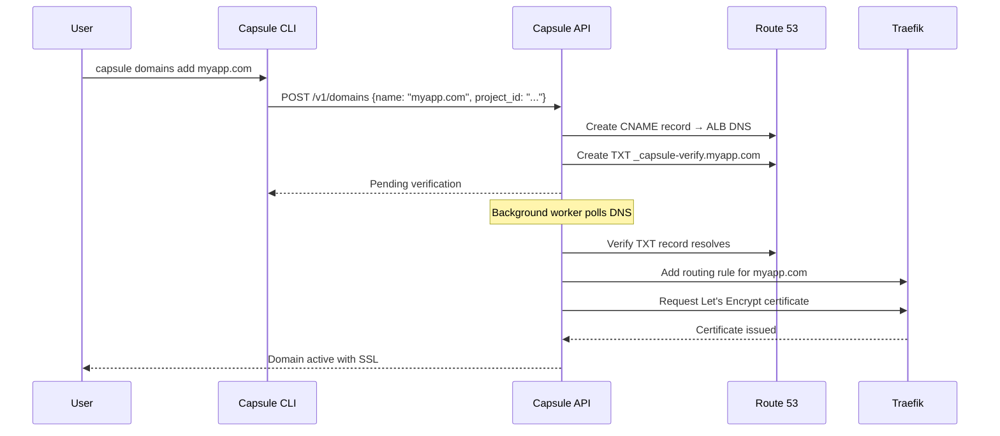

---

## 6. Container Orchestration

### 6.1 Docker Architecture

Capsule uses Docker directly (not Kubernetes) for container orchestration. This keeps complexity low while providing production-grade container management.

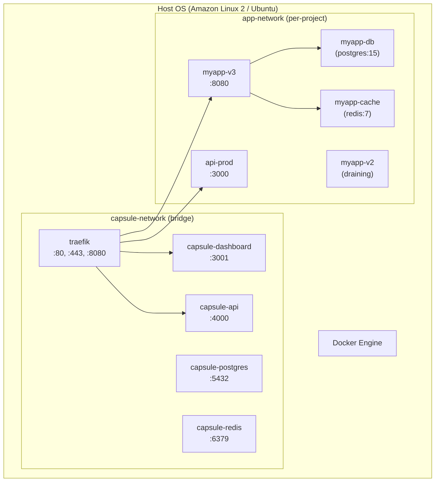

### 6.2 Container Lifecycle

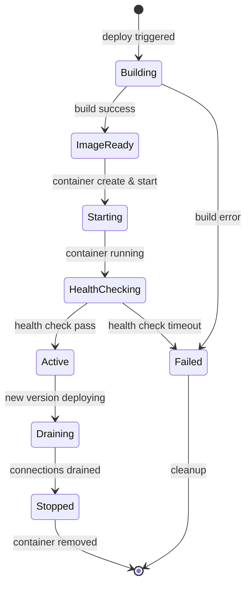

### 6.3 Rolling Deployment Strategy

1. Build new container image with tag `project:git-sha`
2. Start new container on the same Docker network
3. Wait for health check (`GET /health` returns 200)
4. Update Traefik routing to include new container
5. Mark old container as draining (stop accepting new connections)
6. Wait for drain timeout (default: 30 s)
7. Remove old container
8. Update deployment record in database

---

## 7. Data Flow by Operation

### 7.1 Deploy

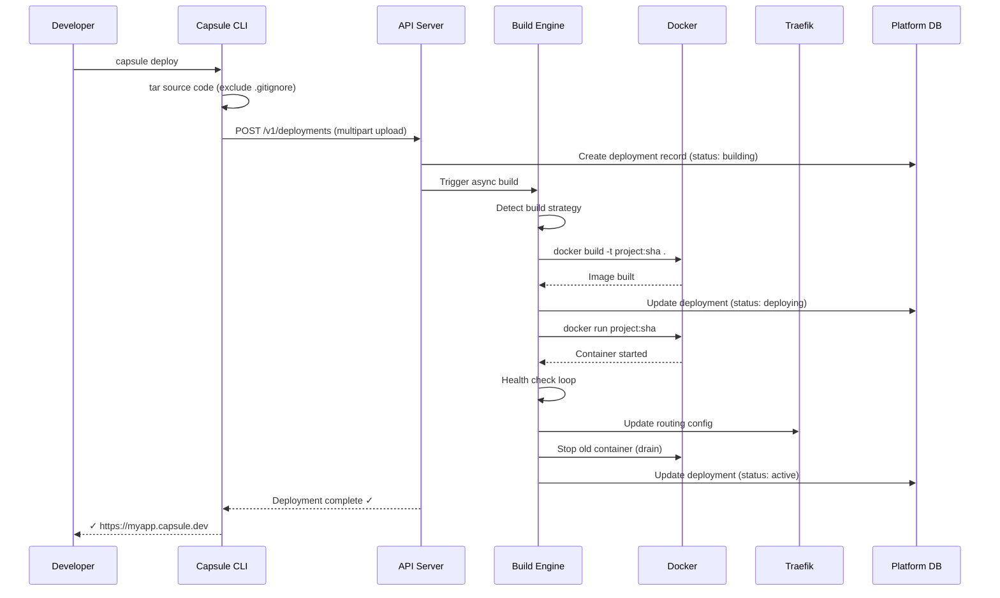

### 7.2 Create Database

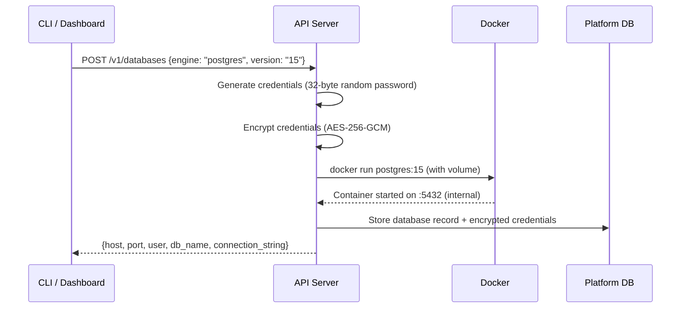

### 7.3 Manage Domains

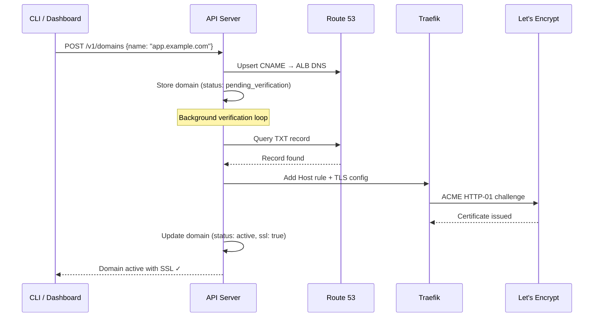

### 7.4 Backup / Package

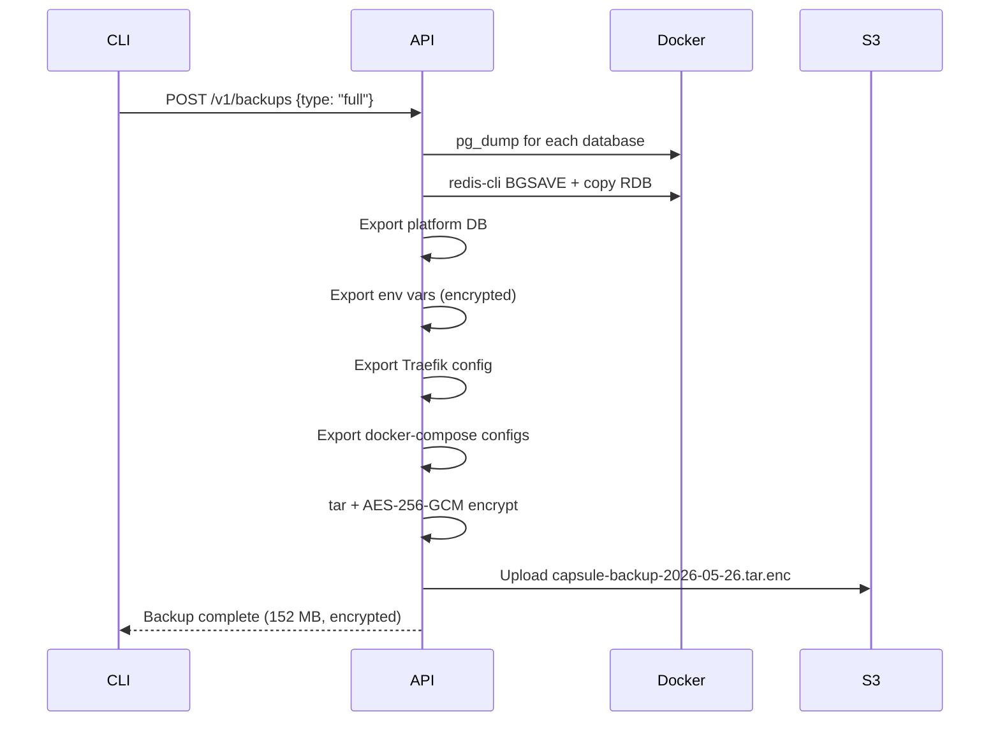

### 7.5 Auto-Scaling (Scale-Out)

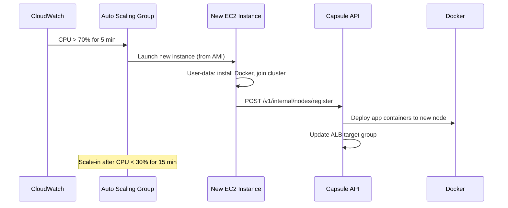

---

## 8. Auto-Scaling Architecture

### 8.1 Components

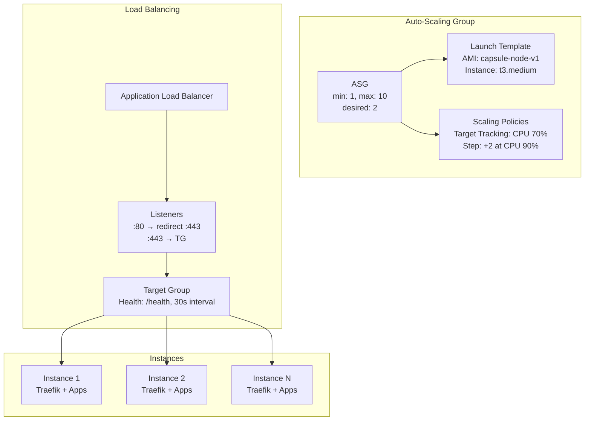

### 8.2 Scaling Policies

| Metric | Threshold | Action | Cooldown |
|---|---|---|---|
| Average CPU | > 70% for 5 min | Add 1 instance | 300 s |
| Average CPU | > 90% for 2 min | Add 2 instances | 180 s |
| Average CPU | < 30% for 15 min | Remove 1 instance | 600 s |
| Request Count | > 10,000/min | Add 1 instance | 300 s |
| Memory Utilization | > 85% for 5 min | Add 1 instance | 300 s |

### 8.3 Node Bootstrap Sequence

1. ASG launches new EC2 instance from Launch Template
2. User-data script installs Docker, pulls Capsule node agent
3. Node agent contacts the Capsule API: `POST /v1/internal/nodes/register`
4. API assigns application containers to the new node
5. Node pulls and starts containers
6. Node registers with ALB target group
7. ALB starts routing traffic after health check passes

---

## 9. Serverless vs Dedicated Mode

Capsule supports two deployment modes per project:

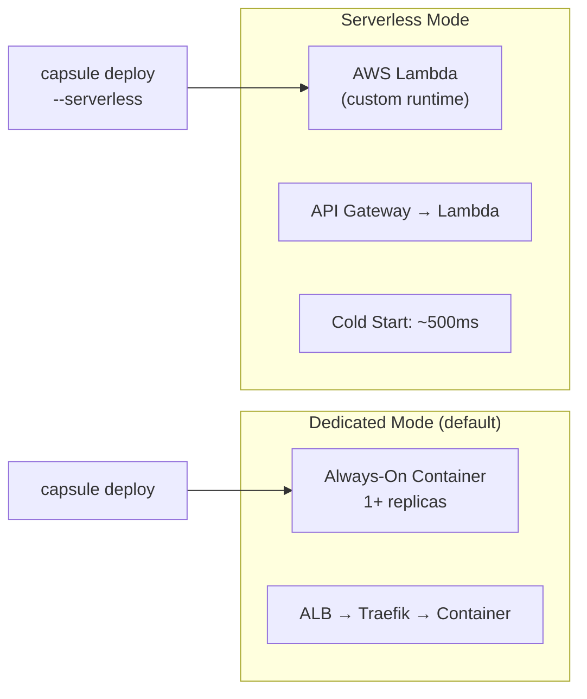

### Comparison

| Aspect | Dedicated | Serverless |
|---|---|---|
| **Latency** | ~5 ms (warm) | ~500 ms (cold start) |
| **Cost at idle** | EC2 hourly rate | $0 when idle |
| **Scaling** | ASG (minutes) | Instant (per-request) |
| **Max request duration** | Unlimited | 15 min (Lambda limit) |
| **WebSocket support** | ✅ Full support | ❌ Not supported |
| **Persistent volumes** | ✅ Docker volumes | ❌ Ephemeral only |
| **Best for** | APIs, dashboards, stateful apps | Webhooks, crons, low-traffic sites |
| **Languages** | Any (Docker) | Go, Node, Python, Ruby (custom runtime) |

### Serverless Build Pipeline

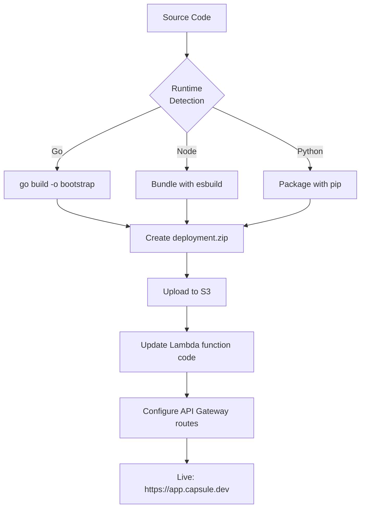

---

## 10. Observability & Monitoring

### 10.1 Metrics Pipeline

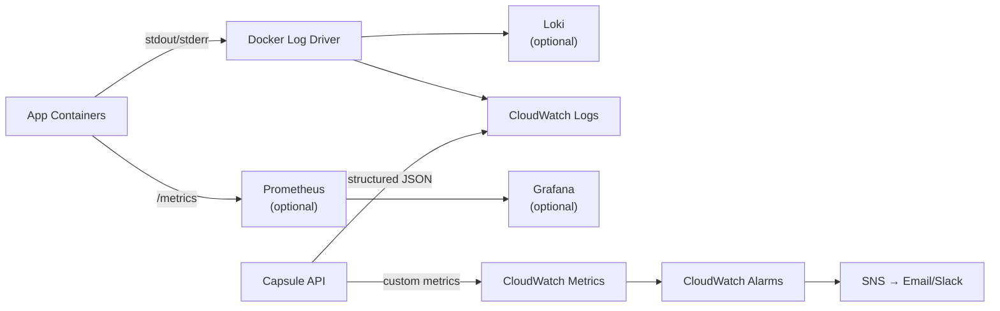

### 10.2 Health Check Strategy

| Component | Endpoint | Interval | Timeout | Healthy After | Unhealthy After |
|---|---|---|---|---|---|
| ALB → Traefik | `GET /ping` | 15 s | 5 s | 2 checks | 3 checks |
| Traefik → App | `GET /health` | 10 s | 3 s | 1 check | 3 checks |
| API self-check | `GET /v1/health` | 30 s | 10 s | 1 check | 2 checks |

---

## 11. Failure Modes & Recovery

| Failure | Detection | Recovery |
|---|---|---|
| App container crash | Docker restart policy + health check | Auto-restart (max 5 retries) then alert |
| Build failure | Non-zero exit code | Keep previous deployment active; notify user |
| EC2 instance failure | ALB health check / ASG | ASG replaces instance; ALB re-routes |
| Database corruption | Automated pg_dump verification | Restore from latest S3 backup |
| Traefik crash | Docker restart: always | Auto-restart; ALB routes to healthy nodes |
| API crash | systemd / Docker restart | Auto-restart; CLI retries with backoff |
| DNS propagation delay | Background polling (60 s) | Retry for up to 48 hours then fail |
| SSL certificate renewal failure | 30-day expiry check | Alert at 14 days; manual renewal fallback |
| S3 backup upload failure | Upload checksum verification | Retry 3x with exponential backoff |

---

## 12. Glossary

| Term | Definition |
|---|---|
| **Project** | A logical unit representing a deployable application |
| **Deployment** | A specific version of a project pushed to the platform |
| **Build** | The process of creating a container image from source code |
| **Node** | An EC2 instance running Docker and Capsule agent |
| **Service** | A running container (app, database, or cache) |
| **Domain** | A custom domain bound to a project with SSL |
| **Package** | An encrypted backup of the entire platform state |
| **Worker** | A long-running background process tied to a project |
| **Cron Job** | A scheduled task with cron expression |
| **Platform DB** | The PostgreSQL database storing Capsule's own state |

---

> **Resumen (ES):** Este documento describe la arquitectura completa de Capsule: una PaaS auto-alojada sobre AWS. Cubre las interfaces de usuario (CLI y Dashboard), el API backend en Go/Fiber, la orquestación de contenedores con Docker y Traefik, la arquitectura de red con VPC y security groups, el auto-escalamiento con ASG/ALB, y los modos serverless vs dedicado. Incluye diagramas de flujo de datos para cada operación principal (deploy, bases de datos, dominios, backups) y estrategias de recuperación ante fallos.
