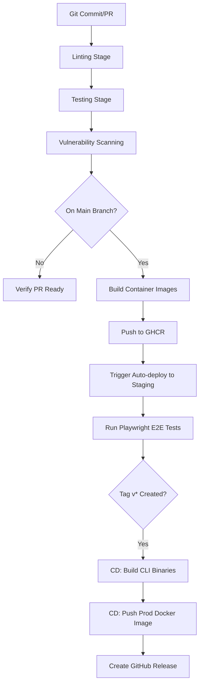

# Capsule CI/CD Pipeline

This document outlines the Continuous Integration (CI) and Continuous Deployment (CD) pipeline structure, triggers, and deployment targets for Capsule.

---

## 1. Pipeline Stages

The Capsule CI/CD pipeline runs entirely on GitHub Actions, splitting into verification (CI) and build/release (CD).

---

## 2. CI Pipeline Specifications (`ci.yml`)

Runs on every push to `main` and all Pull Requests.

### 2.1 Linting
- **Go**: Executed via `golangci-lint` with strict settings (unused vars, errcheck, staticcheck, goimports).
- **TypeScript (Frontend)**: Executed via `eslint` and `prettier`.

### 2.2 Testing
- **Go Backend & CLI**: Runs `go test -v -race -coverprofile=coverage.txt ./...`.
- **TypeScript**: Runs `npm run test` with coverage output.

### 2.3 Security Scans
- Scan container definitions with `trivy`.
- Scan Go source files with `gosec`.

---

## 3. CD Pipeline Specifications (`release.yml`)

Triggers only when a new release tag is pushed (e.g., `v1.0.0`).

### 3.1 CLI Binary Cross-Compilation
The Go CLI compiler targets multiple architectures using GoReleaser or custom shell configurations:
- `linux/amd64` & `linux/arm64`
- `darwin/amd64` & `darwin/arm64` (Apple Silicon)
- `windows/amd64`

All compiled binaries are compressed, checksummed, and automatically attached as assets to the newly created GitHub Release.

### 3.2 Docker Image Production Builds
Builds multi-arch Docker images for `capsule-backend` and `capsule-frontend`, tagging with:
- The release version: `ghcr.io/kynto/capsule-backend:v1.0.0`
- The latest tag: `ghcr.io/kynto/capsule-backend:latest`

Pushes images to GitHub Container Registry (GHCR).

---

## 4. Deployment Environments

Capsule maintains three logical environments:

| Environment | Purpose | Target | Trigger |
|---|---|---|---|
| **Development** | Local testing | Docker Compose | Local manual execution |
| **Staging** | Validation | Single EC2 node | Push to `main` (automatic) |
| **Production** | Live Releases | AWS Auto Scaling Group | Tag creation `v*` (manual gate) |

### 4.1 Rollback Procedures
- **Standard Docker rollback**: Re-tag and deploy previous stable image:
  `docker compose pull && docker compose up -d`
- **Database Rollback**: Safe database migration down routines using `golang-migrate`.
- **Lambda Serverless Rollback**: Shift target traffic percentage back to the previous function version instantly using the AWS SDK Lambda Alias feature.
