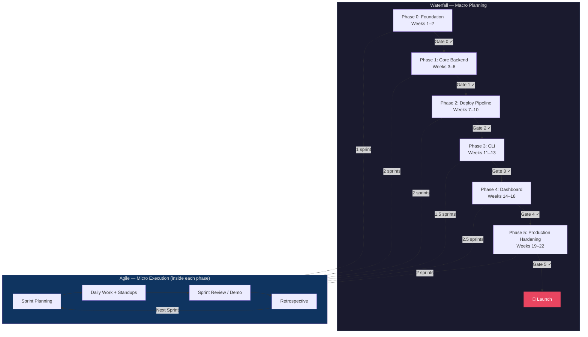
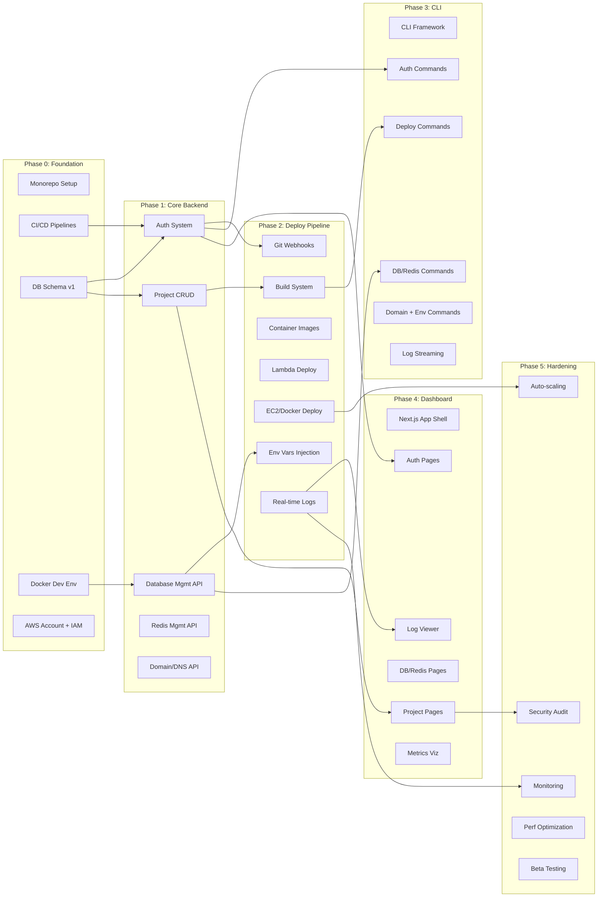
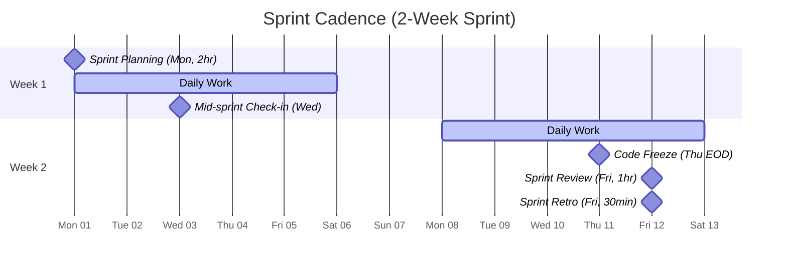
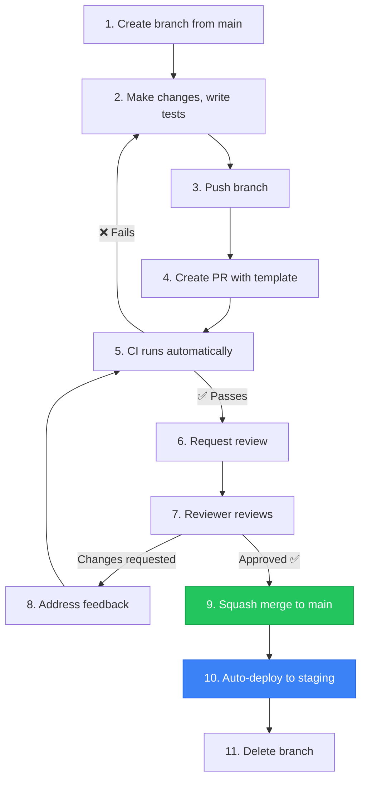
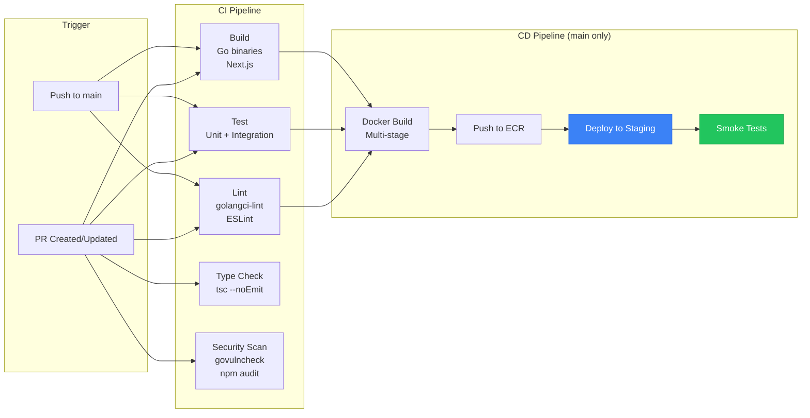
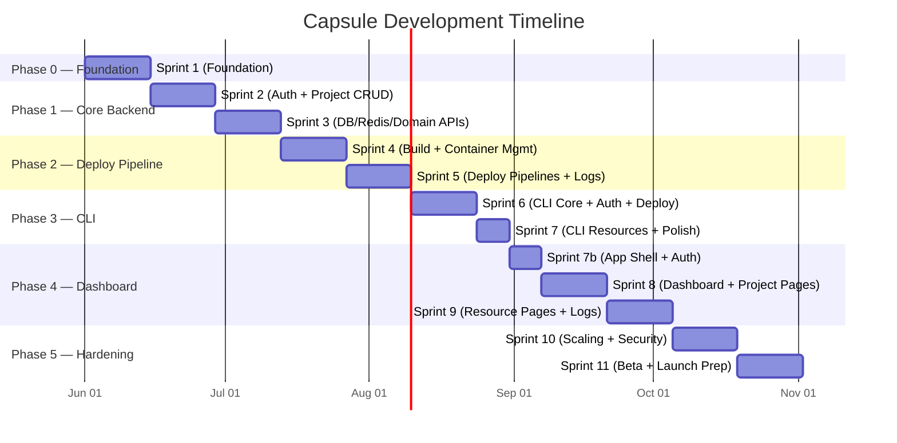
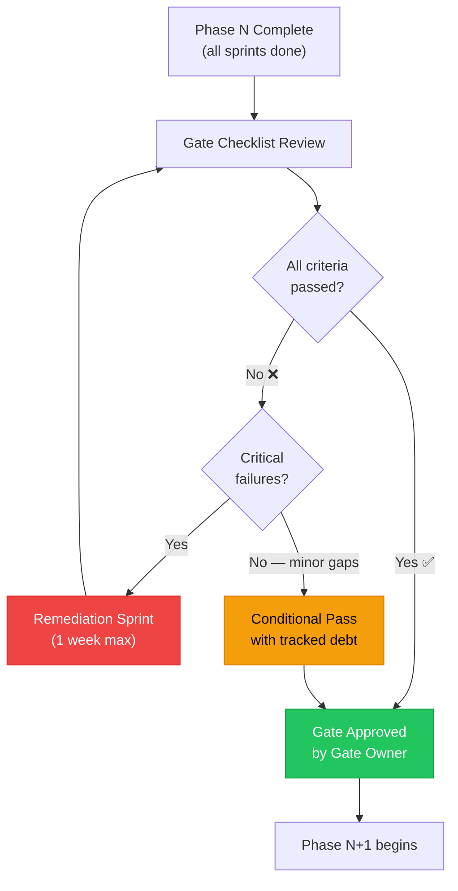
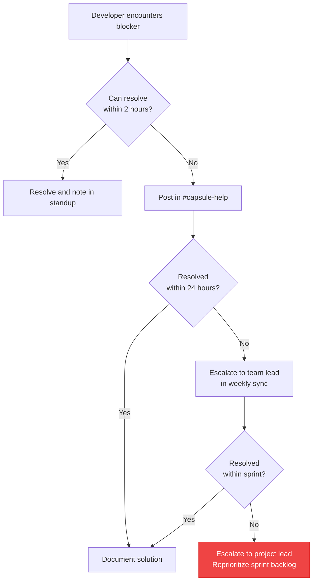
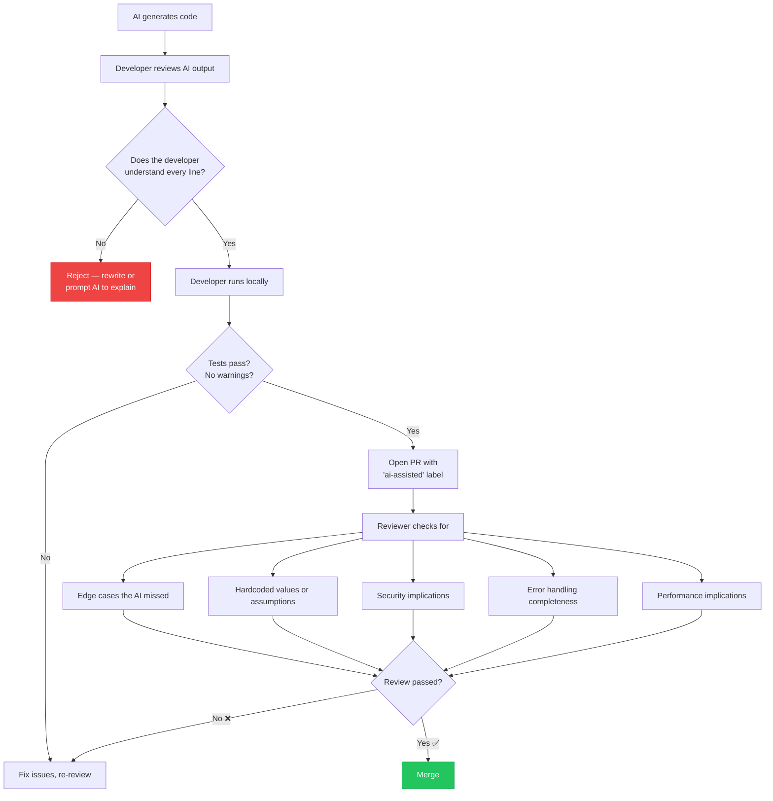

# Capsule — Development Methodology

> **Hybrid Waterfall-Agile Process for Building a Self-Hosted PaaS**
>
> Version: 1.0 · Last Updated: 2026-05-26 · Owner: @Kynto/capsule-core

---

## Table of Contents

1. [Methodology Overview](#1-methodology-overview)
2. [Waterfall Phases (The Big Picture)](#2-waterfall-phases-the-big-picture)
3. [Agile Sprints (Within Each Phase)](#3-agile-sprints-within-each-phase)
4. [Kanban Board Structure](#4-kanban-board-structure)
5. [Definition of Done (DoD)](#5-definition-of-done-dod)
6. [Git Workflow](#6-git-workflow)
7. [Sprint-by-Sprint Breakdown](#7-sprint-by-sprint-breakdown)
8. [Risk Management](#8-risk-management)
9. [Quality Gates Between Phases](#9-quality-gates-between-phases)
10. [Communication Plan](#10-communication-plan)
11. [Tools & Infrastructure](#11-tools--infrastructure)
12. [Velocity Tracking](#12-velocity-tracking)
13. [AI-Assisted Development Guidelines](#13-ai-assisted-development-guidelines)

---

## 1. Methodology Overview

### Why Hybrid?

Capsule is a complex platform with hard infrastructure dependencies, multiple deployment targets (Lambda, EC2/Docker), and three distinct surfaces (Backend API, CLI, Dashboard). A pure Agile approach would risk losing sight of critical-path dependencies and integration milestones. A pure Waterfall approach would be too rigid for the rapid iteration needed on UX, developer experience, and cloud infrastructure.

**The hybrid model gives us the best of both worlds:**

| Concern | Waterfall Contribution | Agile Contribution |
|---------|----------------------|-------------------|
| **Planning horizon** | 6 macro-phases with clear milestones | 2-week sprints inside each phase |
| **Scope management** | Phase gates prevent scope creep | Sprint backlogs flex within phase scope |
| **Risk** | Upfront dependency mapping | Retrospectives catch issues early |
| **Quality** | Formal quality gates between phases | Continuous integration + DoD per task |
| **Delivery** | Predictable end-to-end timeline | Potentially shippable increment every sprint |
| **Stakeholder comms** | Milestone-based progress reports | Sprint demos for rapid feedback |

### Hybrid Flow



### Core Principles

1. **Phase gates are non-negotiable.** No phase begins until the prior gate passes. This protects against cascading technical debt.
2. **Sprints are flexible.** Within a phase, the team self-organizes sprint scope. Stories can shift between sprints if the phase deadline holds.
3. **Working software over comprehensive documentation.** We document decisions (ADRs) and APIs, not every implementation detail.
4. **Automate everything testable.** If it can be tested automatically, it must be. Manual testing is for UX validation only.
5. **Ship to staging continuously.** Every merge to `main` auto-deploys to staging. Phase gates evaluate staging, not local builds.
6. **Fail fast, learn faster.** Spikes and prototypes are encouraged early. Throw away code that taught you something.

---

## 2. Waterfall Phases (The Big Picture)

### Phase Dependency Map



---

### Phase 0: Foundation (Weeks 1–2)

> **Goal:** Every developer can clone the repo, run one command, and have a fully working local environment.

| Deliverable | Description | Owner |
|------------|-------------|-------|
| Monorepo scaffolding | `backend/`, `frontend/`, `cli/`, `deploy/`, `docs/`, `scripts/`, `shared/` with Makefiles | @Kynto/infra |
| CI/CD pipelines | GitHub Actions for lint, test, build across all three components | @Kynto/infra |
| Linting configs | `golangci-lint` (Go), ESLint + Prettier (TS), Markdownlint (docs) | @Kynto/capsule-core |
| Testing framework | `testify` (Go), Vitest + Testing Library (TS), test helpers for DB | @Kynto/capsule-core |
| AWS account setup | Dedicated AWS account, IAM roles for CI, SSO for devs, basic VPC | @Kynto/infra |
| Database schema v1 | Users, projects, deployments, databases, domains tables with migrations | @Kynto/backend |
| Docker Compose dev env | PostgreSQL 16, Redis 7, backend hot-reload, frontend dev server | @Kynto/infra |
| Dev documentation | `CONTRIBUTING.md`, local setup guide, architecture diagram | @Kynto/docs |

#### Gate 0 — Foundation Complete

| # | Criteria | Verification |
|---|----------|-------------|
| G0.1 | All devs can `git clone` + `make dev` and see the API respond on `localhost:8080` | Manual verification by each team member |
| G0.2 | CI pipeline runs lint + tests on PR creation | Open a test PR and confirm |
| G0.3 | Database migrations apply cleanly from zero state | `make migrate-up` on fresh DB |
| G0.4 | All three component directories compile without errors | `make build` succeeds |
| G0.5 | CODEOWNERS, PR template, and issue templates are configured | Repo settings check |

---

### Phase 1: Core Backend (Weeks 3–6)

> **Goal:** A fully functional REST API with authentication, project management, and resource provisioning endpoints — all tested.

| Deliverable | Description | Owner |
|------------|-------------|-------|
| Authentication system | JWT access + refresh tokens, API token generation, OAuth2 device flow for CLI | @Kynto/backend @Kynto/security |
| User management | Registration, login, profile, email verification, password reset | @Kynto/backend |
| Project CRUD API | Create, read, update, delete projects with ownership and team permissions | @Kynto/backend |
| Database management API | Create/delete PostgreSQL instances, check status, trigger backups, restore | @Kynto/backend |
| Redis management API | Create/delete Redis instances, check status, flush, connection info | @Kynto/backend |
| Domain/DNS management API | Add custom domains, verify ownership (CNAME/TXT), manage SSL certs (ACM) | @Kynto/backend |
| OpenAPI specification | Complete OpenAPI 3.1 spec for all endpoints | @Kynto/docs |
| Integration test suite | End-to-end tests for every API endpoint using test containers | @Kynto/backend |

#### Gate 1 — Core Backend Complete

| # | Criteria | Verification |
|---|----------|-------------|
| G1.1 | All core API endpoints return correct responses for happy path | Integration test suite passes |
| G1.2 | Auth flow works end-to-end: register → login → token refresh → API call | Automated E2E test |
| G1.3 | Error responses follow consistent format with proper HTTP status codes | OpenAPI spec validation |
| G1.4 | Unit test coverage > 80% for service layer | `go test -cover` report |
| G1.5 | API documented in OpenAPI spec with examples | Swagger UI renders without errors |
| G1.6 | Security review of auth implementation | @Kynto/security sign-off |

---

### Phase 2: Deploy Pipeline (Weeks 7–10)

> **Goal:** A developer can `git push` a Next.js app and see it live on a custom URL within 5 minutes.

| Deliverable | Description | Owner |
|------------|-------------|-------|
| Git webhook integration | GitHub/GitLab webhook receivers, push event processing, commit tracking | @Kynto/backend |
| Cloud build system | AWS CodeBuild integration or custom builder, Dockerfile auto-detection | @Kynto/backend @Kynto/infra |
| Container image management | ECR repository per project, image tagging, cleanup policies, multi-arch builds | @Kynto/infra |
| Lambda deployment pipeline | Build → package → deploy to Lambda with API Gateway, cold start optimization | @Kynto/backend |
| EC2/Docker deployment pipeline | Build → push to ECR → pull on EC2 → rolling restart with health checks | @Kynto/backend @Kynto/infra |
| Environment variables injection | Encrypted env var storage, injection at build and runtime, secret rotation | @Kynto/backend |
| Real-time build/deploy logs | WebSocket endpoint for streaming build output, log persistence in S3 | @Kynto/backend |
| Deployment rollback | One-click rollback to previous deployment, automatic rollback on health check failure | @Kynto/backend |

#### Gate 2 — Deploy Pipeline Complete

| # | Criteria | Verification |
|---|----------|-------------|
| G2.1 | Can deploy a Next.js app from `git push` to live URL | End-to-end demo with sample app |
| G2.2 | Can deploy a Go API to Lambda from `git push` | End-to-end demo with sample app |
| G2.3 | Build logs stream in real-time via WebSocket | Manual verification |
| G2.4 | Rollback to previous deployment works within 30 seconds | Timed test |
| G2.5 | Environment variables are encrypted at rest and injected correctly | Security test |
| G2.6 | Build completes in under 5 minutes for a typical Next.js app | Performance benchmark |

---

### Phase 3: CLI (Weeks 11–13)

> **Goal:** Developers can manage their entire Capsule workflow from the terminal.

| Deliverable | Description | Owner |
|------------|-------------|-------|
| CLI framework | Cobra + Viper setup, global flags (`--format`, `--project`), auto-completion | @Kynto/cli |
| Auth commands | `capsule login`, `capsule logout`, `capsule whoami`, token caching in `~/.capsule/` | @Kynto/cli |
| Deploy command | `capsule deploy` with project auto-detection (`.capsule.yml`), `capsule link` | @Kynto/cli |
| Database commands | `capsule db create`, `capsule db list`, `capsule db info`, `capsule db delete`, `capsule db backup` | @Kynto/cli |
| Redis commands | `capsule redis create`, `capsule redis list`, `capsule redis info`, `capsule redis delete` | @Kynto/cli |
| Domain commands | `capsule domain add`, `capsule domain list`, `capsule domain verify`, `capsule domain remove` | @Kynto/cli |
| Env var commands | `capsule env set`, `capsule env list`, `capsule env unset`, `capsule env pull` | @Kynto/cli |
| Log streaming | `capsule logs --follow`, `capsule logs --since 1h`, filter by deployment | @Kynto/cli |
| Package/import commands | `capsule init`, `capsule import`, framework detection | @Kynto/cli |

#### Gate 3 — CLI Complete

| # | Criteria | Verification |
|---|----------|-------------|
| G3.1 | All CLI commands work end-to-end against staging API | Automated E2E test suite |
| G3.2 | CLI binary compiles for linux/amd64, linux/arm64, darwin/amd64, darwin/arm64, windows/amd64 | `goreleaser` build matrix |
| G3.3 | `capsule --help` output is clear and well-organized | Manual review |
| G3.4 | Auto-completion works for bash, zsh, fish, PowerShell | Manual verification on each shell |
| G3.5 | Error messages are actionable (suggest fix, link to docs) | UX review |
| G3.6 | CLI respects `--format json` for scripting/automation | JSON output parse test |

---

### Phase 4: Dashboard (Weeks 14–18)

> **Goal:** A polished web dashboard where users can manage all Capsule resources visually.

| Deliverable | Description | Owner |
|------------|-------------|-------|
| Next.js app shell | App Router layout, auth middleware, navigation, theme (dark/light) | @Kynto/frontend |
| Auth pages | Login, register, forgot password, email verification, OAuth callbacks | @Kynto/frontend |
| Dashboard home | Overview cards: project count, active deployments, resource usage, recent activity | @Kynto/frontend |
| Project detail pages | Deployments list/detail, environment variables editor, domain management, project settings | @Kynto/frontend |
| Database management pages | Create database wizard, instance list, connection info, backup/restore UI | @Kynto/frontend |
| Redis management pages | Create Redis wizard, instance list, connection info, flush confirmation | @Kynto/frontend |
| Server management pages | EC2 instance list, status indicators, SSH key management, scaling controls | @Kynto/frontend |
| Backup/restore pages | Backup schedule configuration, backup list, one-click restore, download backup | @Kynto/frontend |
| Real-time log viewer | xterm.js terminal component, ANSI color support, search/filter, WebSocket connection | @Kynto/frontend |
| Metrics visualization | CPU, memory, request count, error rate charts using Recharts or similar | @Kynto/frontend |

#### Gate 4 — Dashboard Complete

| # | Criteria | Verification |
|---|----------|-------------|
| G4.1 | All dashboard pages render correctly and interact with backend API | E2E tests (Playwright) |
| G4.2 | Responsive design works on desktop (1920px), laptop (1366px), tablet (768px) | Visual regression tests |
| G4.3 | Accessibility audit passes (WCAG 2.1 AA) | Lighthouse + axe-core |
| G4.4 | Real-time log viewer handles 1000+ lines/sec without lag | Performance test |
| G4.5 | Loading states, error states, and empty states are handled for all pages | UX checklist review |
| G4.6 | Design review passed by team lead | Design review meeting |
| G4.7 | No console errors or warnings in production build | `next build` + smoke test |

---

### Phase 5: Production Hardening (Weeks 19–22)

> **Goal:** Capsule is production-ready — secure, scalable, monitored, and documented.

| Deliverable | Description | Owner |
|------------|-------------|-------|
| Auto-scaling | ASG + ALB for backend, Lambda concurrency limits, RDS read replicas | @Kynto/infra |
| Monitoring & alerting | CloudWatch dashboards, PagerDuty/OpsGenie integration, SLI/SLO definitions | @Kynto/infra |
| Security audit | Penetration testing, dependency vulnerability scan, OWASP Top 10 checklist | @Kynto/security |
| Performance optimization | Database query optimization, caching strategy, CDN for static assets, build time reduction | @Kynto/backend @Kynto/frontend |
| Documentation finalization | User guide, API reference, CLI reference, deployment guide, troubleshooting FAQ | @Kynto/docs |
| Beta testing | Invite 10–20 beta users, structured feedback collection, bug triage | @Kynto/capsule-core |
| Disaster recovery | Automated backups, cross-region replication, runbooks for common failures | @Kynto/infra |
| Rate limiting & abuse prevention | Per-user rate limits, request throttling, IP-based blocking | @Kynto/backend @Kynto/security |

#### Gate 5 — Production Ready

| # | Criteria | Verification |
|---|----------|-------------|
| G5.1 | Load test: system handles 100 concurrent users with p95 latency < 500ms | k6 load test report |
| G5.2 | Security audit: no critical or high vulnerabilities | Security firm report |
| G5.3 | All beta feedback (P0, P1) addressed | Issue tracker review |
| G5.4 | Monitoring dashboards show all key metrics | CloudWatch walkthrough |
| G5.5 | Disaster recovery tested: can restore from backup in < 1 hour | DR drill |
| G5.6 | Documentation complete and reviewed | @Kynto/docs sign-off |
| G5.7 | Zero known P0/P1 bugs | Bug tracker query |

---

## 3. Agile Sprints (Within Each Phase)

Each Waterfall phase is decomposed into **2-week sprints**. Sprints operate within the scope of their parent phase — the phase defines *what* to build, the sprint defines *how much* to build this iteration.

### Sprint Cadence



### Sprint Ceremonies

| Ceremony | When | Duration | Format | Participants |
|----------|------|----------|--------|-------------|
| **Sprint Planning** | Monday of sprint start, 10:00 AM | 2 hours | Sync (video call) | All devs + product lead |
| **Daily Standup** | Every weekday, 9:30 AM | 15 min | Async (Discord/Slack thread) | All devs |
| **Mid-Sprint Check-in** | Wednesday of week 1, 2:00 PM | 30 min | Sync (video call) | All devs |
| **Sprint Review / Demo** | Friday of sprint end, 2:00 PM | 1 hour | Sync (video call + screen share) | All devs + stakeholders |
| **Sprint Retrospective** | Friday of sprint end, 3:30 PM | 30 min | Sync (video call) | All devs (no stakeholders) |

### Sprint Planning Process

1. **Product lead** presents the phase goals and proposed stories for the sprint
2. **Team** discusses feasibility and refines stories
3. **Team** estimates stories using planning poker (story points: 1, 2, 3, 5, 8, 13)
4. **Team** selects stories up to sprint velocity capacity
5. **Each dev** volunteers for or is assigned stories
6. **Sprint backlog** is locked — changes require team agreement

### Daily Standup Format (Async)

Post in the `#capsule-standup` channel by 9:30 AM:

```
🟢 **Yesterday:** What I completed
🔵 **Today:** What I'll work on
🔴 **Blockers:** Anything preventing progress
```

### Sprint Artifacts

| Artifact | Tool | Description |
|----------|------|-------------|
| **Product Backlog** | GitHub Projects board | All stories, ordered by priority. Lives across sprints. |
| **Sprint Backlog** | GitHub Projects board (sprint view) | Stories selected for the current sprint. |
| **Increment** | Staging deployment | Potentially shippable product at sprint end. |
| **Burndown Chart** | GitHub Projects insights | Story points remaining over time. |
| **Sprint Report** | `docs/sprints/sprint-NN.md` | Goals, delivered, deferred, retro notes. |

---

## 4. Kanban Board Structure

### Board Columns

The GitHub Projects board uses the following columns, reflecting the lifecycle of every work item:

| Column | Emoji | Description | WIP Limit |
|--------|-------|-------------|-----------|
| **Backlog** | 📋 | All stories not yet planned for a sprint | None |
| **Sprint Backlog** | 🎯 | Stories selected for the current sprint, not yet started | None |
| **In Progress** | 🏗️ | Actively being worked on by a developer | 3 per dev |
| **In Review** | 👀 | PR is open, awaiting code review | 5 total |
| **Done** | ✅ | Merged, deployed to staging, meets DoD | None |
| **Blocked** | 🚫 | Cannot proceed — blocker documented in issue | None |

### Labels

#### Priority

| Label | Color | Meaning | SLA |
|-------|-------|---------|-----|
| `P0-Critical` | 🔴 Red | System down, security vulnerability, data loss risk | Fix within 24h |
| `P1-High` | 🟠 Orange | Major feature blocked, significant bug | Fix within sprint |
| `P2-Medium` | 🟡 Yellow | Important but not blocking, quality improvement | Plan for next sprint |
| `P3-Low` | 🟢 Green | Nice to have, cosmetic, minor enhancement | Backlog |

#### Type

| Label | Description |
|-------|-------------|
| `feature` | New functionality |
| `bug` | Something is broken |
| `tech-debt` | Refactoring, cleanup, performance |
| `docs` | Documentation changes |
| `infra` | CI/CD, Docker, Terraform, AWS |

#### Component

| Label | Scope |
|-------|-------|
| `backend` | Go API server (`/backend`) |
| `frontend` | Next.js dashboard (`/frontend`) |
| `cli` | Go CLI tool (`/cli`) |
| `infra` | Infrastructure, DevOps (`/deploy`, `.github/workflows`) |
| `docs` | Documentation (`/docs`) |

#### Size (Estimated Effort)

| Label | Time Estimate | Story Points |
|-------|--------------|-------------|
| `XS` | ~1 hour | 1 |
| `S` | ~half day | 2 |
| `M` | 1–2 days | 3–5 |
| `L` | 3–5 days | 8 |
| `XL` | 1+ week (should be split) | 13 |

> [!WARNING]
> **XL stories must be broken down.** If a story is estimated at 13 points or more, it must be decomposed into smaller stories before entering a sprint backlog. No single story should span more than one sprint.

---

## 5. Definition of Done (DoD)

A task is **DONE** when every checkbox below is satisfied:

### Code Quality

- [ ] Code written and self-reviewed (read your own diff before opening PR)
- [ ] Unit tests written with >80% coverage for new code
- [ ] Integration tests for API endpoints (if applicable)
- [ ] Linting passes: `golangci-lint run ./...` (Go), `pnpm lint` (TypeScript)
- [ ] No `TODO` or `FIXME` left without a linked issue

### Review & CI

- [ ] PR created with complete description using [PR template](../../.github/PULL_REQUEST_TEMPLATE.md)
- [ ] Screenshots attached for UI changes (before/after)
- [ ] Code review approved by 1+ team member (2 for security-sensitive code)
- [ ] CI pipeline passes: tests, lint, build, type-check
- [ ] No new security vulnerabilities flagged by dependency scanner

### Delivery

- [ ] Documentation updated (if API, CLI, or config changed)
- [ ] OpenAPI spec updated (if REST endpoints changed)
- [ ] Merged to `main` branch via squash merge
- [ ] Deployed to staging environment automatically
- [ ] Smoke test passed on staging (manual or automated)

> [!IMPORTANT]
> The DoD is a **minimum bar**, not a ceiling. Individual stories may have additional acceptance criteria defined in the issue.

---

## 6. Git Workflow

### Branching Strategy: GitHub Flow

```mermaid
gitGraph
    commit id: "Initial setup"
    branch feat/auth-system
    checkout feat/auth-system
    commit id: "feat(auth): add JWT generation"
    commit id: "feat(auth): add refresh token flow"
    commit id: "test(auth): add integration tests"
    checkout main
    merge feat/auth-system id: "Squash merge" tag: "v0.1.0"
    branch fix/token-expiry
    checkout fix/token-expiry
    commit id: "fix(auth): correct token expiry check"
    checkout main
    merge fix/token-expiry id: "Squash merge"
    branch feat/project-crud
    checkout feat/project-crud
    commit id: "feat(project): add CRUD endpoints"
    commit id: "feat(project): add team permissions"
    checkout main
    merge feat/project-crud id: "Squash merge" tag: "v0.2.0"
```

### Branch Naming Convention

| Prefix | Purpose | Example |
|--------|---------|---------|
| `feat/` | New feature | `feat/database-backup-api` |
| `fix/` | Bug fix | `fix/jwt-refresh-race-condition` |
| `infra/` | Infrastructure changes | `infra/github-actions-caching` |
| `docs/` | Documentation | `docs/api-reference-update` |
| `refactor/` | Code refactoring | `refactor/service-layer-interfaces` |
| `test/` | Adding/improving tests | `test/deploy-pipeline-e2e` |

### Commit Convention: Conventional Commits

```
<type>(<scope>): <description>

[optional body]

[optional footer(s)]
```

**Types:**

| Type | Description | Example |
|------|-------------|---------|
| `feat` | New feature | `feat(backend): add database creation endpoint` |
| `fix` | Bug fix | `fix(cli): resolve auth token refresh issue` |
| `docs` | Documentation | `docs(api): update REST API reference` |
| `style` | Formatting, no logic change | `style(frontend): fix indentation in auth pages` |
| `refactor` | Code restructuring | `refactor(backend): extract deploy service` |
| `test` | Adding/fixing tests | `test(backend): add project CRUD integration tests` |
| `chore` | Build process, deps | `chore(deps): upgrade Go to 1.22.3` |
| `infra` | Infrastructure | `infra(docker): optimize production Dockerfile` |
| `perf` | Performance | `perf(backend): add Redis caching for project list` |

**Scopes:** `backend`, `frontend`, `cli`, `infra`, `docs`, `deps`, `ci`

### PR Process



### CI/CD Pipeline



---

## 7. Sprint-by-Sprint Breakdown

### Timeline Overview



### Detailed Sprint Table

| Sprint | Dates | Phase | Goals | Key Deliverables | Success Criteria | Dependencies |
|--------|-------|-------|-------|-----------------|-----------------|-------------|
| **Sprint 1** | Weeks 1–2 | Phase 0: Foundation | Set up the entire development infrastructure | Monorepo structure, CI/CD pipelines, Docker Compose, DB schema v1, AWS account, linting configs | All devs can `make dev` and see API on `localhost:8080`; CI runs on PRs | None (first sprint) |
| **Sprint 2** | Weeks 3–4 | Phase 1: Core Backend | Build authentication and project management | JWT auth system with refresh tokens, user registration/login, project CRUD API with permissions | Auth flow works end-to-end; project API passes integration tests; >80% unit test coverage | Sprint 1 (DB schema, CI) |
| **Sprint 3** | Weeks 5–6 | Phase 1: Core Backend | Build resource management APIs | Database management API (create, delete, status, backup), Redis management API, Domain/DNS management API, OpenAPI spec | All resource APIs pass integration tests; OpenAPI spec validates; security review passed | Sprint 2 (auth system) |
| **Sprint 4** | Weeks 7–8 | Phase 2: Deploy Pipeline | Build the build and container system | Git webhook receivers, CodeBuild integration, ECR image management, Dockerfile auto-detection, env var encryption | Webhook triggers build successfully; images pushed to ECR; env vars encrypted at rest | Sprint 3 (project API) |
| **Sprint 5** | Weeks 9–10 | Phase 2: Deploy Pipeline | Build deployment pipelines and real-time logs | Lambda deployment pipeline, EC2/Docker deployment pipeline, WebSocket log streaming, deployment rollback | Can deploy Next.js app from git push to live URL; logs stream in real-time; rollback works in <30s | Sprint 4 (build system) |
| **Sprint 6** | Weeks 11–12 | Phase 3: CLI | Build CLI framework and core commands | Cobra/Viper setup, auth commands (login, logout, whoami), deploy command, project linking, auto-completion | CLI authenticates and deploys against staging API; compiles for all target platforms | Sprint 5 (deploy pipeline) |
| **Sprint 7** | Weeks 13–14 | Phase 3: CLI + Phase 4 start | Complete CLI resource commands; start dashboard | DB/Redis/Domain/Env CLI commands, log streaming, `capsule init`; Next.js app shell, auth pages | All CLI commands work E2E; Next.js app renders login page; CLI `--help` is polished | Sprint 6 (CLI framework) |
| **Sprint 8** | Weeks 15–16 | Phase 4: Dashboard | Build dashboard core pages | Dashboard home (overview), project detail pages (deployments, logs, env vars, domains, settings) | Dashboard shows real data from API; project pages handle CRUD operations; responsive design | Sprint 7 (app shell + backend APIs) |
| **Sprint 9** | Weeks 17–18 | Phase 4: Dashboard | Build resource pages and real-time features | DB management pages, Redis pages, server pages, backup/restore pages, xterm.js log viewer, metrics visualization | All resource management pages functional; log viewer handles 1000+ lines/sec; Playwright E2E tests pass | Sprint 8 (dashboard core) |
| **Sprint 10** | Weeks 19–20 | Phase 5: Hardening | Production infrastructure and security | Auto-scaling (ASG + ALB), monitoring dashboards, PagerDuty integration, security audit, dependency vulnerability scan | Load test: 100 concurrent users, p95 <500ms; no critical security findings; monitoring alerts fire correctly | Sprint 9 (all features built) |
| **Sprint 11** | Weeks 21–22 | Phase 5: Hardening | Beta testing and launch preparation | Performance optimization, documentation finalization, beta user onboarding, bug fixing, DR testing, launch checklist | Beta feedback (P0/P1) addressed; documentation complete; DR drill passed; zero P0/P1 bugs | Sprint 10 (infra hardened) |

---

## 8. Risk Management

### Risk Register

| ID | Risk | Probability | Impact | Severity | Mitigation Strategy | Owner | Status |
|----|------|:-----------:|:------:|:--------:|-------------------|-------|--------|
| R01 | **AWS service limits** block provisioning at scale (e.g., VPC limits, Lambda concurrency) | Medium | High | 🔴 High | Request limit increases in Phase 0; design for multi-account from the start; add quota monitoring | @Kynto/infra | Open |
| R02 | **Build times exceed SLA** (>5 min for typical apps) due to CodeBuild cold starts or large dependencies | High | Medium | 🔴 High | Implement build caching (layer caching, dependency caching); evaluate self-hosted runners; set up build performance benchmarks in CI | @Kynto/backend | Open |
| R03 | **WebSocket connections drop** under load or behind certain proxies/firewalls, breaking real-time logs | Medium | Medium | 🟡 Medium | Implement reconnection logic with exponential backoff; add SSE fallback; test behind corporate proxies | @Kynto/backend | Open |
| R04 | **JWT secret compromise** leads to unauthorized access across all user accounts | Low | Critical | 🔴 High | Use asymmetric keys (RS256); implement key rotation; short-lived tokens (15 min); add token revocation list | @Kynto/security | Open |
| R05 | **Database migration conflicts** when multiple developers modify schema simultaneously | Medium | Medium | 🟡 Medium | Use sequential migration numbering; require migration review in PRs; test migrations in CI; maintain rollback scripts for every migration | @Kynto/backend | Open |
| R06 | **Scope creep in Dashboard phase** due to unbounded UI requirements and design iterations | High | High | 🔴 High | Lock UI designs in Figma before sprint starts; limit to 2 design revision rounds per page; timebox UX polish to last 2 days of sprint | @Kynto/frontend | Open |
| R07 | **Multi-tenancy data leakage** — user A sees user B's resources due to missing authorization checks | Low | Critical | 🔴 High | Row-level security in PostgreSQL; mandatory `user_id` filter in all repository queries; automated authorization test suite; security audit in Phase 5 | @Kynto/security | Open |
| R08 | **Key team member unavailable** for extended period (illness, departure) during critical phase | Medium | High | 🔴 High | Document all architectural decisions (ADRs); pair programming for critical paths; cross-train on each component; no single-owner modules | @Kynto/capsule-core | Open |
| R09 | **Third-party API changes** (GitHub webhooks, AWS SDK, ACM) break integrations unexpectedly | Low | Medium | 🟡 Medium | Pin API versions; abstract third-party calls behind interfaces; monitor changelogs; integration tests run nightly against live APIs | @Kynto/backend | Open |
| R10 | **Docker build compatibility** issues across different host architectures (ARM vs x86) or Docker versions | Medium | Low | 🟢 Low | Multi-arch builds with `docker buildx`; test on both ARM and x86 in CI; pin Docker base image versions; document minimum Docker version | @Kynto/infra | Open |
| R11 | **AI-generated code introduces subtle bugs** that pass code review but cause production issues | Medium | High | 🔴 High | Require comprehensive tests for AI-generated code; double code review for complex AI output; run mutation testing on critical paths; limit AI to well-scoped tasks | @Kynto/capsule-core | Open |
| R12 | **Beta users overwhelm support capacity** with feedback volume, delaying launch | Medium | Medium | 🟡 Medium | Limit beta to 10–20 users; provide structured feedback form; triage weekly; only P0/P1 block launch | @Kynto/capsule-core | Open |

### Risk Severity Matrix

|  | **Low Impact** | **Medium Impact** | **High Impact** | **Critical Impact** |
|---|:---:|:---:|:---:|:---:|
| **High Probability** | 🟡 Medium | 🔴 High | 🔴 High | 🔴 Critical |
| **Medium Probability** | 🟢 Low | 🟡 Medium | 🔴 High | 🔴 High |
| **Low Probability** | 🟢 Low | 🟢 Low | 🟡 Medium | 🔴 High |

### Risk Review Cadence

- **Weekly:** Quick scan during team sync — any new risks? Any risk status changes?
- **Sprint Retrospective:** Discuss whether mitigations are effective
- **Phase Gate:** Full risk register review before approving gate

---

## 9. Quality Gates Between Phases

### Gate Process



### Gate Details

#### Gate 0: Foundation → Core Backend

| # | Criterion | Verification Method | Required? |
|---|-----------|-------------------|:---------:|
| G0.1 | All developers can clone + `make dev` successfully | Each dev confirms in standup | ✅ Yes |
| G0.2 | CI pipeline runs lint + test + build on PRs | Submit test PR | ✅ Yes |
| G0.3 | Database migrations apply from clean state | `make migrate-fresh` on CI | ✅ Yes |
| G0.4 | All three components compile without errors | `make build` on CI | ✅ Yes |
| G0.5 | CODEOWNERS + PR template configured | Repo settings check | ✅ Yes |
| G0.6 | AWS account accessible with appropriate IAM roles | Console login by each dev | ✅ Yes |

**Gate Owner:** @Kynto/infra lead
**Failure Protocol:** Extend Phase 0 by up to 1 week. If still failing, escalate to project lead.

---

#### Gate 1: Core Backend → Deploy Pipeline

| # | Criterion | Verification Method | Required? |
|---|-----------|-------------------|:---------:|
| G1.1 | All core API endpoints pass integration tests | CI test report | ✅ Yes |
| G1.2 | Auth flow works end-to-end | Automated E2E test | ✅ Yes |
| G1.3 | Consistent error response format | OpenAPI validation | ✅ Yes |
| G1.4 | >80% unit test coverage for service layer | Coverage report | ✅ Yes |
| G1.5 | OpenAPI spec complete and renders in Swagger UI | Manual check | ✅ Yes |
| G1.6 | Auth security review passed | @Kynto/security sign-off | ✅ Yes |

**Gate Owner:** @Kynto/backend lead + @Kynto/security
**Failure Protocol:** Focus remediation sprint on failing criteria. Security failures are hard blockers.

---

#### Gate 2: Deploy Pipeline → CLI

| # | Criterion | Verification Method | Required? |
|---|-----------|-------------------|:---------:|
| G2.1 | Deploy Next.js app from git push to live URL | Live demo | ✅ Yes |
| G2.2 | Deploy Go API to Lambda from git push | Live demo | ✅ Yes |
| G2.3 | Build logs stream in real-time | Manual verification | ✅ Yes |
| G2.4 | Rollback works within 30 seconds | Timed test | ✅ Yes |
| G2.5 | Env vars encrypted at rest | Security test | ✅ Yes |
| G2.6 | Build time < 5 min for typical app | Benchmark | 🟡 Soft |

**Gate Owner:** @Kynto/backend lead + @Kynto/infra lead
**Failure Protocol:** G2.6 is a soft target — can proceed with tracked tech-debt if builds are under 8 min.

---

#### Gate 3: CLI → Dashboard

| # | Criterion | Verification Method | Required? |
|---|-----------|-------------------|:---------:|
| G3.1 | All CLI commands work E2E against staging | Automated test suite | ✅ Yes |
| G3.2 | Compiles for all 5 target platforms | goreleaser build | ✅ Yes |
| G3.3 | `--help` output clear and well-organized | UX review | ✅ Yes |
| G3.4 | Auto-completion works for bash, zsh, fish, PowerShell | Manual test | 🟡 Soft |
| G3.5 | Error messages are actionable | UX review | ✅ Yes |
| G3.6 | `--format json` works for all commands | Parse test | ✅ Yes |

**Gate Owner:** @Kynto/cli lead
**Failure Protocol:** G3.4 can be deferred as tracked debt for obscure shells. Others are hard blockers.

---

#### Gate 4: Dashboard → Production Hardening

| # | Criterion | Verification Method | Required? |
|---|-----------|-------------------|:---------:|
| G4.1 | All pages render and interact with API | Playwright E2E suite | ✅ Yes |
| G4.2 | Responsive on 1920px, 1366px, 768px | Visual regression tests | ✅ Yes |
| G4.3 | WCAG 2.1 AA accessibility audit | Lighthouse + axe-core | 🟡 Soft |
| G4.4 | Log viewer handles 1000+ lines/sec | Performance test | ✅ Yes |
| G4.5 | Loading/error/empty states handled | UX checklist | ✅ Yes |
| G4.6 | Design review passed | Team lead sign-off | ✅ Yes |
| G4.7 | No console errors in production build | Smoke test | ✅ Yes |

**Gate Owner:** @Kynto/frontend lead
**Failure Protocol:** G4.3 accessibility can proceed with a remediation plan. Others are hard blockers.

---

#### Gate 5: Production Hardening → Launch

| # | Criterion | Verification Method | Required? |
|---|-----------|-------------------|:---------:|
| G5.1 | 100 concurrent users, p95 < 500ms | k6 load test report | ✅ Yes |
| G5.2 | No critical/high security vulnerabilities | Security audit report | ✅ Yes |
| G5.3 | Beta feedback P0/P1 addressed | Issue tracker query | ✅ Yes |
| G5.4 | Monitoring dashboards operational | CloudWatch walkthrough | ✅ Yes |
| G5.5 | DR drill: restore from backup < 1 hour | DR drill report | ✅ Yes |
| G5.6 | Documentation complete | @Kynto/docs sign-off | ✅ Yes |
| G5.7 | Zero P0/P1 open bugs | Bug tracker query | ✅ Yes |

**Gate Owner:** @Kynto/capsule-core (all leads)
**Failure Protocol:** No conditional passes for Gate 5. All criteria are hard blockers for launch.

---

## 10. Communication Plan

### Daily Async Standup

**Channel:** `#capsule-standup` (Discord/Slack)
**Time:** By 9:30 AM local time
**Format:**

```markdown
## [Your Name] — YYYY-MM-DD

🟢 **Completed:**
- feat(backend): finished project CRUD endpoints (#42)
- Reviewed PR #45 (auth middleware)

🔵 **Today:**
- Start integration tests for project API
- Pair with @dev on database migration approach

🔴 **Blocked:**
- Waiting on AWS IAM role for CodeBuild (#38)

📊 **Sprint Points:** 8/21 done
```

### Weekly Sync Meeting

**When:** Wednesday, 2:00 PM (30 minutes)
**Channel:** Video call
**Agenda:**

1. **Sprint progress check** (5 min) — burndown review
2. **Blockers triage** (10 min) — anything in 🚫 Blocked column
3. **Cross-component coordination** (10 min) — API contract changes, shared types
4. **Risk check** (5 min) — any new risks surfaced this week?

### Sprint Review Format

**When:** Friday of sprint end, 2:00 PM (1 hour)
**Audience:** All devs + stakeholders

| Segment | Duration | Description |
|---------|----------|-------------|
| Sprint summary | 5 min | What we committed to vs. what we delivered |
| Live demo | 30 min | Working software on staging — each dev demos their work |
| Feedback | 15 min | Stakeholders ask questions, suggest changes |
| Next sprint preview | 10 min | Top priorities for next sprint |

### Sprint Retrospective Format

**When:** Friday of sprint end, 3:30 PM (30 minutes)
**Audience:** Devs only (safe space, no stakeholders)

| Question | Format |
|----------|--------|
| 🟢 What went well? | Each person adds sticky notes, then vote on top 3 |
| 🔴 What didn't go well? | Each person adds sticky notes, then vote on top 3 |
| 🔵 What will we try differently? | One concrete action item per "didn't go well" |

**Action items** are tracked in `docs/sprints/sprint-NN.md` and reviewed at next retro.

### Escalation Path



### Documentation Standards

| Document Type | Location | Format | Update Cadence |
|--------------|----------|--------|---------------|
| Architecture Decision Records | `docs/adr/` | Markdown (ADR template) | On each significant decision |
| API Reference | `docs/api/` | OpenAPI 3.1 YAML | Every sprint with API changes |
| CLI Reference | `docs/cli/` | Markdown (auto-generated from Cobra) | Every sprint with CLI changes |
| Sprint Reports | `docs/sprints/` | Markdown (sprint template) | End of each sprint |
| Runbooks | `docs/runbooks/` | Markdown (runbook template) | Phase 5 + as incidents occur |
| User Guide | `docs/user-guide/` | Markdown / Docusaurus | Phase 5 (finalized) |

---

## 11. Tools & Infrastructure

### Development Tools

| Category | Tool | Purpose | Link |
|----------|------|---------|------|
| **Version Control** | GitHub | Code hosting, PRs, code review | [github.com/Kynto/capsule](https://github.com/Kynto/capsule) |
| **Project Management** | GitHub Projects | Sprint board, backlog, roadmap | Integrated with repo |
| **CI/CD** | GitHub Actions | Lint, test, build, deploy pipelines | `.github/workflows/` |
| **Communication** | Discord / Slack | Async standups, discussions, alerts | `#capsule-*` channels |
| **Design** | Figma | UI mockups, component library, design system | Shared team workspace |
| **Documentation** | `docs/` folder + Docusaurus | Technical docs, user guide, API reference | In repo |
| **Secrets Management** | AWS Secrets Manager | Production secrets, API keys, tokens | AWS Console |
| **Error Tracking** | Sentry | Runtime error tracking, performance monitoring | Sentry project |

### Infrastructure Stack

| Component | Technology | Environment |
|-----------|-----------|-------------|
| **Backend API** | Go 1.22+ with Chi router | EC2 / ECS / Lambda |
| **Frontend** | Next.js 14 (App Router) + Tailwind + shadcn/ui | Vercel / S3+CloudFront |
| **CLI** | Go 1.22+ with Cobra + Viper | Distributed binary (goreleaser) |
| **Database** | PostgreSQL 16 (via `pgx`) | RDS (prod) / Docker (dev) |
| **Cache** | Redis 7 | ElastiCache (prod) / Docker (dev) |
| **Container Registry** | Amazon ECR | AWS |
| **Build System** | AWS CodeBuild | AWS |
| **DNS** | Route 53 | AWS |
| **SSL/TLS** | AWS Certificate Manager (ACM) | AWS |
| **Object Storage** | S3 | Build logs, backups |
| **Monitoring** | CloudWatch + Grafana | AWS |
| **IaC** | Terraform | `deploy/terraform/` |

### Channel Structure (Discord/Slack)

| Channel | Purpose |
|---------|---------|
| `#capsule-general` | General discussion, questions, links |
| `#capsule-standup` | Async daily standups |
| `#capsule-help` | Blocker escalation, technical questions |
| `#capsule-prs` | GitHub PR notifications (bot) |
| `#capsule-ci` | CI/CD build status notifications (bot) |
| `#capsule-alerts` | Production monitoring alerts (bot) |
| `#capsule-design` | UI/UX discussion, Figma links |

---

## 12. Velocity Tracking

### Story Point Scale

We use a modified Fibonacci scale. Points measure **complexity + effort + uncertainty**, not hours.

| Points | Complexity | Typical Example |
|:------:|-----------|----------------|
| **1** | Trivial — 100% clear how to do it | Fix a typo, update a config value, add a CSS class |
| **2** | Simple — straightforward, minimal decisions | Add a new field to an API response, write a unit test |
| **3** | Moderate — some design decisions needed | New API endpoint with validation and tests |
| **5** | Complex — multiple components or unknowns | WebSocket log streaming, OAuth device flow |
| **8** | Very complex — significant uncertainty | Build deployment pipeline for a new target (Lambda) |
| **13** | Epic-scale — should probably be split | Full database management subsystem (API + CLI + UI) |

> [!TIP]
> **Use planning poker.** Each dev estimates independently, then reveals simultaneously. Discuss divergences > 2 levels apart. The purpose is shared understanding, not precision.

### Velocity Calculation

**Sprint velocity** = total story points completed (in ✅ Done column at sprint end).

- **Sprint 1–2:** Use estimated velocity of **21 points/sprint** (based on team size)
- **Sprint 3+:** Use rolling average of last 3 sprints

```
Velocity = (Sprint N points + Sprint N-1 points + Sprint N-2 points) / 3
```

### Burndown Chart

Track daily during each sprint. The burndown shows points remaining vs. ideal pace:

```
Points
  |╲
  | ╲         ← Ideal line
  |  ╲●
  |   ╲ ●
  |    ╲  ●   ← Actual progress
  |     ╲   ●
  |      ╲●
  +────────── Days
  1  2  3  4  5  6  7  8  9  10
```

**Reading the chart:**

| Pattern | Meaning | Action |
|---------|---------|--------|
| Actual tracks ideal | On pace | Continue as planned |
| Actual above ideal | Behind schedule | Discuss in standup; consider descoping lowest-priority stories |
| Actual below ideal | Ahead of schedule | Pull in stretch stories from backlog |
| Flat line | No progress for 2+ days | Likely blocked — escalate immediately |

### When to Adjust Scope

| Trigger | Action |
|---------|--------|
| Velocity drops >30% from average for 2 sprints | Root cause analysis in retro; adjust capacity or scope |
| Sprint has >20% carryover | Stories are too large — enforce splitting at planning |
| Team consistently finishes early | Increase sprint commitment by 10–15% |
| New P0 bug introduced mid-sprint | Swap with lowest-priority story in sprint backlog |
| Phase gate at risk | Focus sprint on gate criteria; defer non-gate stories |

---

## 13. AI-Assisted Development Guidelines

### Overview

AI coding agents (Claude, GitHub Copilot, etc.) are integral to Capsule's development velocity. These guidelines ensure AI-generated code meets the same quality bar as human-written code.

### Which Tasks Are Best Suited for AI

| ✅ Great for AI | ⚠️ Use with Caution | ❌ Not Recommended |
|----------------|---------------------|-------------------|
| Boilerplate CRUD endpoints | Complex business logic with edge cases | Architecture decisions |
| Unit test generation | Security-critical code (auth, encryption) | Team process changes |
| Database migration files | Performance-sensitive hot paths | Dependency selection |
| CLI command scaffolding | Multi-service orchestration | Infrastructure provisioning (first time) |
| React component skeletons | State management logic | Security audit |
| API client code | Error handling strategies | Production incident response |
| Documentation drafts | Database query optimization | |
| Refactoring repetitive code | WebSocket/real-time logic | |
| Type definitions and interfaces | | |
| Test data generators | | |

### How to Write Effective Prompts

Use the `.claude/commands/` directory for reusable prompt templates. Follow these principles:

**1. Provide context:**

```
You are working on the Capsule project, a self-hosted PaaS.
The backend is Go with Chi router, using clean architecture.
See .claude/CLAUDE.md for full project context.
```

**2. Be specific about inputs and outputs:**

```
Create a new API endpoint POST /api/v1/projects/{id}/databases
that creates a PostgreSQL database for the given project.

Input: { "name": "mydb", "plan": "basic" }
Output: { "id": "...", "name": "mydb", "host": "...", "port": 5432, "status": "creating" }

Follow the patterns in backend/internal/server/project_handler.go
```

**3. Specify constraints:**

```
- Must include input validation using the validate package
- Must check that the user owns the project (auth middleware)
- Must be idempotent (creating an existing DB returns 409)
- Must include unit tests with table-driven test pattern
- Must follow error wrapping convention: fmt.Errorf("createDB: %w", err)
```

**4. Reference existing code:**

```
Follow the exact same patterns used in:
- backend/internal/server/project_handler.go (handler structure)
- backend/internal/service/project_service.go (service layer)
- backend/internal/repository/project_repo.go (repository layer)
```

### Code Review Process for AI-Generated Code

AI-generated code receives **enhanced code review** — it's treated as code from a skilled but unfamiliar contributor:



### Testing Requirements for AI-Generated Code

| Aspect | Requirement |
|--------|-------------|
| **Unit tests** | AI-generated code must come with tests (or tests are written separately). Coverage > 80%. |
| **Edge cases** | Tests must cover: nil/empty inputs, boundary values, concurrent access, error paths |
| **Integration tests** | Required for any API endpoint, database operation, or external service call |
| **Manual testing** | Developer must manually test the feature before opening PR |
| **Mutation testing** | Recommended for critical paths — verify tests actually catch bugs |

### AI Prompt Library (`.claude/commands/`)

Maintain reusable prompts for common tasks:

| Prompt File | Purpose |
|------------|---------|
| `new-endpoint.md` | Create a new REST API endpoint (handler + service + repo + tests) |
| `new-cli-command.md` | Add a new CLI command with flags and output formatting |
| `new-component.md` | Create a new React component with TypeScript, tests, and Storybook |
| `write-tests.md` | Generate tests for existing code |
| `refactor.md` | Refactor code following project patterns |
| `migration.md` | Create a database migration |
| `review.md` | Review code for quality, security, and performance issues |

### Rules for AI-Assisted Development

1. **Never blindly merge AI output.** Every line must be understood by the committing developer.
2. **Label PRs with `ai-assisted`.** This triggers enhanced review requirements.
3. **AI does not make architectural decisions.** Architecture changes require team discussion and an ADR.
4. **Test AI-generated code more than human-written code.** AI is confident but sometimes wrong.
5. **Use AI for speed, not for replacing understanding.** If you can't explain the code, don't ship it.
6. **Keep prompt context current.** Update `.claude/CLAUDE.md` when project conventions change.
7. **Track AI effectiveness.** Note in sprint retros which AI-assisted tasks went well or poorly.

---

## Appendix A: Templates

### Sprint Report Template (`docs/sprints/sprint-NN.md`)

```markdown
# Sprint NN Report — [Start Date] to [End Date]

## Phase: [Phase Name]

## Sprint Goal
[One sentence describing the sprint's primary objective]

## Metrics
- **Committed:** XX points
- **Completed:** XX points
- **Velocity:** XX (rolling 3-sprint average: XX)
- **Carryover:** XX points (X stories)

## Delivered
| Story | Points | Assignee | Notes |
|-------|:------:|---------|-------|
| #123 feat: ... | 5 | @dev1 | |
| #124 feat: ... | 3 | @dev2 | |

## Carried Over
| Story | Points | Reason |
|-------|:------:|--------|
| #125 feat: ... | 8 | Blocked by AWS IAM setup |

## Retrospective
### What went well
- ...

### What didn't go well
- ...

### Action items for next sprint
- [ ] ...
```

### ADR Template (`docs/adr/NNNN-title.md`)

```markdown
# NNNN. [Title]

**Date:** YYYY-MM-DD
**Status:** Proposed | Accepted | Deprecated | Superseded by [NNNN]
**Deciders:** @dev1, @dev2

## Context
[What is the issue we're facing? What decision needs to be made?]

## Decision
[What is the change that we're proposing and/or doing?]

## Consequences
### Positive
- ...

### Negative
- ...

### Neutral
- ...
```

---

## Appendix B: Quick Reference Card

| Question | Answer |
|----------|--------|
| Sprint length? | 2 weeks |
| Sprint planning when? | Monday of sprint start, 10 AM, 2 hours |
| Daily standup how? | Async in `#capsule-standup` by 9:30 AM |
| Demo when? | Friday of sprint end, 2 PM, 1 hour |
| Retro when? | Friday of sprint end, 3:30 PM, 30 min |
| Branch naming? | `feat/`, `fix/`, `infra/`, `docs/`, `refactor/`, `test/` |
| Commit format? | `type(scope): description` |
| PR merge strategy? | Squash merge |
| Min reviewers? | 1 (2 for security-sensitive) |
| Test coverage target? | >80% for new code |
| Point scale? | 1, 2, 3, 5, 8, 13 |
| Max story size? | 8 points (13 = must split) |
| WIP limit per dev? | 3 in-progress items |
| P0 bug SLA? | Fix within 24 hours |
| AI-generated PR label? | `ai-assisted` |

---

> **This is a living document.** Update it in sprint retrospectives as the team learns what works and what doesn't. Changes require a PR reviewed by @Kynto/capsule-core.
