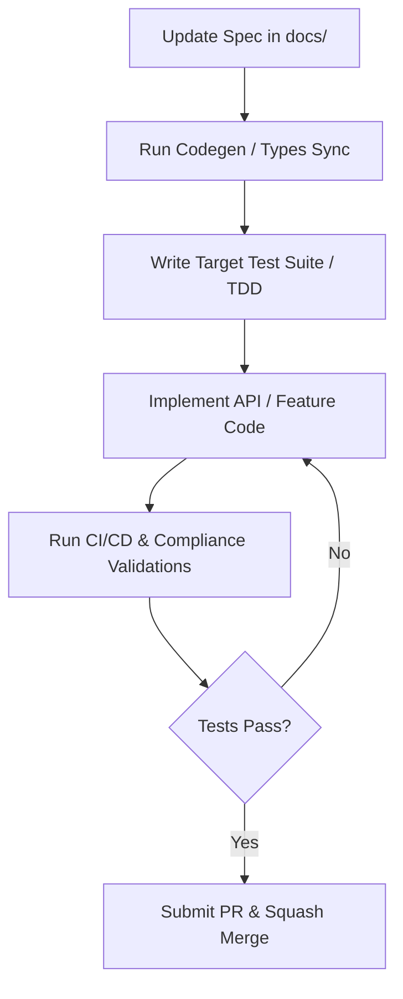

# Spec-Driven Development (SDD) Protocol

This document defines the **Spec-Driven Development (SDD)** workflow for Capsule. SDD is the absolute standard of engineering for all developers and AI agents collaborating on this project. 

The core principle of SDD is: **The Spec is the Single Source of Truth. No code changes, model alterations, or endpoint adjustments can be made without first updating the corresponding spec.**

---

## 1. The SDD Lifecycle



### Stage 1: Spec Modification
Every feature begins with a pull request modifying a specification document inside `docs/`:
- **API Spec**: `docs/architecture/API_REFERENCE.md`
- **Database Schema**: `docs/architecture/DATABASE_SCHEMA.md`
- **CLI Commands**: `docs/architecture/CLI_REFERENCE.md`
- **IAM Boundaries**: `docs/architecture/AWS_IAM_POLICIES.md`

### Stage 2: Schema / Interface Generation
Before writing business logic, compile and generate all required models:
- **Go Backend**: Run `sqlc generate` or database migrations to ensure SQL queries align perfectly with table schemas.
- **Next.js Frontend**: Import typed interfaces generated from the Go structs or OpenAPI specs.
- **CLI cobra commands**: Define the subcommand struct, flags, and arguments strictly as described in the CLI reference.

### Stage 3: Test-Driven Blueprinting (TDD)
Write assertions and integration stubs first. 
- API endpoints must have a test checking request validation, status codes (200, 400, 401, 403, 404, 500), and response payloads.
- CLI commands must have automated golden-file tests or CLI E2E tests executing CLI flags with mock inputs.

### Stage 4: Execution & Implementation
Implement the logic to make the tests pass. 

### Stage 5: Verification & Merging
Verify and run `make test` and `make lint`. No PR will be merged with failing specs or untested endpoints.

---

## 2. SDD Rule Matrix

| Phase | Developer Focus | AI Agent Focus | Verification Command |
|---|---|---|---|
| **Database** | Create migrations under `/migrations` | Validate against `DATABASE_SCHEMA.md` | `make db-migrate-up` |
| **API Backend** | Build handlers, services, and middlewares | Match request/response objects to `API_REFERENCE.md` | `make test-backend` |
| **CLI Tool** | Implement commands and subcommands | Mirror `CLI_REFERENCE.md` flags and output formats | `make test-cli` |
| **Dashboard UI** | Component layouts and client state fetching | Ensure TypeScript interfaces align with API specs | `make lint-frontend` |
| **AWS Ops** | Write IAM roles, policies, and SDK triggers | Ensure IAM calls stay strictly inside `AWS_IAM_POLICIES.md` | `make lint-infra` |

---

## 3. Strict Compliance Checks

1. **API Conformity**: All API routes must return standardized envelopes:
   ```json
   {
     "success": true,
     "data": {},
     "error": null
   }
   ```
   For errors:
   ```json
   {
     "success": false,
     "data": null,
     "error": {
       "code": "AUTH_FAILED",
       "message": "Token has expired",
       "details": []
     }
   }
   ```

2. **CLI Consistent Feedback**: 
   - All standard output must support `--json` output flags.
   - Standard logs must go to `stderr`, while pure results must print to `stdout`.
   - Text output must use standardized terminal styling (spinners for operations, green checks for success, red crosses for failures).

3. **No Phantom Code**: Any code that is written but not backed by an approved specification file will be flagged during code review and must be removed.
